# UNICAMP 2022 – Acesso Direto – Prova 2 (tarde)

- Formato: Resposta curta (discursiva)
- Tipo: regular
- Data de aplicação: 2021-12-20
- Questões: 60
- Prova original: https://www.comvest.unicamp.br/residenciamedica2022/provas/dAD.pdf
- Gabarito oficial: https://www.comvest.unicamp.br/residenciamedica2022/resp_esperadas/resp_ad.pdf (retificado em 03/01/2022)

Valores de referência dos exames laboratoriais

Valor de referência exames laboratoriais:

| Parâmetro | Valor de normalidade |
|---|---|
| Ácido fólico | 3,1 a 20,5 ng/dL |
| Albumina plasmática | 3,5 a 5,2 g/dL |
| ALT (TGP) | Homem <41UI/L; mulher < 33 UI/L |
| AST (TGO) | Homem < 40 UI/L; mulher < 33 UI/L |
| Atividade plasmática de renina | 0,6 a 4,18 ng/ml/h (ortostática) 0,32 a 1,84 ng/ml/h (supino) |
| Bilirrubina total | 0,3 a 1,2 mg/dL |
| Cálcio | 8,8 a 10,2 mg/dL |
| CPK (creatina fosfoquinase) | 0 a 171 UI/L |
| CK-mb (creatinaquinase fração mb) | 0 a 24 UI/L |
| Cloro | 98 a 106 mmol/L |
| Colesterol total | < 200 mg/dL |
| Colesterol HDL | Homem ≥ 40 mg/dL; mulher ≥ 50 mg/dL |
| Colesterol LDL | < 100 mg/dL |
| Creatinina | Homem: ≤ 1,2 mg/dL Mulher: ≤ 0,8 mg/dL |
| Cortisol urinário | 3,5 a 4,5 mcg/24h |
| Ferritina | Homem: 30 a 400 ng/mL; mulher 13 a 150 ng/mL |
| Ferro sérico | Homem: 70 a 180 µg/dL; mulher 60 a 180µg/dL |
| Fibrinogênio | 175 a 400 mg/dL |
| Fosfatase alcalina | Homem: 40 a 129UI/L; mulher 35 a 103UI/L |
| Fósforo | 2,5 a 4,5 mg/dL |
| Glicemia jejum | 60 a 99 mg/dL |
| Hemograma | Hemoglobina: homem 14-18 g/dL; mulher 12 a 16 g/dL Hematócrito: homem 41-52%; mulher 36 a 46% Leucócitos: 4.000 a 10.000/mm3 (segmentados 2.000 a 8.000/mm3; linfócitos 1.000 a 4.000/ mm3; monócitos 200 a 800/mm3;eosinófilos < 450/mm3, basófilos <200/ mm3) Plaquetas: 150.000 a 450.000/mm3 VCM: 80 a 99 fL HCM 27 a 32 pg Reticulócitos: 50.000 a 100.000/ mm3 |
| Hemoglobina glicada (HbA1c) | 4,0 a 5,6% |
| Metanefrinas urina | < 400 mcg/24h (totais < 1300 mcg/24h) |
| Paratormônio (PTH) | 15 a 65 pg/mL |
| Potássio | 3,5 a 5,1 mEq/L |
| Proteína C reativa | Processo inflamatório: 10-50 mg/L (leve); 50-100 mg/dL (moderado); > 100 mg/dL (grave) Risco cardiovascular: < 1 mg/dL (baixo); 1-3 mg/dL (médio); > 3 mg/dL (alto) |
| RNI (TP) | Até 1,25 |
| R (TTPA) | Até 1,3 |
| Sódio | 135 a 145 mEq/L |
| TIBC | 255 a 450µg/dL |
| Troponina T | 0 a 14 ng/L |
| Triglicérides | < 150 mg/dL |
| TSH | 0,3 a 4,2 µUI/mL |

| T4livre | 0,9 a 1,7 ng/dL |
|---|---|
| Vitamina B12 | 200 a 900 pg/mL |
| Vitamina D | 31 a 100 ng/mL |
| Ureia | 17 a 43 mg/dL |
| Exame de urina | Leucócitos < 5/campo Hemácias < 5/campo Proteína negativo/traços |
| Relação albumina/creatinina urinária | < 30 mg/g |
| Relação proteína/creatinina urinária | < 0,20 |

| Gasometria | Arterial | venosa |
|---|---|---|
| pH | 7,35 a 7,45 | 7,33 a 7,43 |
| pO2 | 83 a 108 mmHg | 38 a 50 mmHg |
| pCO2 | 32 a 48 mmHg | 31 a 54 mmHg |
| HCO3 | 18 a 23 mmol/L | 18 a 23 mmol/L |
| Lactato | 0,5 a 1,6 mmol/L | 0,5 a 1,6 mmol/L |
| Cálcio iônico | 1,15 a 1,29 mmol/L | 1,15 a 1,29 mmol/L |

## Clínica Médica

### Questão 1

Homem, 52a, procura Unidade de Emergência por mal-estar geral e dor precordial. Antecedente pessoal: doença renal crônica em diálise, faltou na última sessão. ECG: ANEXO A. A CONDUTA IMEDIATA É:

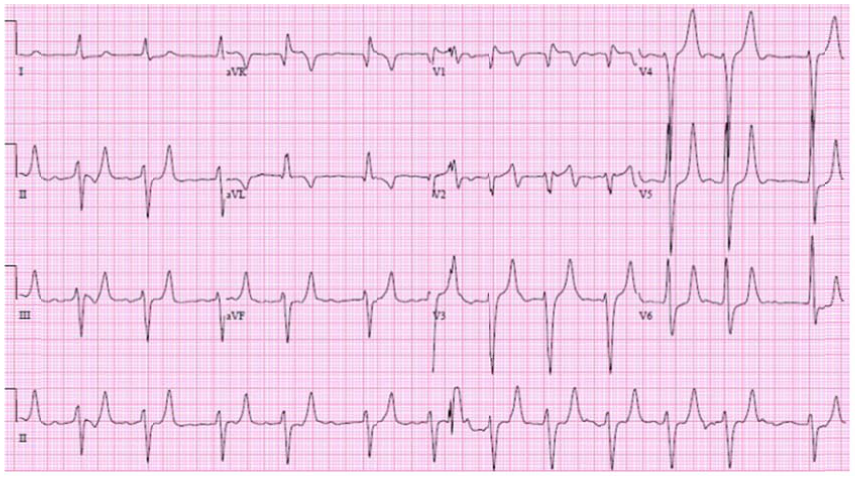

Gabarito

Gluconato de Cálcio endovenoso ou Gluconato de Calcio/ não considerar outras vias

### Questão 2

Homem, 37a, queixa-se de cefaleia persistente há seis meses. Há três meses passou a apresentar episódios de crises convulsivas. Exame físico: PA= 120x82 mmHg sem alterações. Tomografia computadorizada e Ressonância magnética de crânio: ANEXO A.O HIPOTESE DIAGNÓSTICA É:

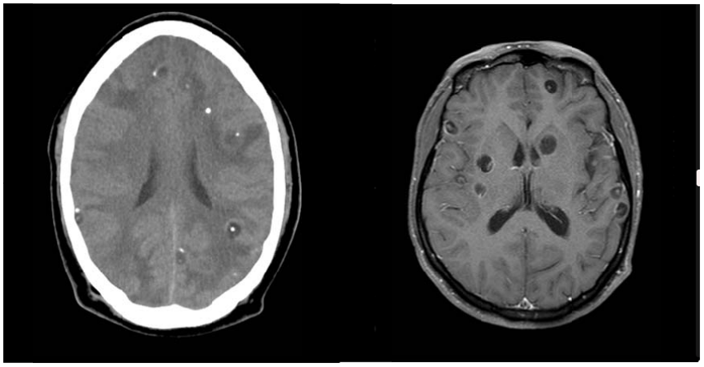

Gabarito

Neurocisticercose

### Questão 3

Homem, 64a, queixa-se de fraqueza em membros inferiores há seis meses. Exame físico: PA= 158x112 mmHg; FC= 88 bpm; FR= 16 irpm; Oximetria de pulso (ar ambiente)= 96%; IMC= 32 kg/m2; neurológico: diminuição da sensibilidade vibratória em pés e diminuição do pulso pedioso à direita. Hb= 14,3 g/dL; Ht= 43%; sódio= 141 mEq/L; potássio= 4,1 mEq/L; glicemia jejum= 187 mg/dL; HbA1c= 7,8%, colesterol total = 256 mg/dL; HDL = 24 mg/dL; LDL = 190 mg/dL; triglicérides= 230 mg/dL; ureia= 56 mg/dL; creatinina= 1,0 mg/dL; AST= 17 UI/L; ALT= 21UI/L. Iniciado tratamento com metformina, furosemida, captopril, atenolol e sinvastatina. Retorna após 10 dias com os exames de controle do tratamento coletados no dia: ureia= 80 mg/dL, creatinina= 1,87 mg/dL; K= 3,8 mEq/L; glicemia jejum=126 mg/dL; ALT= 41 UI/L; AST= 37 UI/L; CK= 300 mg/dL. O MEDICAMENTO ASSOCIADO AO DESENVOLVIMENTO DE LESÃO RENAL AGUDA NESTE CASO É:

Gabarito

captopril

### Questão 4

Mulher, 45a, assintomática, procura o serviço médico pois possui antecedentes familiares para câncer de intestino (pai), estômago (tio paterno) e endométrio (mãe). O EXAME PARA RASTREAMENTO NESSA PACIENTE É:

Gabarito

colonoscopia

### Questão 5

Homem, 41a, previamente hígido, foi admitido na sala de emergência cerca de 36 horas após ter sentido uma picada pouco dolorosa na coxa direita após vestir o macacão de trabalho de marcenaria, que estava pendurado em um cabideiro de parede. Cerca de 8-12 horas após a picada relatou início de dor local em queimação e pontadas recorrentes, de moderada/forte intensidade (nota 6/7 na escala de notas de dor 0-10), acompanhada de vermelhidão e “inchaço duro” no local da picada. Queixou-se também de cefaleia, indisposição, dores no corpo e febre (38oC). Exame físico: lesão violácea (área de aproximadamente 5x2 cm) com vesículas de conteúdo hemorrágico no centro da lesão, edema endurado, e uma grande placa eritematosa (14x8 cm). ANEXO A. TRATA-SE DE PROVÁVEL PICADA POR:

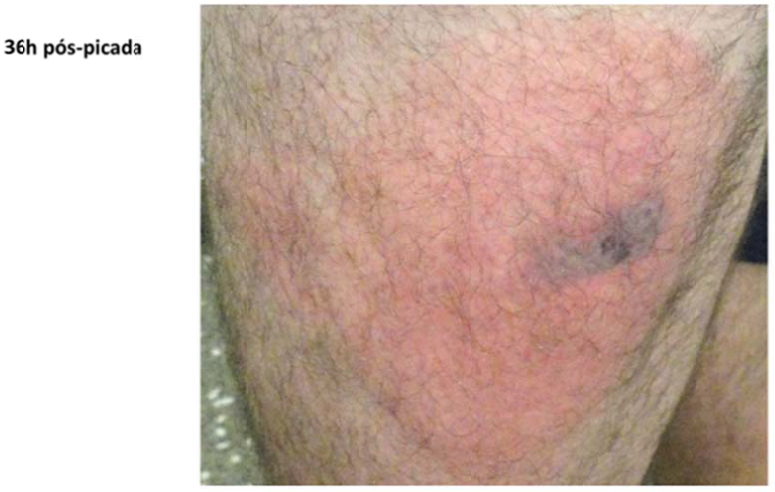

Gabarito

Aranha marrom (Loxosceles spp)

### Questão 6

Homem, 57a, procura assistência médica, referindo dor muscular e redução do débito urinário há uma semana. Antecedente pessoal: doença coronariana crônica e hipertensão arterial há 15 anos. Há um mês teve diagnóstico de infarto agudo do miocárdio, submetido a cateterismo cardíaco com colocação de stent farmacológico. Recebeu alta após uma semana de hospitalização com creatinina= 1,2 mg/dL, mantendo-se o uso de: losartana 50 mg, atenolol 50 mg, sinvastatina 40 mg, e iniciado omeprazol 20 mg/dia e ciprofibrato 100 mg. Creatinina= 6,4 mg/dL; ureia= 237mg/dL; AST= 1009 UI/L e ALT= 610UI/L; LDH= 3.090UI/L; K= 6,1mEq/L. O DIAGNÓSTICO ETIOLÓGICO DA LESÃO RENAL AGUDA É:

Gabarito

rabdomiólise

### Questão 7

Homem, 60a, procura Unidade Básica de Saúde com queixa de edema progressivo de membros inferiores há três semanas. Refere falta de ar há dois anos com piora progressiva nos últimos quatro meses, associada a perda de peso (6 kg). Antecedentes pessoais: tratamento para tuberculose por duas vezes, sendo o último há quatro anos. Trabalhou por 30 anos em produção de cerâmica, parou há dois anos por “fadiga”. Exame físico: cianose de extremidades; PA=112x74 mmHg; FR= 24 irpm; FC=112 bpm; oximetria de pulso (ar ambiente)= 82% em ar ambiente. Pulmões: murmúrio vesicular presente, estertores crepitantes contínuos e grosseiros; Coração: Bulhas rítmicas normofonéticas, sem sopros, Abdome: fígado palpável a 4 cm do rebordo costal direito; Edema simétrico de membros inferiores 3+/4+. Radiograma e tomografia computadorizada de tórax: ANEXO A .O DIAGNÓSTICO ETIOLÓGICO É:

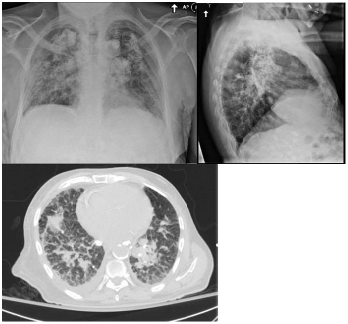

Gabarito

Silicose/doença relacionada à sílica

### Questão 8

Homem, 68a, queixa-se de dor de ouvido esquerdo, de forte intensidade, irradiada para pavilhão auricular. Relata aparecimento de lesões pruriginosas em orelha, região periauricular, além de vesículas em cavidade oral esquerda, há um dia. Refere embaçamento visual ipisilateral. ANEXO A. A HIPÓTESE DIAGNÓSTICA É:

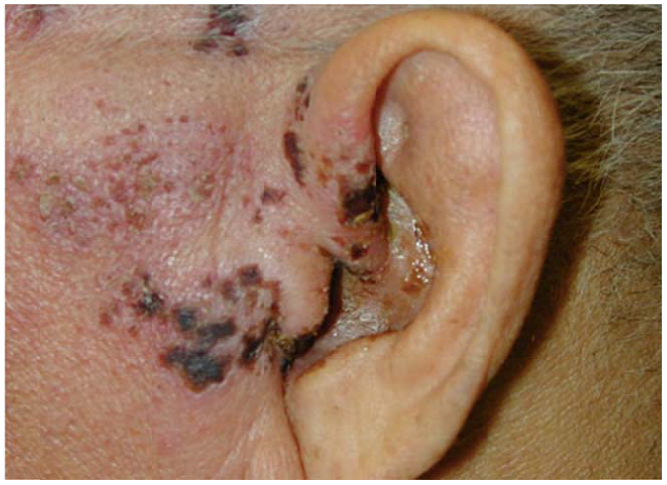

Gabarito

Herpes zoster ou síndrome de Ramsay Hunt

### Questão 9

Mulher, 55a, procura Unidade de Emergência com quadro de fraqueza. Tem diagnóstico de hipertensão arterial há vários anos e na última consulta sua medicação foi trocada de atenolol para metildopa por bradicardia sintomática. Exame físico: PA= 130x82mmHg, FC= 88bpm. Hb= 9,2g/dL; Ht= 28%, VCM= 91,8fL, HCM= 28,2pg, leucócitos= 7.180/mm3, plaquetas= 376.000/mm3; bilirrubina total= 3,4mg/dL; reticulócitos= 12%; Coombs direto positivo. O DIAGNÓSTICO ETIOLÓGICO É:

Gabarito

Anemia hemolítica autoimune/por metildopa

### Questão 10

Mulher, 56a, comparece em consulta de rotina, assintomática. Está preocupada pois participou de uma campanha de prevenção de diabetes na comunidade e seu exame de glicemia capilar foi de 222 mg/dL. Desde então reduziu a ingesta de açúcares e passou a fazer caminhadas diárias de 30 minutos. Antecedentes pessoais: hipertensão arterial há oito anos, em uso regular de besilato de anlodipino 10 mg/dia e enalapril 10 mg/dia. Exame físico: IMC= 31,6 kg/m2; PA= 132x78mmHg; FC= 78 bpm. Edema maleolar +/4. Glicemia de jejum= 158 mg/dL; sódio= 143 mEq/L; potássio= 4,1 mEq/L; colesterol total= 200 mg/dL; HDL= 73 mg/dL; LDL= 98 mg/dL; triglicérides= 210 mg/dL; HbA1c= 8,1%; relação albumina/creatinina em urina= 14,3 mg/g. A CONDUTA MEDICAMENTOSA É:

Gabarito

Metformina

### Questão 11

Homem, 47a, chega ao Pronto Atendimento referindo queda do estado geral há três dias, com febre e dor abdominal há um dia, acompanhado de aumento de volume abdominal. Antecedentes pessoais: cirrose hepática alcoólica em uso de espironolactona e furosemida. Exame físico: Regular estado geral, descorado +/4, ictérico ++/4, hidratado; PA= 108x58 mmHg; FC= 88 bpm. Abdome ascítico, doloroso à palpação, descompressão brusca negativa; edema maleolar 2+/4+. Hb= 10,4 g/dL: Ht= 31%; leucócitos= 14.700/mm3 (70% neutrófilos); plaquetas= 124.000/mm3; sódio= 132 mEq/L; potássio= 4,7 mEq/L; ureia= 84 mg/dL; creatinina= 1,2 mg/dL; glicemia de jejum= 94 mg/dL; AST= 48 U/L; ALT= 44 U/L; RNI= 1,6; bilirrubina total= 4,3 mg/dL; albumina= 2,9 g/dL. Líquido ascítico: citologia= 1320 células/mm3, (74% polimorfonucleares); albumina= 0,6 g/dL; glicose= 66 mg/dL; LDH= 102 UI/L. A HIPÓTESE DIAGNÓSTICA É:

Gabarito

Peritonite bacteriana espontânea /PBE (não considerar secundária: esta errado)

### Questão 12

Mulher, 24a, procura Unidade de Pronto Atendimento com história de febre não aferida, cefaleia retro-orbitária, mialgia, náuseas, vômitos e prostração há quatro dias. Relata vermelhidão no corpo há 12 horas. Antecedente pessoal: vacinação adequada para a idade. Exame físico: Bom estado geral, T= 37,5oC, PA= 122x74 mmHg, FC= 96bpm, FR= 16 irpm, anictérica e acianótica. Exantema em face e tronco, sem adenomegalia: ANEXO A. Exames laboratoriais: Hb= 12,0g/dL; Ht= 39%, leucócitos= 4.200/mm3, plaquetas 150.000/mm3. A HIPÓTESE DIAGNÓSTICA É:

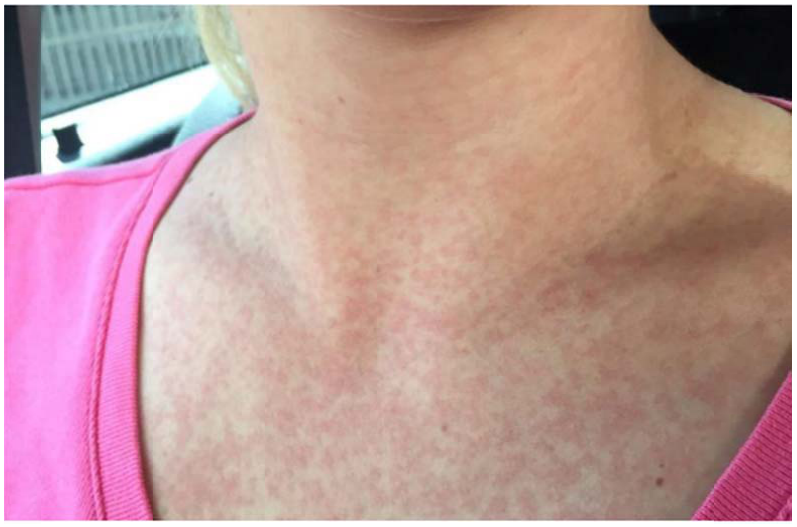

Gabarito

Dengue

## Cirurgia

### Questão 13

Homem, 70a, refere episódios de infecção urinária há um ano. Apresenta quadro de pneumatúria e fecalúria há 30 dias. A PRINCIPAL ETIOLOGIA DETERMINANTE DESSA CONDIÇÃO É:

Gabarito

Diverticulite (complicada) Doença diverticular/diverticulose/moléstia diverticular

### Questão 14

Mulher, 50a, procura atendimento médico com queixa de dispneia aos esforços que se acentua com o decúbito. Nega disfagia. Tomografia computadorizada: tumor heterogêneo com calcificações em seu interior na transição cérvico torácica à esquerda com desvio contralateral da traqueia e esôfago. ANEXO A QUAL É A PRINCIPAL HIPÓTESE DIAGNÓSTICA?

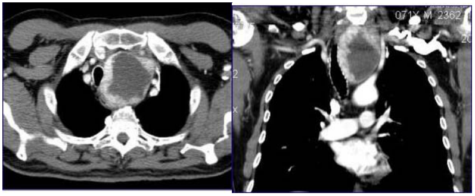

Gabarito

Bócio mergulhante/bócio

### Questão 15

O TEMPO DE ENCHIMENTO VENOSO SUPERIOR A 60 SEGUNDOS E TROMBOSE DE VEIAS SUPERFICIAIS EM UM DOENTE, TEM COMO HIPÓTESE DIAGNÓSTICA:

Gabarito

Oclusão arterial aguda

### Questão 16

Mulher, 62a, é atendida na Unidade Básica de Saúde apresentando queixa de dor abdominal em hipocôndrio direito associada a febre e icterícia há três dias. Tem diagnóstico de colelitíase com indicação de cirurgia eletiva, porém não conseguiu ser operada devido à pandemia de SARS-CoV-2. A ASSOCIAÇÃO DESTES TRÊS SINTOMAS É DENOMINADA:

Gabarito

Tríade de Charcot

### Questão 17

Mulher, 68a, procura a Unidade Básica de Saúde com queixa de fraqueza, cansaço e palpitação há quatro meses, principalmente após esforço como caminhada. Refere empachamento e perda ponderal de 5 Kg no período. Nega alteração do hábito intestinal, mas acha que as fezes estão escuras e fétidas. Exame físico: Bom estado geral, descorada 2+/4+, anictérica, acianótica. Abdome: tumoração palpável, endurecida, de limites imprecisos, indolor, em fossa ilíaca direita. Toque retal: sem alterações. A PRINCIPAL HIPÓTESE DIAGNÓSTICA É:

Gabarito

Neoplasia de ceco/cólon direito/cólon ascendente

### Questão 18

Mulher, 26a, apresenta-se no Pronto Socorro com história de dispneia progressiva há um mês. Refere vários atendimentos médicos anteriores com a mesma queixa, que melhoraram após uso de inalações com broncodilatadores. Neste atendimento foi repetida a inalação, sem melhora dos sintomas. Antecedente pessoal: traumatismo crânio encefálico há três meses, com internação em Unidade de Terapia Intensiva e ventilação mecânica invasiva por 10 dias. CONSIDERANDO A PRINCIPAL HIPÓTESE DIAGNÓSTICA, O EXAME A SER SOLICITADO É:

Gabarito

Broncoscopia / tomografia computadorizada tórax/ nasofibroscopia

### Questão 19

Homem, 52a, vítima de atropelamento com traumatismo cranioencefálico grave, foi trazido por populares ao Hospital de Clínicas da Unicamp. Foram realizados o atendimento inicial e os procedimentos cirúrgicos necessários. RT-PCR SARS-CoV-2: reagente na admissão. Na quarta semana de internação evoluiu para óbito secundário a choque séptico. DE QUEM É A RESPONSABILIDADE PELO PREENCHIMENTO DA DECLARAÇÃO DE ÓBITO?

Gabarito

IML/Instituto Médico Legal/Médico Legista

### Questão 20

Mulher, 27a, vítima de colisão frontal de carro contra carro, é trazida pelo SAMU ao hospital terciário. Exame físico: consciente e orientada, PA= 96x68mmHg, FC= 112bpm, FR= 18irpm, oximetria de pulso (ar ambiente)= 98%. Cabeça, pescoço, tórax e extremidades sem alterações; abdome: presença de abrasão horizontal linear, ao nível do umbigo, dor a palpação profunda e descompressão brusca indolor. Tomografia de abdome: lesão hepática Grau II sem sinais de extravasamento de contraste, líquido peri-hepático em moderada quantidade e pneumoperitônio. Amilase= 123mg/dL, hematócrito= 38% e hemoglobina= 12,4g/dL. A INDICAÇÃO DA LAPAROTOMIA FOI BASEADA NO ACHADO DE:

Gabarito

Pneumoperitônio

### Questão 21

Homem, 22a, sofreu queda de motocicleta em autoestrada, é trazido pelo Atendimento Pré-Hospitalar Básico com cânula de Guedel e máscara de oxigênio não reinalante com 15L/min. Exame físico na Sala de Emergência: PA= 113x84mmHg, FC= 102bpm, FR= 20irpm, oximetria de pulso= 99%; Neurológico: Escala de Coma de Glasgow= 7 e pupilas anisocóricas (direita > esquerda). Realizados: punção de um acesso venoso periférico calibroso, infusão intravenosa de 500mL de solução cristaloide aquecida e coleta de sangue para tipagem sanguínea. A CONDUTA A SEGUIR É:

Gabarito

Intubação orotraqueal/via aérea definitiva/intubação nasotraqueal/ cricotireoidostomia

### Questão 22

Homem, 57a, refere dificuldade em se alimentar com alimentos sólidos e depois a líquidos há três meses, associada a perda de peso de 5 Kg no período. Há uma semana apresenta tosse todas as vezes que tenta ingerir líquidos e com a própria saliva. Antecedente pessoal: alcoolista e tabagista há longo tempo. A endoscopia mostra uma lesão vegetante e estenosante de esôfago a 22 cm da arcada dentária superior. A COMPLICAÇÃO CLÍNICA DESCRITA HÁ UMA SEMANA ASSOCIADA A ESSE DIAGNÓSTICO É:

Gabarito

Fistua traqueoesofagica/esofagotraqueal/broncoaspiração

### Questão 23

Homem, 34a, vítima de queimaduras ao acender churrasqueira com combustível há uma hora, é trazido por familiares ao Pronto Socorro. Exame físico: consciente, orientado, PA= 132x84mmHg, FC= 112bpm, FR= 16irpm, oximetria de pulso (ar ambiente)= 98%; Peso= 70Kg. Área de queimaduras distribuídas nas regiões do tórax anterior (5% de primeiro grau e 13% de segundo grau) e nos membros inferiores (8% de primeiro grau e 9% de segundo grau). O VOLUME DE SOLUÇÃO CRISTALOIDE A SER ADMINISTRADO NAS PRÓXIMAS 7 HORAS É:

Gabarito

1540 ml a 3080 ml

### Questão 24

Mulher teve o diagnóstico de câncer de intestino grosso aos 49 anos. Seus filhos procuram a Unidade Básica de Saúde para orientação sobre riscos e necessidade de rastreamento. NESTA SITUAÇÃO, A COLONOSCOPIA ESTÁ INDICADA A PARTIR DE QUAL IDADE?

Gabarito

39 anos/10 anos antes da idade do diagnóstico materno

## Pediatria

### Questão 25

Criança de 40 semanas de idade gestacional nasce de parto vaginal com líquido amniótico meconial espesso e apresenta-se hipotônico ao nascimento. O cordão umbilical foi clampeado imediatamente e o recém-nascido colocado sobre o berço de calor radiante para avaliação. Dentro dos passos iniciais da reanimação foram realizados, em sequência, posicionamento do pescoço em leve extensão, aspiração de boca e narinas e secagem do paciente. Na reavaliação, recém-nascido encontra-se com respiração irregular e frequência cardíaca de 50bpm. A CONDUTA A SEGUIR É:

Gabarito

Ventilação com pressão positiva com máscara em ar ambiente.

### Questão 26

Criança, 2a, com história de quadro de início súbito de tosse seca e “metálica”, rouquidão e dificuldade para respirar, na madrugada. Mãe nega história de febre, coriza, engasgo e conta melhora do quadro no trajeto ao serviço. Vacinação atualizada. Exame físico: Bom estado geral, FC= 97bpm, FR= 41irpm T= 36,7oC. Leve estridor laríngeo com retração de fúrcula. Pulmões: Murmúrio vesicular presente simétrico. A HIPÓTESE DIAGNÓSTICA É:

Gabarito

Crpe espasmódico (ou laringite espasmódica ou laringite estridulosa).

### Questão 27

Recém-nascido a termo (39 semanas) com duas horas de vida, internado em uma maternidade de referência, encontra-se ictérico e a dosagem laboratorial de bilirrubina sérica é de 9mg/dL. Mãe secundigesta com tipagem sanguínea A Rh negativo e teste de Coombs indireto positivo nesta gestação. A CONDUTA TERAPÊUTICA IMEDIATA É:

Gabarito

Fototerapia de alta intensidade.

### Questão 28

Ao retornar ao trabalho, após licença maternidade de 120 dias, a mãe solicita orientações de como armazenar o leite ordenhado. PARA GARANTIR SUA QUALIDADE E VALIDADE, O LEITE MATERNO DEVE SER MANTIDO EM REFRIGERAÇÃO (5oC) POR UM TEMPO MÁXIMO DE:

Gabarito

12 horas.

### Questão 29

Menino, 15m, é trazido à consulta médica com história de dificuldade para ganhar peso progressiva após os oito meses de vida. A mãe diz que está mais irritado e inapetente, que apresentou aumento das evacuações, com fezes muito fétidas, pálidas, em grande quantidade. Alimentação: leite materno com introdução da dieta da família a partir do sexto mês. Nega infecções recorrentes. Exame físico: Irritado, pálido com peso e altura em queda progressiva na curva de referência. Abdômen: distendido, diminuição de gordura subcutânea e da massa muscular com proeminente hipotrofia de glúteos. Biopsia intestinal: relação vilo/cripta 1:1, linfócitos intraepiteliais e infiltrado de linfócitos e plasmócitos em lâmina própria. O TRATAMENTO A SER INSTITUÍDO É:

Gabarito

Dieta isenta de glúten.

### Questão 30

Recém-nascido a termo com peso adequado, apresenta dosagem aumentada do Tripsinogênio Imunorreativo no teste do pezinho colhido no terceiro dia e na terceira semana de vida. O EXAME A SER REALIZADO É:

Gabarito

Dosagem de sódio e cloro no suor/teste do suor/dosagem de cloro no suor/dosagem de cloreto no suor.

### Questão 31

Lactente, 3m, previamente hígido, é trazido a emergência com história de coriza e obstrução nasal há quatro dias e febre hoje. Medicamentos em uso: descongestionante nasal e antitérmicos. Exame físico: ativo e reativo, FC= 186bpm, PA= 95x52mmHg, FR= 40irpm, T= 40,2oC, sudorese profusa, pulsos cheios, perfusão periférica= 2 segundos, midríase bilateral, hiperreflexia, fontanela normotensa, pele sem lesões. O DIAGNÓSTICO SINDRÔMICO É:

Gabarito

Síndrome simpatomimética.

### Questão 32

Menino, 2 anos e 5 meses, previamente hígido, é trazido a Unidade Básica de Saúde, com história de inchaço lento e progressivo nos olhos e pés há 10 dias e redução do volume urinário há um dia. Exame físico: bom estado geral, descorado+/4+; PA no percentil 50 para idade e sexo; abdome: semicírculos de Skoda a 2 cm da cicatriz umbilical, fígado a 1 cm do rebordo costal direito com borda fina, consistência elástica e hepatimetria de 6 cm; baço não percutível; genital: edema de bolsa escrotal sem eritema ou aumento da temperatura; membros inferiores: edema frio e depressível em face interna dos tornozelos até terço médio das pernas, bilateralmente; olhos: edema bipalpebral, sem secreção ou hiperemia. O DIAGNÓSTICO SINDRÔMICO É:

Gabarito

Síndrome nefrótica.

### Questão 33

Menino, 4m, hígido, sem uso de medicamentos, é trazido à Unidade Básica de Saúde para atualização do calendário vacinal. Mãe refere que o filho apresentou convulsão em vigência de febre um dia após as vacinas dos dois meses e nega efeitos colaterais após a vacina administrada aos tres meses de idade. QUAL VACINA A CRIANÇA DEVE RECEBER EM UM CENTRO DE REFERÊNCIA PARA IMUNOBIOLÓGICOS ESPECIAIS?

Gabarito

DTPa/hexavalente/pentavalente acelular/vacina acelular.

### Questão 34

Menino, 45 dias, vem para puericultura com história de irritabilidade e lesões pelo corpo há 15 dias. Nega febre, vômitos, inapetência e uso de medicamentos. Hábito urinário e intestinal normais. Leite materno exclusivo. Vacinação em dia. Exame físico: bom estado geral, ganho ponderal de 35g/dia desde a última consulta, fontanela normotensa. Pele: ANEXO A. A HIPÓTESE DIAGNÓSTICA É:

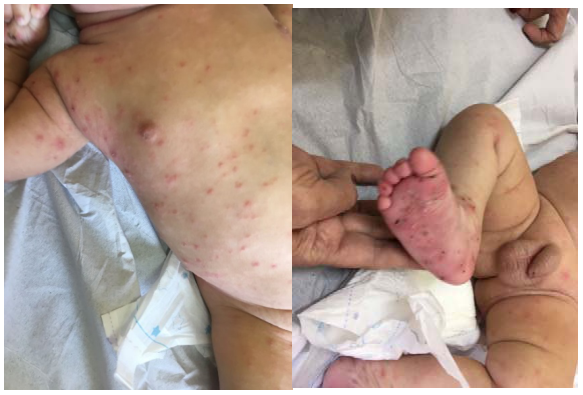

Gabarito

Escabiose.

### Questão 35

Menino, 15m, vem para consulta de puericultura trazido por tia materna. Não apresenta queixas atuais. Vacina em dia. Desenvolvimento neuropsicomotor adequado para idade. Alimentação: não sabe referir adequadamente, pois não é a cuidadora da criança. A curva de Índice de Massa Corporal (OMS): ANEXO A. O DIAGNÓSTICO NUTRICIONAL É:

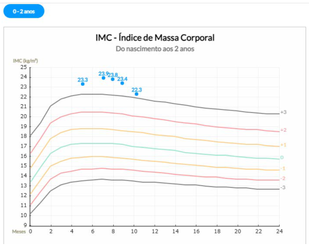

Gabarito

Obesidade.

### Questão 36

Menino, 5a, estava sentado nos ombros do pai quando sofreu queda com trauma na região frontal do crânio no solo. O pai mede cerca de 1,80m. Ele conta que o filho chorou muito e apresentou um episódio de vômito. Nega dor de cabeça e perda de consciência. Exame físico: acordado, movimenta os quatro membros e comunica-se normalmente; hematoma subgaleal em região frontal; otoscopia e rinoscopia normais. A CONDIÇÃO DESCRITA QUE APONTA O RISCO ALTO (PECARN), COM NECESSIDADE DE TOMOGRAFIA DE CRÂNIO OU OBSERVAÇÃO HOSPITALAR É:

Gabarito

A altura maior que 1,5m/altura/altura de 1,80m

## Ginecologia e Obstetrícia

### Questão 37

Gestante, 35a, G5P3A1, procura maternidade com queixa de cefaleia de forte intensidade há um dia. Nega sintomas respiratórios. Refere boa movimentação fetal. Exame físico: PA= 153x102mmHg, altura uterina= 34cm, BCF= 134bpm. Edema em membros inferiores e superiores 3+/4+ e em abdome. Saturação O2= 98% (ar ambiente). Fita urinária: 2+/4+ de proteína. Cartão pré-natal:
A CONDUTA MEDICAMENTOSA INICIAL É:

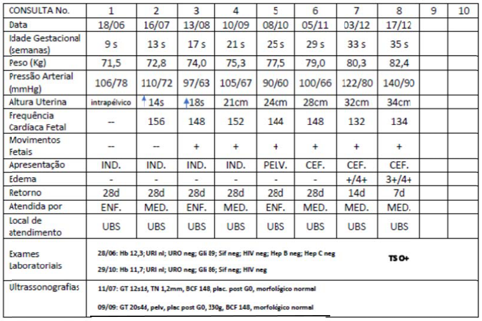

Gabarito

Sulfato de Magnésio

### Questão 38

Mulher, 25a, G2P1A0, Idade Gestacional= 22 semanas, com parto espontâneo às 28 semanas em gestação anterior, deu entrada na maternidade com queixa de dor em baixo ventre e secreção vaginal. Exame obstétrico: altura uterina 21cm, dinâmica uterina ausente, batimentos cardíacos fetais: 140 bpm; especular: ausência de sangramento, presença de muco fisiológico em colo uterino e ausência de leucorreia; toque vaginal: colo medianizado, amolecido, 50% esvaecido, orifício externo entreaberto. Ultrassonografia: colo uterino medindo 20mm, com abertura de orifício interno e herniação de membrana amniótica pelo canal cervical, com aspecto de funil. A CONDUTA É:

Gabarito

Cerclagem ou Circlagem Uterina/ Cerclagem ou Circlagem de emergência / Pessário em colo uterino pode estar em associação com progesterona. Progesterona isolado não aceitar

### Questão 39

Mulher, 24a, G1P0A0, idade gestacional de 11 semanas e 6 dias, vem para avaliação de exames de rotina pré-natal. Hb= 11,6g/dL, Ht= 33%, glicemia de jejum= 91mg/dL; Exame sumário de urina= normal, Urocultura= negativa, VDRL= não reagente, HIV= não reagente, Toxoplasmose: IgG= reagente e IgM= reagente. PARA ELUCIDAÇÃO DIAGNÓSTICA DEVE-SE SOLICITAR:

Gabarito

Teste de avidez de IgG para toxoplasmose/ aceitar avidez de IgG

### Questão 40

Primigesta com 31 semanas vem encaminhada da Unidade Básica de Saúde a um centro de referência por diminuição de movimentos fetais, sem contrações e sem perdas vaginais. Exame físico: PA= 106X67mmHg, FC= 86bpm, altura uterina= 26 cm, apresentação cefálica, sem rechaço à palpação uterina, BCF= 144bpm; membros sem edema. Ultrassonografia realizada há 7 dias observou feto cefálico, com peso no percentil 1 e índice de líquido amniótico 54mm. Realizada cardiotocografia hoje= normal. A CONDUTA SUBSEQUENTE É:

Gabarito

Dopplerfluxometria fetal/ Ultrassonografia com Doppler/ Ecografia com Doppler

### Questão 41

Mulher, 37a, G4PV3A0, em puerpério imediato de parto vaginal, sem episiotomia e sem lacerações. Após uma hora de dequitação apresentou sangramento vaginal intenso. Exame físico: PA= 102x58mmHg, FC= 120bpm, FR= 22ipm, oximetria de pulso (ar ambiente)= 98%; exame obstétrico: útero de consistência amolecida, palpável a 3cm acima da cicatriz umbilical. Após monitorização, suporte hemodinâmico e administração de uterotônicos e de ácido tranexâmico, mantém sangramento aumentado. A PRÓXIMA CONDUTA É:

Gabarito

Avaliação da presença de restos placentários/ curetagem uterina/ curagem uterina (aceitar manobra de Hamilton ou compressão bi-manual uterina) não se faz balão ou B-linch antes de avaliar restos ovulares.

### Questão 42

Mulher, 42a, G4P3A1, comparece ao serviço de emergência com queixa de aumento do volume abdominal há dois meses com piora progressiva. Há três dias refere inapetência e dificuldade para respirar pelo aumento da barriga. Exame físico: Regular estado geral, descorada 2+/4+, emagrecida. FR= 26irpm, PA= 102x74mmHg, FC= 96bpm, oximetria de pulso (ar ambiente)= 96%; abdome: volumoso com massa palpável de 10cm em mesogastro e sinal de Piparote positivo. Ultrassonografia de abdome= ascite volumosa, omento tumoral, sinais de implantes tumorais em peritoneo em região de goteiras parietocólicas, pelve e subdiafragmática. Tumoração ovariana sólida bilateral com superfície irregular e vascularização aumentada (ovário direito= 150cm3 e ovário esquerdo= 210cm3). Antígeno carcinoembrionário = 45ng/mL e CA 125= 220U/mL. A PRINCIPAL HIPÓTESE DIAGNÓSTICA DA TUMORAÇÃO OVARIANA É:

Gabarito

Tumor metastático ou metástase (estomago, intestino, mama, pâncreas, tireoide) Tumor de Krukenberg

### Questão 43

Mulher, 54a, procura atendimento ginecológico na atenção primária por episódios de sangramento via vaginal em pequena quantidade há quatro meses. Antecedente pessoal: menopausa há dois anos, com exames periódicos atualizados com resultados normais. Exame físico: IMC= 27Kg/m2. A CAUSA MAIS PROVÁVEL DO SANGRAMENTO É:

Gabarito

Atrofia endometrial

### Questão 44

Mulher, 45a, submetida a mastectomia radical à esquerda há cinco anos por carcinoma ductal invasivo, estadio IIa, encontra-se assintomática e sem uso de medicação. A avaliação clínica e mamográfica realizadas hoje não apresentam evidência de doença. EM QUANTO TEMPO DEVERÁ SER REALIZADA A PRÓXIMA MAMOGRAFIA?

Gabarito

12 meses/1ano

### Questão 45

Mulher, 30a, nuligesta, com queixa de sangramento menstrual aumentado há um ano, com ciclos menstruais regulares com duração de sete dias, desejando tratamento. Última menstruação há 10 dias. Método contraceptivo: preservativo masculino. Antecedente pessoal: enxaqueca com aura. Exame físico: IMC= 29Kg/m2; descorada 1+/4. Hb= 9,5g/dL, Ht= 28%. FSH, LH, TSH e prolactina normais. Ultrassonografia transvaginal: útero e ovários de tamanho e forma adequados para a idade, sem anormalidades. A TERAPIA HORMONAL INDICADA É:

Gabarito

Uso de progestagênio (via oral, injetável, dispositivo intrauterino ou implante)

### Questão 46

Mulher, 42a, comparece à Unidade Básica de Saúde com queixa de ondas de calor intensas que dificultam seu sono; tem acordado seis vezes durante a noite com ondas de calor. Antecedentes ginecológicos: cirurgia de câncer de ovário há oito meses, com realização de histerectomia total e anexectomia bilateral, com anatomopatológico de carcinoma epitelial de ovário. Não apresenta outros antecedentes mórbidos. A TERAPIA HORMONAL INDICADA É:

Gabarito

Terapia hormonal sistêmica com estrogênios isolados, Resposta aceitáveis: estradiol via oral ou transdérmico, estrogênios, terapia com estrogênio, tibolona.

### Questão 47

Mulher, 25a, retorna à Unidade Básica de Saúde para resultado de primeira colpocitologia oncológica (CO) realizada há um mês. Antecedente pessoal: diagnóstico de infecção pelo HIV há dois anos. CO= células escamosas atípicas de significado indeterminado (ASC-US). A CONDUTA É:

Gabarito

Exame de colposcopia.

### Questão 48

Mulher, 27a, com gestação de 39 semanas, interna em trabalho de parto espontâneo. Antecedentes obstétricos: primigesta, com pré-natal realizado em Unidade Básica de Saúde e sem intercorrências gestacionais, em uso de sulfato ferroso em dose profilática. Antecedentes pessoais: sem comorbidades, alergias ou cirurgias prévias, nega tabagismo ou uso de outras substâncias. Partograma:
O DIAGNÓSTICO DA EVOLUÇÃO DO TRABALHO DE PARTO É:

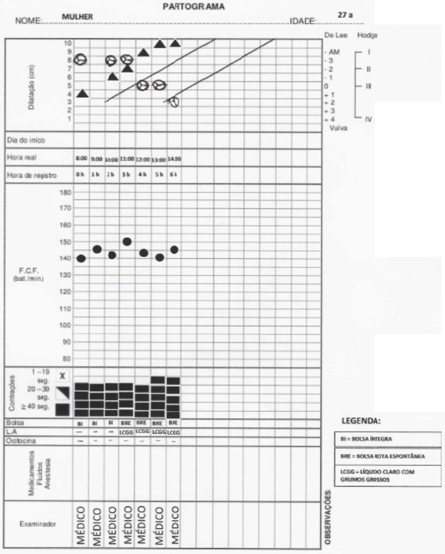

Gabarito

Trabalho de parto fisiológico (trabalho de parto eutócico/ trabalho de parto normal

## Saúde Coletiva

### Questão 49

De acordo com os dados da Figura abaixo: Forest plot para a associação de comorbidades (diabetes, hipertensão, doença renal crônica e câncer) com desfechos graves de covid-19. ANEXO A CONSIDERANDO O MODELO DE EFEITOS ALEATÓRIOS, CITE A CONDIÇÃO CRÔNICA ESTATISTICAMENTE ASSOCIADA COM DESFECHOS GRAVES DE COVID-19:

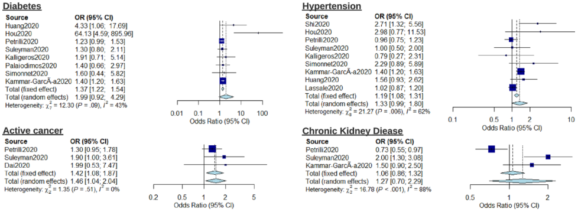

Gabarito

Câncer (ativo)/active cancer/neoplasia

> **Enunciado para as questões 50, 51:**
>
> Para avaliar a ocorrência de câncer de próstata em homens com idade ≥ 50 anos, alguns médicos realizaram o atendimento - anamnese e toque prostático - de 600 indivíduos, em um mês. Eles verificaram que a média de idade era de 62 anos; 38,6% relataram história familiar de câncer; 58,4% eram fumantes ou ex-fumantes e 40,5% consumiam bebidas alcoólicas regularmente. No exame foi possível observar que 28,9% apresentaram próstata aumentada; 3,9% superfície prostática irregular; 11,3% assimétrica; 2% com consistência pétrea. Foram solicitadas e realizadas 40 biópsias e 15 apresentaram resultado positivo para adenocarcinoma prostático.

### Questão 50

CITE O DESENHO DE ESTUDO EPIDEMIOLÓGICO:

Gabarito

Estudo seccional ou transversal ou de prevalência

### Questão 51

A OCORRÊNCIA DE CASOS POR 1000 HOMENS FOI DE:

Gabarito

15/600=25/1000 homens ou 25 para cada 1000 homens/25

### Questão 52

Uma universidade realiza atividades de extensão em ocupação caracterizada por barracos de madeira, fornecimento precário de água e eletricidade, ausência de saneamento básico e presença de grande quantidade de cães e gatos. Durante o exame físico de crianças entre quatro e seis anos de idade foram observadas lesões no couro cabeludo com placa de alopécia e sem prurido. As crianças apresentaram melhora após seis semanas de uso de griseofulvina. A HIPÓTESE DIAGNÓSTICA É:

Gabarito

Tinea capitis/ tinha capitis/ tinea/ tinea couro cabeludo

### Questão 53

Equipe de saúde da família responsável por comunidade com famílias vulneráveis, com alta taxa de desemprego e predomínio de crianças e adultos jovens tem elaborado Projetos Terapêuticos Singulares, durante reuniões semanais, em parceria com pediatria, psicologia, assistência social e terapia ocupacional. O ARRANJO OU DISPOSITIVO COMPOSTO POR EQUIPES MULTIPROFISSIONAIS PARA AMPLIAR AS OFERTAS DE SAÚDE NA REDE DE SERVIÇOS, A RESOLUTIVIDADE, A ABRANGÊNCIA E O ALVO DAS AÇÕES É:

Gabarito

Núcleo ampliado de saúde da família/NASF/Núcleo de apoio de saúde da família

### Questão 54

Homem, 50a, casado, trabalha na mesma empresa há 20 anos, sendo 15 como técnico em telecomunicações. Há cinco anos, a empresa iniciou processo de reestruturação e o promoveu para o cargo de gerente. As novas atribuições incluem a demissão de muitos funcionários antigos e contratação de novos trabalhadores terceirizados para reduzir os custos da empresa. As sucessivas mudanças de diretrizes e metas da empresa, o levaram a trabalhar até mais tarde praticamente todos os dias, incluindo muitos fins de semana, para dar conta de seu trabalho. Nos últimos meses, tem se sentido extremamente cansado, ansioso, tenso e com episódios de insônia. Além da exaustão física e mental, sente que está sendo exigido além do seu limite emocional, tornando-se irritado e impaciente, ao contrário de como se sentia antes. Percebe que passou a evitar os colegas de trabalho e, até mesmo, alguns clientes. Não sente mais prazer nas atividades de trabalho, tem dificuldade em tomar decisões, refere "brancos" de memória, desesperança e sentimento de desvalorização pessoal. Nas últimas semanas, manifestou vontade de morrer, o que o levou a buscar o serviço de saúde. TRATA-SE DE UM CASO DE:

Gabarito

Burnout, Síndrome de Burnout, ou esgotamento profissional.

### Questão 55

Homem, 28a, bancário, procurou serviço médico com queixas de desânimo, ideação suicida e insônia há três meses. Conta que há um ano o novo gerente da agência passou a divulgar um ranking dos melhores e piores vendedores de seguros, ameaçando de demissão aqueles que permanecerem na parte de baixo da lista. Relata que, desde então, seu nome é citado como um mau exemplo nas reuniões mensais da equipe. Sente-se humilhado e percebe distanciamento dos colegas de trabalho. AS ATITUDES DO GERENTE E DOS COLEGAS DE TRABALHO SÃO CARACTERIZADAS COMO:

Gabarito

Assédio moral/violência psicológica/ bullying/ agressão moral/ assédio

### Questão 56

Um serviço de saúde tem apresentado problemas de comunicação entre os profissionais, conflitos e baixa responsabilização global pelo paciente. Uma análise do organograma gerencial demonstrou que as funções de coordenação estão associadas às profissões (cada profissão tem sua chefia e o seu sistema de gerenciamento separado). Desta forma, profissionais que trabalham lado a lado com o mesmo paciente, se reportam a coordenações diferentes. A Política Nacional de Humanização propõe a reorganização do organograma de forma que trabalhadores responsáveis pelos mesmos pacientes sejam da mesma equipe e tenham a mesma coordenação. ESSA DIRETRIZ É DENOMINADA:

Gabarito

equipe de referência e apoio matricial/equipe de referência

### Questão 57

Mulher, 66a, hipertensa, diabética e dislipidêmica, buscou a Unidade Básica de Saúde para acompanhamento das doenças crônicas e renovação de suas receitas, entre elas a sinvastatina. Paciente assídua, segue as recomendações médicas, participa de grupo de caminhada, toma os fármacos prescritos. Seus pedidos de exames laboratoriais também precisavam ser renovados, pois o laboratório do município estava com falta de insumos e sem previsão de realizá-los nos próximos três meses. Ao ser questionada sobre a possibilidade de ela pagar pelos exames na rede privada, respondeu constrangida que não pode pagar. BASEADO NA CONDUTA ÉTICA O PRINCÍPIO DO SUS A SER SEGUIDO É:

Gabarito

Equidade

### Questão 58

A PRÁTICA DE INTERVENÇÕES QUE FALHAM EM RESTAURAR, CURAR OU QUE SÃO INCAPAZES DE PRODUZIR ALGUM BENEFÍCIO SIGNIFICATIVO PARA O PACIENTE, NÃO CONSIDERANDO A QUALIDADE DE VIDA PRESUMIVELMENTE ALCANÇÁVEL, E QUE DESRESPEITAM A DECISÃO COMPARTILHADA ENTRE PACIENTES E FAMILIARES, É CONHECIDA COMO:

Gabarito

Distanásia/futilidade/obstinação terapêutica

### Questão 59

Homem, 42a, procura atendimento médico com dores abdominais em cólica há dois dias sem melhora com antiespasmódico. Antecedente profissional: trabalhador de uma cerâmica, com exposição a algumas substâncias químicas, há dois anos. Exame físico: palidez cutânea 2+/4; abdome: dores à palpação abdominal, sem sinais de abdome agudo. Ultrassonografia abdominal sem alterações. A HIPÓTESE DIAGNÓSTICA É:

Gabarito

Intoxicação por chumbo/saturnismo/plumbismo

### Questão 60

Em geral as profissões de saúde e as respectivas especialidades conseguem definir claramente, cada uma, a sua prioridade em relação a um mesmo paciente. QUANDO UMA EQUIPE MULTIPROFISSIONAL SE REÚNE PARA CONSTRUIR UM PROJETO TERAPÊUTICO SINGULAR, A PRIMEIRA TAREFA É CHEGAR A UM CONSENSO SOBRE:

Gabarito

Diagnósticos/problemas/prioridades/necessidades (do paciente)

