# UNICAMP 2023 – Acesso Direto – Prova 2 (tarde)

- Formato: Resposta curta (discursiva)
- Tipo: regular
- Data de aplicação: 2022-12-20
- Questões: 60
- Prova original: https://www.comvest.unicamp.br/residenciamedica2023/provas/dAD.pdf
- Gabarito oficial: https://www.comvest.unicamp.br/residenciamedica2023/resp_esperadas/resp_ad.pdf (retificado em 02/01/2023)

Valores de referência dos exames laboratoriais

Valor de referência exames laboratoriais:

| Parâmetro | Valor de normalidade |
|---|---|
| Ácido fólico | 3,1 a 20,5 ng/dL |
| Albumina plasmática | 3,5 a 5,2 g/dL |
| ALT (TGP) | Homem <41UI/L; mulher < 33 UI/L |
| AST (TGO) | Homem < 40 UI/L; mulher < 33 UI/L |
| Atividade plasmática de renina | 0,6 a 4,18 ng/ml/h (ortostática) 0,32 a 1,84 ng/ml/h (supino) |
| Bilirrubina total | 0,3 a 1,2 mg/dL |
| Cálcio | 8,8 a 10,2 mg/dL |
| CPK (creatina fosfoquinase) | 0 a 171 UI/L |
| CK-mb (creatinaquinase fração mb) | 0 a 24 UI/L |
| Cloro | 98 a 106 mmol/L |
| Colesterol total | < 200 mg/dL |
| Colesterol HDL | Homem ≥ 40 mg/dL; mulher ≥ 50 mg/dL |
| Colesterol LDL | < 100 mg/dL |
| Creatinina | Homem: ≤ 1,2 mg/dL Mulher: ≤ 0,8 mg/dL |
| Cortisol urinário | 3,5 a 4,5 mcg/24h |
| Ferritina | Homem: 30 a 400 ng/mL; mulher 13 a 150 ng/mL |
| Ferro sérico | Homem: 70 a 180 µg/dL; mulher 60 a 180µg/dL |
| Fibrinogênio | 175 a 400 mg/dL |
| Fosfatase alcalina | Homem: 40 a 129UI/L; mulher 35 a 103UI/L |
| Fósforo | 2,5 a 4,5 mg/dL |
| Glicemia jejum | 60 a 99 mg/dL |
| Hemograma | Hemoglobina: homem 14-18 g/dL; mulher 12 a 16 g/dL Hematócrito: homem 41-52%; mulher 36 a 46% Leucócitos: 4.000 a 10.000/mm3 (segmentados 2.000 a 8.000/mm3; linfócitos 1.000 a 4.000/ mm3; monócitos 200 a 800/mm3;eosinófilos < 450/mm3, basófilos <200/ mm3) Plaquetas: 150.000 a 450.000/mm3 VCM: 80 a 99 fL HCM 27 a 32 pg Reticulócitos: 50.000 a 100.000/ mm3 |
| Hemoglobina glicada (HbA1c) | 4,0 a 5,6% |
| Metanefrinas urina | < 400 mcg/24h (totais < 1300 mcg/24h) |
| Paratormônio (PTH) | 15 a 65 pg/mL |
| Potássio | 3,5 a 5,1 mEq/L |
| Proteína C reativa | Processo inflamatório: 10-50 mg/L (leve); 50-100 mg/dL (moderado); > 100 mg/dL (grave) Risco cardiovascular: < 1 mg/dL (baixo); 1-3 mg/dL (médio); > 3 mg/dL (alto) |
| RNI (TP) | Até 1,25 |
| R (TTPA) | Até 1,3 |
| Sódio | 135 a 145 mEq/L |
| TIBC | 255 a 450µg/dL |
| Troponina T | 0 a 14 ng/L |
| Triglicérides | < 150 mg/dL |
| TSH | 0,3 a 4,2 µUI/mL |

| T4livre | 0,9 a 1,7 ng/dL |
|---|---|
| Vitamina B12 | 200 a 900 pg/mL |
| Vitamina D | 31 a 100 ng/mL |
| Ureia | 17 a 43 mg/dL |
| Exame de urina | Leucócitos < 5/campo Hemácias < 5/campo Proteína negativo/traços |
| Relação albumina/creatinina urinária | < 30 mg/g |
| Relação proteína/creatinina urinária | < 0,20 |

| Gasometria | Arterial | venosa |
|---|---|---|
| pH | 7,35 a 7,45 | 7,33 a 7,43 |
| pO2 | 83 a 108 mmHg | 38 a 50 mmHg |
| pCO2 | 32 a 48 mmHg | 31 a 54 mmHg |
| HCO3 | 18 a 23 mmol/L | 18 a 23 mmol/L |
| Lactato | 0,5 a 1,6 mmol/L | 0,5 a 1,6 mmol/L |
| Cálcio iônico | 1,15 a 1,29 mmol/L | 1,15 a 1,29 mmol/L |

## Clínica Médica

### Questão 1

Mulher, 59a, queixa-se de cefaleia desde os 19 anos caracterizada por dor hemicraniana (mas com variação de lateralidade nas crises), pulsátil, associada a fotofobia e náuseas, piora com esforço. Nega sintomas precedentes, exceto fadiga inespecífica. Refere que os episódios eram muito raros, mas atualmente tem apresentado cerca de seis crises ao mês, sem qualquer mudança de característica, o que tem atrapalhado sua atividade laboral. Antecedentes: constipação intestinal (1 evacuação a cada 15 dias); tabagismo 30 anos-maço e doença pulmonar obstrutiva crônica. Exame físico: PA=112x72mmHg; FC=56bpm; FR=14irpm; IMC=33,2Kg/m2; Exame físico geral e neurológico: sem alterações. CONSIDERANDO O CASO ACIMA, O MEDICAMENTO INDICADO PARA A PROFILAXIA DAS CRISES É:

Gabarito

Topiramato

### Questão 2

Mulher, 37a, é avaliada por surgimento de placas brancas nos membros superiores e inferiores, progressivamente maiores nos últimos quatro meses. Nega dor ou prurido associado e não faz uso de medicações. Exame físico: T=36,8oC; PA=116x82mmHg; FC=76bpm; FR=14irpm. Pele: presença de máculas acrômicas circulares e coalescentes em pernas, antebraços e mãos (Figura Q2, anexo). Este quadro clínico pode estar associado a outras doenças. O EXAME COMPLEMENTAR INDICADO PARA INVESTIGAR A COMORBIDADE MAIS FREQUENTE NESTE CASO É:

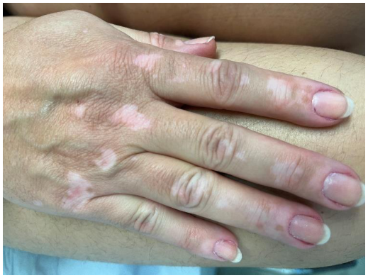

Gabarito

TSH ou avaliação de função tireoidiana ou antiTPO ou anti tireoglobulina

### Questão 3

Homem, 37a, foi trazido ao Pronto Atendimento com insuficiência respiratória e evoluiu para óbito. Achados da necropsia: ápice do lobo superior pulmonar esquerdo apresentando cavidades, contendo material necrótico nas paredes e múltiplos pequenos nódulos no parênquima subjacente, denotando destruição pulmonar progressiva no sentido do ápice para base (Figura Q3, anexo). A HIPÓTESE DIAGNÓSTICA É:

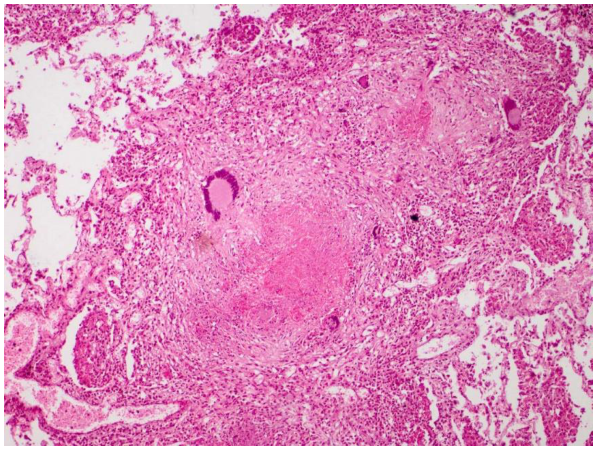

Gabarito

Tuberculose, tuberculose pulmonar, tuberculose secundária

### Questão 4

Homem, 62a, apresenta uma lesão pápulo nodular, perlácea, em região de asa nasal esquerda há dois anos, de crescimento lento. Foi realizada uma biópsia e o exame histopatológico está representado na figura anexa (Figura Q4- anexo). A HIPÓTESE DIAGNÓSTICA É:

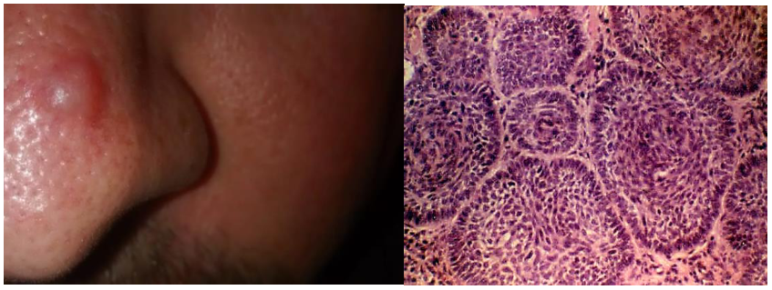

Gabarito

Ca basocelular, CBC, carcinoma basocelular ou basalioma

### Questão 5

Mulher, 32a, vítima de traumatismo crânio encefálico grave, durante a internação na Unidade de Terapia Intensiva, evoluiu com ausência de reflexos de tronco. Às 23h42 de 05/03/2021 foi feito o primeiro exame clínico do protocolo de morte encefálica, compatível com ausência de atividade encefálica. Às 04h33 de 06/03/2021, o segundo exame clínico manteve os achados. Às 10h15 de 06/03/2021, o eletroencefalograma mostrou inatividade elétrica cerebral. Como a família confirmou que a paciente era doadora de órgãos, às 02h07 de 07/03/2021 foi feita a primeira incisão cirúrgica. Às 04h22 de 07/03/2021, o coração entrou em assistolia. O DIA E HORÁRIO DO ÓBITO SÃO:

Gabarito

06/03/2021 as 10:15

### Questão 6

Mulher, 32a, previamente hígida, internada para investigação de lesões de pele em pernas que surgiram há duas semanas, falta de ar progressiva há uma semana, com escarros hemoptoicos e piora nas últimas 48 horas. Exame físico: T=38,1oC; PA=162x96mmHg; membros inferiores: edema1+/4+ e lesões purpúricas em pele (Figura Q6, anexo). Hb=9,2mg/dL; leucócitos=3.320/mm3 (neutrófilos=2.600/mm3, linfócitos=600/mm3 e eosinófilos=120/mm3); plaquetas=102.000/mm3; ureia=88mg/dL; creatinina=3,2mg/dL; C3=42mg/dL; C4=4mg/dL; VHS=102mm/h; proteína C reativa=6,2mg/L; fator antinuclear=1/160, padrão nuclear homogêneo. Exame de urina: hemácias=60/campo, leucócitos=40/campo, proteína=3+/4+, presença de acantócitos e codócitos; proteinúria 24h=3,2g. A história clínica e exames laboratoriais sugerem a hipótese diagnóstica de lúpus eritematoso sistêmico. O DIAGNÓSTICO DIFERENCIAL A SER DESCARTADO É:

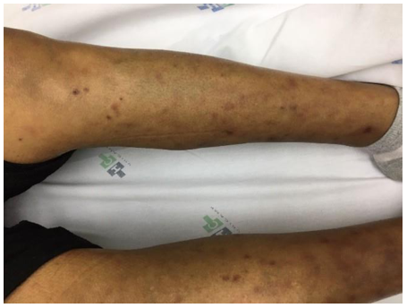

Gabarito

Endocardite bacteriana, endocardite infecciosa, endocardite, crioglobulinemia, vasculite crioglobulnêmica

### Questão 7

Homem, 61a, foi trazido ao Pronto Atendimento por falta de ar. Referia sete dias de tosse produtiva amarelada, associada a febre e dor torácica. A dispneia piorou nos últimos dois dias, com dificuldade para completar frases. Exame físico: T=38,2oC; PA=96x64mmHg; FC=122bpm; FR=32irpm; oximetria de pulso=78% em ar ambiente e 89% com máscara não reinalante com 15L O2/min; peso=110Kg (peso predito=80Kg); ausculta cardíaca normal; ausculta pulmonar com estertores em terço médio à direita. Ultrassonografia pulmonar: presença de linhas B em bases e campos médios bilateralmente. Após pré-oxigenação por cinco minutos, foi realizada intubação orotraqueal. AO CONFIGURAR O RESPIRADOR, O VOLUME CORRENTE INICIAL MÁXIMO RECOMENDADO PARA ESTE PACIENTE É:

Gabarito

480mL ou 6mL/Kg de peso predito

### Questão 8

Mulher, 32a, procura a Unidade Básica de Saúde por apresentar lesões nas regiões axilares e inguinais há 10 anos, que se iniciam com nódulos e abscessos e drenam secreção purulenta, resolvendo espontaneamente ou com antibióticos em uma a duas semanas. Já teve várias crises de dor e secreção e hoje apresenta fístulas drenantes nas axilas (Figura Q8, anexo). Antecedentes: obesidade e tabagismo ativo. Cultura da secreção: Staphylococcus aureus multissensível; culturas para fungos e micobactérias: negativas. A HIPÓTESE DIAGNÓSTICA É:

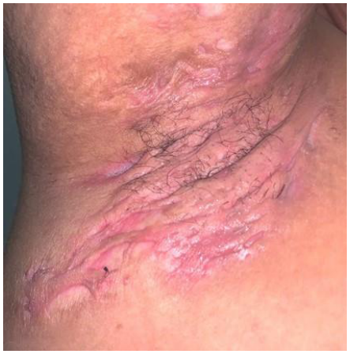

Gabarito

Hidradenite supurativa, hidradenite bacteriana, hidradenite crônica, hidradenite infecciosa, hidrosadenite, hidrosadenite supurativa, adenite supurativa. Não aceitar celulite, abscesso ou erisipela, micose.

### Questão 9

Homem, 46a, admitido na Sala de Emergência após episódio de síncope, ocorrida em um bar há 30 minutos. Exame físico: desnutrido; PA=126x72mmHg; FC=78bpm; FR=18irpm; oximetria de pulso=96% (ar ambiente); parótidas aumentadas. Eletrocardiograma: alargamento do intervalo QT. Após 20 minutos da admissão, apresentou dispneia súbita, com PA=82x46mmHg, FR=30irpm, oximetria de pulso=96% (ar ambiente). Você observa, no monitor, o seguinte traçado eletrocardiográfico:
A CONDUTA IMEDIATA É:

Gabarito

Desfibrilação, cardioversão elétrica não sincronizada, desfibrilação elétrica, desfibrilação seguida de sulfato de magnésio. Não aceitar sulfato de magnésio, oxigênio

### Questão 10

Homem, 60a, retorna à Unidade Básica de Saúde para controle de hipertensão arterial e resultados de exames. Refere piora dos níveis pressóricos nos últimos meses. Antecedentes: hipertensão arterial e tabagismo, em uso crônico e regular de anlodipina 10mg/dia e furosemida 40mg/dia. Há um mês, em consulta de rotina, apresentava PA=172x98mmHg, quando foi associado enalapril 10 mg/dia. Hoje, PA=152x88mmHg. A creatinina aumentou de 1,2mg/dL(dosada há 15 dias) para 2,2mg/dL. O EXAME NECESSÁRIO PARA CONFIRMAR A HIPÓTESE DIAGNÓSTICA É:

Gabarito

Ultrassonografia com Doppler de artérias renais, ultrassom de artérias renais, ultrassom de abdome com Doppler, angiotomografia de artéria renal, angiotomografia de rins, angiotomografia de abdome, arteriografia de artérias renais. Na resposta deve ficar claro a avaliação das artérias renais. Não será aceito ultrassonografia renal ou de vias urinárias.

### Questão 11

Homem, 51a, é trazido pelo Serviço de Atendimento Móvel de Urgência à Unidade de Emergência Referenciada com história de dispneia e dor torácica em aperto, iniciadas há duas horas, com irradiação para o membro superior direito. Antecedentes: tabagismo, hipertensão arterial e acidente vascular encefálico hemorrágico há duas semanas. Exame físico: T=36,8oC; PA: membro superior direito=116x92mmHg e membro superior esquerdo=112x84mmHg; FC=84bpm; FR=24irpm e oximetria de pulso=96% (ar ambiente); ausculta pulmonar com crepitações em ambas as bases. Recebeu AAS e clopidogrel no atendimento móvel. Eletrocardiograma na admissão da emergência:
A CONDUTA É:

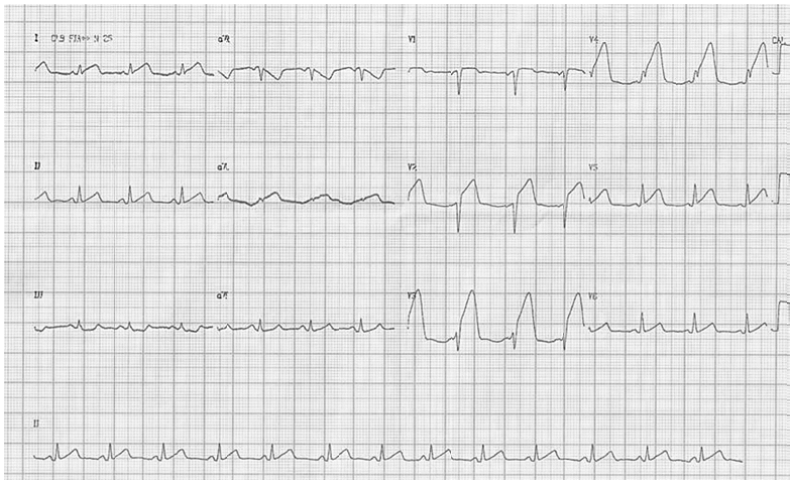

Gabarito

Cateterismo cardíaco, ou angioplastia ou cineangiocoronariografia. Cateterismo, angioplastia primária, cateterismo de urgência, CATE com angioplastia, intervenção coronariana percutânea, terapia de reperfusão coronariana percutânea, trombectomia mecânica, trombólise mecânica no cateterismo. Não aceitar trombólise química, ATPlase.

### Questão 12

Homem, 42a, refere tosse seca há três meses. Desde o início da tosse está usando budesonida nasal, sem melhora. Nega outras queixas e nega tabagismo. Antecedentes: rinite sazonal. Exame físico: bom estado geral; T=36,4oC; PA=122x82mmHg; FC=84bpm; FR=18irpm; ausculta pulmonar sem alterações. Radiograma de tórax normal. Reação intradérmica de Mantoux=0mm. O EXAME COMPLEMENTAR INDICADO É:

Gabarito

Espirometria ou prova de função pulmonar, espirometria com prova de broncodilatador, espirometria pré e pós broncodilatador, teste de broncoprovocação. Não aceitar endoscopia digestiva, tomografia ou nasofibro

## Cirurgia

### Questão 13

Conforme o ATLS®, a cricotireoidostomia cirúrgica é uma das formas de obtenção de via aérea. ESTE PROCEDIMENTO É REALIZADO ATRAVÉS DE QUAL ESTRUTURA ANATÔMICA?

Gabarito

Membrana cricotireoidea

### Questão 14

Criança, 4a, é trazida para avaliação de um caroço no pescoço, com aumento progressivo há uma semana, observado após infecção de vias aéreas superiores. Sem outras queixas. Exame físico: nódulo de consistência amolecida, com pouca mobilidade e indolor, localizado em linha média do pescoço, junto ao osso hioide. Restante do exame físico normal. A HIPÓTESE DIAGNÓSTICA É:

Gabarito

Cisto do ducto tireoglosso, cisto do tireoglosso, cisto tireoglosso, persistência do ducto tireoglosso.

### Questão 15

Mulher, 31a, sofreu queda de motocicleta em rodovia. Foi socorrida pelo atendimento pré-hospitalar e trazida ao Pronto Socorro com colar cervical, em prancha longa rígida, com cânula de Guedel e máscara de oxigênio não reinalante com 15L/min. Exame físico: PA=143x75mmHg; FC=96bpm; FR=22irpm; oximetria de pulso=97%. Neurológico: Escala de coma de Glasgow=7, pupilas anisocóricas. Após intubação orotraqueal, foi realizado protocolo de exames de imagem. Tomografia computadorizada de crânio (Figura Q15, anexo). O TIPO DE HEMATOMA INTRACRANIANO É:

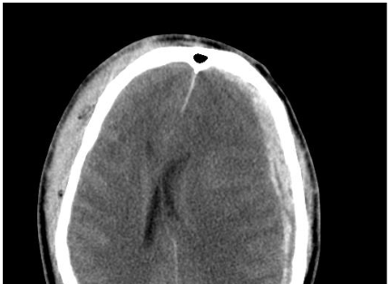

Gabarito

Subdural ou subdural agudo. Nâo será aceito subdural crônico.

### Questão 16

Mulher, 32a, retorna à Unidade Básica de Saúde para avaliar resultado de exame. Colonoscopia: centenas de pólipos colorretais. Anatomopatológico: adenomas tubulares e túbulo-vilosos com displasia de baixo grau. Tem quatro filhos com o mesmo marido (que tem 55 anos e refere colonoscopia normal). A PROBABILIDADE DE SEUS FILHOS APRESENTAREM A MESMA DOENÇA É:

Gabarito

50% ou 1:2

### Questão 17

Homem, 45a, natural da Bahia, refere dificuldade em se alimentar há quatro anos, necessitando ingerir líquidos com a comida. Há seis meses, a dificuldade piorou até para alimentos líquidos e a própria saliva. Acorda à noite com episódios de tosse. Refere perda de 5Kg nos últimos três meses. Antecedentes pessoais: tabagismo=20 anos/maço; etilismo=2 doses destilado/dia há 10 anos; trabalha na lavoura com agrotóxicos. Sorologia para Chagas=1/64; endoscopia digestiva alta=normal. QUAL EXAME DEVE SER SOLICITADO PARA COMPLEMENTAR A AVALIAÇÃO DA DISFAGIA?

Gabarito

Esofagograma ou seriografia gástrica ou exame contrastado de esôfago, estômago e duodeno ou EED. Esofagograma baritado, esofagografia baritada, esofagograma contrastado, esofagografia, radiografia contrastada com EED, radiografia de esôfago com bário, trânsito esofágico.

### Questão 18

Homem, 76a, foi submetido à biopsia prostática por apresentar toque retal com próstata de 50g, com área endurecida no lobo direito, e PSA total=5,6ng/dL. Anatomopatológico: adenocarcinoma de próstata Gleason 3.3, em 2/20 fragmentos. A proporção de tumor nas lâminas foi de 10% e 20%, em cada fragmento. A MELHOR CONDUTA PARA ESSE PACIENTE É:

Gabarito

Vigilância ativa ou acompanhamento vigiado, ou active surveilance ou seguimento vigiado ou seguimento semestral com PSA, acompanhamento clínico, acompanhamento clínico seriado, acompanhamento com vigilância ativa, seguimento clínico, vigilância

### Questão 19

Homem, 64a, procura Pronto Socorro queixando-se de sangue na urina. Antecedente pessoal: válvula mitral metálica, hipertensão arterial, uso diário de losartana e warfarina. Exame físico: PA=125x84mmHg; FC=79bpm; oximetria de pulso=97% (ar ambiente). RNI=4,87; Hb=13,1g/dL; Ht=39%; plaquetas=232.000/mm3; exame de urina: hemácias >100/campo, leucócitos 20/campo, proteína +/4. Realizada sondagem vesical com diurese hematúrica, sem coágulos. PARA CORREÇÃO DO VALOR DO RNI, DEVE-SE:

Gabarito

Prescrever ou indicar vitamina K

### Questão 20

Homem, 57a, é trazido ao Pronto Socorro de hospital de referência por quadro de sangramento digestivo alto com hematêmese volumosa, sendo este o primeiro episódio. Antecedentes pessoais: cirrose hepática por álcool, em acompanhamento há três anos. Exame físico: regular estado geral; emagrecido; descorado +/4+; FC=92bpm; PA=122x64mm/Hg; FR=16irpm; sinal de aranhas vasculares em tronco; distensão abdominal; sem sinais de ascite; fígado palpável 2cm abaixo do rebordo costal, com borda romba; baço percutível; toque retal: presença de melena. APÓS ESTABILIZAÇÃO DO QUADRO E PRESCRIÇÃO DE ANÁLOGO DA SOMATOSTATINA E DE INIBIDOR DE BOMBA DE PRÓTONS, A CONDUTA É:

Gabarito

Endoscopia alta ou endoscopia ou EDA ou EDA com ligadura elástica

### Questão 21

Mulher, 58a, queixa-se de dispneia e dor torácica à direita. Sem outras queixas. Está no nono dia de pós-operatório de ressecção de um tumor de mediastino posterior, sem intercorrências. Antecedentes: hipertensão arterial, tabagismo ativo. Exame físico: regular estado geral; corada; hidratada; PA=132x76mmHg; FC=68bpm; T=36,4oC; FR=16irpm; oximetria de pulso=96% (ar ambiente). Pulmões: murmúrio vesicular reduzido à direita, sem ruídos adventícios. Tomografia computadorizada de tórax: derrame pleural à direita, com atelectasias restritivas principalmente em lobo inferior, e leve espessamento parietal brônquico. Realizada toracocentese diagnóstica. Líquido pleural: coloração=esbranquiçada, aspecto=leitoso; hemácias=4.000/mm3; leucócitos=2.032/mm3 (90% linfomonucleares e 10% polimorfonucleares); raras células mesotelias e regular número de macrófagos; proteínas totais=1,5g/dL; glicose=102mg/dL; colesterol=66mg/dL; triglicérides=2.683mg/dL; desidrogenase láctica=77U/L. A ANÁLISE DESTE LÍQUIDO CAVITÁRIO CLASSIFICA O DERRAME PLEURAL COMO:

Gabarito

Quilotórax ou derrame quiloso, linfático, linfa, quiloso

### Questão 22

Mulher, 38a, procurou Pronto Socorro com queixa de dor no lado direito do abdome, abaixo da última costela, em cólica, de forte intensidade, após churrasco. Sem comorbidades. Ultrassonografia de abdome: colecistite aguda litiásica. O LOCAL ANATÔMICO ONDE OCORRE A OBSTRUÇÃO PARA DESENVOLVER ESSA DOENÇA É:

Gabarito

Ducto cístico ou óstio do ducto cístico. Nâo aceitar outra estrutura anatômica.

### Questão 23

Menino, 9a, é trazido à Unidade de Emergência após ter sofrido queda da bicicleta há duas horas. Exame físico: fácies dolorosa; palidez cutânea; FC=104bpm; FR=22irpm; PA=109x82mmHg; pulsos cheios. Abdome: doloroso à palpação, sem irritação peritoneal. (Figura Q23, anexo). O MECANISMO DE TRAUMA E O EXAME FÍSICO ESTÃO RELACIONADOS À LESÂO DE QUAL ÓRGÃO?

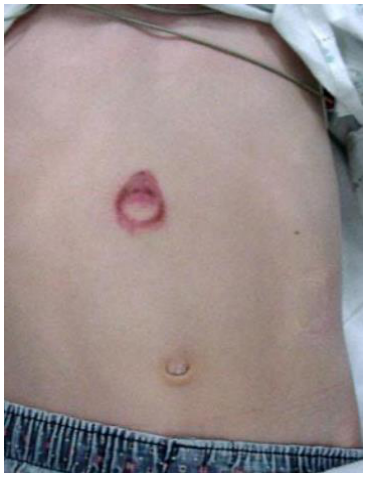

Gabarito

Pâncreas e/ou duodeno. Aceitar intestino delgado (duodeno como parte de delgado)

### Questão 24

Homem, 57a, vem ao Pronto Socorro com queixa de dor em membros inferiores ao deambular por cerca de 50 metros, sendo mais intensa no membro inferior esquerdo (MIE). Precisa parar a marcha por algum tempo até conseguir voltar a caminhar. Exame físico: FC=80bpm; PA=130x88mmHg; pressão em tornozelo direito=90mmHg; pressão em tornozelo esquerdo=45mmHg. QUAL O VALOR DO ÍNDICE TORNOZELO-BRAÇO (ITB) MEDIDO NESTE PACIENTE PARA O MIE?

Gabarito

0,34 ou 45/130 (aceitar valores entre 0,3 a 0,4), 9/26.

## Pediatria

### Questão 25

Adolescente, 15a, procura Unidade Básica de Saúde para avaliação de uma lesão que não cicatriza há dois meses. Exame físico: lesão em face anterior de região tibial esquerda (Figura Q25, anexo), sem outras alterações. A HIPÓTESE DIAGNÓSTICA É:

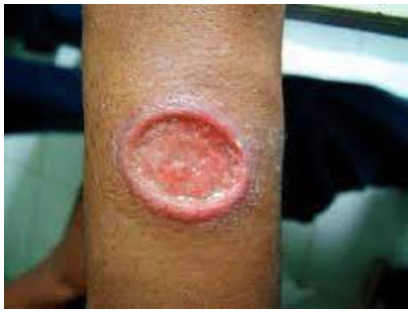

Gabarito

Leishmaniose cutânea ou úlcera de Bauru ou Leishmaniose ou Leishmaniose tegumentar americana, Leishmaniose tegumentar, ou ferida brava.

### Questão 26

Menino, 5a, é trazido para consulta de puericultura sem queixas. Mãe refere bom desenvolvimento e nega doenças ou uso de medicamentos. Exame físico: bom estado geral; corado; IMC=percentil 30; FC=104bpm; FR=27irpm; PA membro superior direito=142x78mmHg; PA membro inferior direito=88x53mmHg; pulsos= radiais cheios e pediosos fracos; membros inferiores sem edema. A HIPÓTESE DIAGNÓSTICA É:

Gabarito

Coarctação de aorta ou estenose de aorta ou coarctação de aorta torácica.

### Questão 27

Menina, 5a, é internada para investigação com história de febre (1 pico diário de até 38,2oC), hipoatividade, palidez progressiva, perda de 10% do peso e surgimento de massas cervicais e pápulas cutâneas não pruriginosas há seis meses. Exame físico: regular estado geral; descorada 3+/4+; hipoativa; emagrecida; T=38,2oC; FC=100bpm; FR=23irpm; linfonodos= aumentados em todas as cadeias, com drenagem de secreção de linfonodo cervical direito (figura Q27, anexo). Hb=7,2g/dL; plaquetas=256.000/mm3; leucócitos=34.000/mm3 (segmentados=35%, linfócitos típicos=15%, eosinófilos=40%, monócitos=10%); albumina=2,8g/dL, gamaglobulina=3,78g/dL. A HIPÓTESE DIAGNÓSTICA ETIOLÓGICA É:

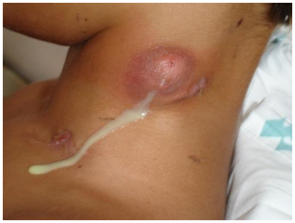

Gabarito

Paracoccidioidomicose ou blastomicose ou blastomicose Sul-americana. Paracoccidiode juvenil ou Paracoccidioidis brasiliensis

### Questão 28

Menina, 4m, em aleitamento materno exclusivo e residente em área onde ocorreu a confirmação de circulação do vírus da febre amarela (epizootias, casos humanos e vetores na área). Neste caso, sua mãe tem indicação de receber a vacina da febre amarela. EM RELAÇÃO AO ALEITAMENTO MATERNO, A ORIENTAÇÃO É:

Gabarito

Interromper por 10 dias e manter a ordenha ou interromper por 10 dias. Suspender por 10 dias e iniciar fórmula láctea. O tempo de interrupção de 10 dias precisa constar da resposta.

### Questão 29

Menino, 10m, previamente hígido, é trazido à Emergência com história de palidez e sudorese durante a amamentação, há uma hora. Exame físico: mau estado geral; pálido; com cianose de extremidades e perioral; T=35,8oC; FC=214bpm; FR=56irpm; pulsos periféricos finos; tempo de enchimento capilar=6segundos. Coração: bulhas taquicárdicas e normofonéticas; pulmões: murmúrio vesicular presente e simétrico, estertores em bases; abdome: fígado a 4cm do rebordo costal direito. Eletrocardiograma:
A CONDUTA É:

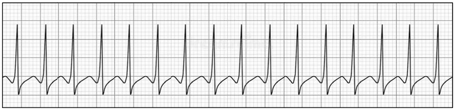

Gabarito

Cardioversão elétrica sincronizada, cardioversão elétrica ou adenosina

### Questão 30

Menino, 2m, é trazido ao Pronto Atendimento com história de tosse há oito dias. Hoje a mãe refere que a criança apresentou três episódios de perda de fôlego e cianose após tosse. Nega inapetência e febre. Antecedentes: mãe não realizou pré-natal, parto vaginal a termo, sem intercorrências, peso adequado e recebeu alta da maternidade com 48h de vida. Exame físico: bom estado geral; T=36,5oC; FC=148bpm; FR=67irpm; pulmões: murmúrio vesicular presente e simétrico, sem ruídos adventícios; coração: bulhas rítmicas normofonéticas; abdome: fígado a 2cm do rebordo costal direito, hepatimetria=4cm; pulsos simétricos. Durante o exame, apresentou um episódio de tosse seguido de cianose periférica, com duração de dois minutos, e melhora com a introdução de oxigênio em máscara não reinalante. Hb=9,7g/dL; Ht=30%; leucócitos=15.740/mm3 (78% linfócitos típicos, 13% neutrófilos, 1% eosinófilos, 8% monócitos). A HIPÓTESE DIAGNÓSTICA É:

Gabarito

Coqueluche ou infecção por B pertussis ou tosse comprida ou Pertussis

### Questão 31

Menina, 13a, é internada para investigação de quadro de dor abdominal e evacuações líquidas com muco e sangue (12 a 15 episódios ao dia, inclusive durante o período noturno), associadas a tenesmo e à lesão perianal com drenagem intermitente de secreção purulenta, há seis meses. Apresenta perda de 24% do peso, amenorreia, embotamento afetivo e abandonou a escola durante o período. A HIPÓTESE DIAGNÓSTICA É:

Gabarito

Doença de Chron ou doença inflamatória intestinal. Não será aceito retocolite ulcerativa.

### Questão 32

Menina, 9a, previamente hígida, é trazida ao Pronto Atendimento com queixa de inchaço nas pernas, dor de cabeça e urina escura há dois dias. Sem outras queixas. Exame físico: T=36,2oC; PA=154x82mmHg; FC=96bpm; FR=23irpm; pulmões: murmúrio vesicular presente; membros inferiores: edema +/4+. Pele: máculas hipercrômicas, algumas com crostas melicéricas, em membros inferiores. Creatinina=0,42mg/dL; ureia=31mg/dL; exame de urina: hemácias=100/campo; leucócitos=60/campo; proteína +/4+; codócitos e acantócitos presentes, cilindros granulosos. O DIAGNÓSTICO SINDRÔMICO É:

Gabarito

Síindrome Nefrítica

### Questão 33

Menino, 2a, é trazido à Unidade Básica de Saúde com queixa de fezes líquidas (seis vezes ao dia), vômitos há dois dias, com piora há um dia. Exame físico: Regular estado geral; T=36,4oC; FC=145bpm; FR=26irpm; mucosas secas; turgor pastoso; perfusão periférica menor que 2 segundos; hipoativo e reativo. QUAL É O GRAU DE DESIDRATAÇÃO DESTA CRIANÇA?

Gabarito

Desidratação moderada ou de segundo grau ou grau 2

### Questão 34

Menina, 11m, foi encaminhada à Unidade de Terapia Intensiva após reanimação cardiopulmonar na Sala de Emergência, onde foi realizado acesso intraósseo tibial à direita. O acesso permanece funcionante com infusão contínua de droga vasoativa. O TEMPO MÁXIMO, EM HORAS, QUE SE PODE MANTER O ACESSO INTRAÓSSEO É DE:

Gabarito

24 horas ou 24 ou 24h

### Questão 35

Menino, 14m, é trazido com queixa de vermelhidão pelo corpo há um dia. As lesões começaram na região do pescoço e progrediram rapidamente por todo o corpo, sem prurido, e pioram após o banho quente e com exposição ao sol. Mãe relata febre, irritabilidade e diminuição do apetite há quatro dias. Nas últimas 24h está afebril e apresenta melhora da irritabilidade e da aceitação alimentar. Exame físico: bom estado geral; T=36,5oC; oroscopia sem alterações; linfonodos não palpáveis; pele= exantema maculopapular difuso. A HIPÓTESE DIAGNÓSTICA É:

Gabarito

Exantema súbito ou roséola ou sexta doença ou infecção por Herpesvirus tipo 6 ou 7

### Questão 36

Menino, 3a, é trazido para consulta por estar mancando há um dia. Mãe acha que está com dor na perna. Nega trauma, febre ou outras queixas. Antecedentes: nega comorbidades ou uso de medicamentos, refere um resfriado comum há duas semanas. Carteira vacinal atualizada. Exame físico: bom estado geral; afebril; eupneico; hidratado; anictérico; boa perfusão periférica; IMC=+1z escore; marcha claudicante; quadris livres; articulações de membros inferiores sem edema, eritema ou bloqueio articular. A HIPÓTESE DIAGNÓSTICA É:

Gabarito

Sinovite monoarticular transitória ou sinovite transiente ou sinovite transitória ou sinovite reacional. Sinovite transitória de quadril, artrite transitória de quadril, sinovite pós-viral, tenossinovite transitória de quadril. Sinovite isolada não pontua.

## Ginecologia e Obstetrícia

### Questão 37

Mulher, 38a, G3P2C2A0, idade gestacional de 28 semanas e 5 dias (E8), refere sangramento vaginal vermelho vivo em pequena quantidade há dois dias. Nega contrações, relação sexual ou esforço físico. Refere boa movimentação fetal. Nega perda de líquido por via vaginal. Exame físico: altura=1,71m; peso=85,5Kg; PA=122x72mmHg; FC=88bpm; altura uterina=27cm; batimentos cardíacos fetais=148bpm; dinâmica uterina=ausente; movimentos fetais=presentes. Especular=presença de pequena quantidade de sangue coletada em fundo de saco vaginal, sem sangramento ativo, colo aparentemente impérvio e sem lesões. Toque vaginal=não realizado. Solicitada ultrassonografia obstétrica, que apresenta a seguinte imagem (Figura Q37, anexo). A HIPÓTESE DIAGNÓSTICA É:

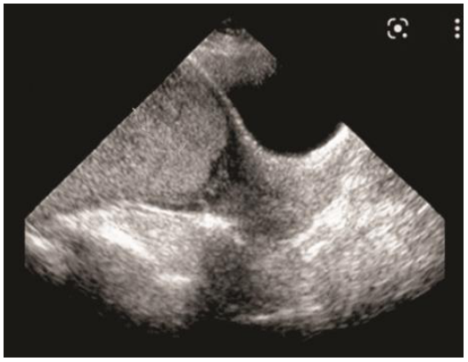

Gabarito

Placenta prévia centro total. Placenta prévia.

### Questão 38

Mulher, 28a, refere dor e prurido vulvar, além de disúria. Refere que já teve três episódios semelhantes. Ao exame ginecológico, observa-se (figura Q38, anexo). A PRINCIPAL HIPÓTESE DIAGNÓSTICA É:

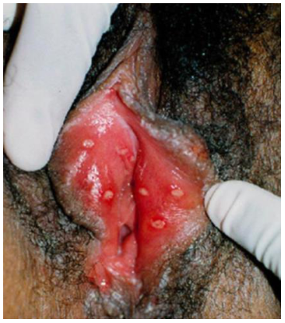

Gabarito

Herpes genital, herpes simplex, herpes tipo II, herpes vaginal, herpes vírus, herpes simplex, Herpes. Herpes zoster ou outros tipos de lesão ulcerada não pontuam.

### Questão 39

Mulher, 38a, primípara, comparece à Unidade Básica de Saúde no oitavo dia de puerpério, referindo febre e dor abdominal há dois dias. Está em amamentação exclusiva, sem queixas mamárias. Refere hábito intestinal e urinário sem alterações. Antecedentes: diabetes gestacional, tratada com dieta e atividade física; o parto foi cesárea por desproporção cefalopélvica. Exame físico: bom estado geral; descorada 2+/4+; hidratada; eupneica; T=38oC; PA=124x82mmHg; FC=124bpm; FR=18irpm. Mamas=lactantes, sem alterações; cardiopulmonar: sem alterações; abdome: flácido, ruídos hidroaéreos presentes, descompressão brusca negativa, ausência de massas palpáveis; presença de útero amolecido, palpável 1cm abaixo da cicatriz umbilical, dolorido à palpação. Cicatriz de cesárea seca, sem sinais flogísticos. Especular: presença de lóquio rubro em moderada quantidade. Toque vaginal: colo uterino pérvio para 1 polpa digital, com dor à mobilização. A HIPÓTESE DIAGNÓSTICA É:

Gabarito

Endometrite, endometrite puerperal, infecção uterina puerperal, infecção uterina puerperal, infecção uterina.

### Questão 40

Mulher, 30a, G4P3C0A0, sem comorbidades e com último parto há três anos, apresenta trabalho de parto espontâneo às 39 semanas e 4 dias de gestação, representado pelo seguinte partograma:
A CONDUTA OBSTÉTRICA APÓS EXAME DAS 19:00 É:

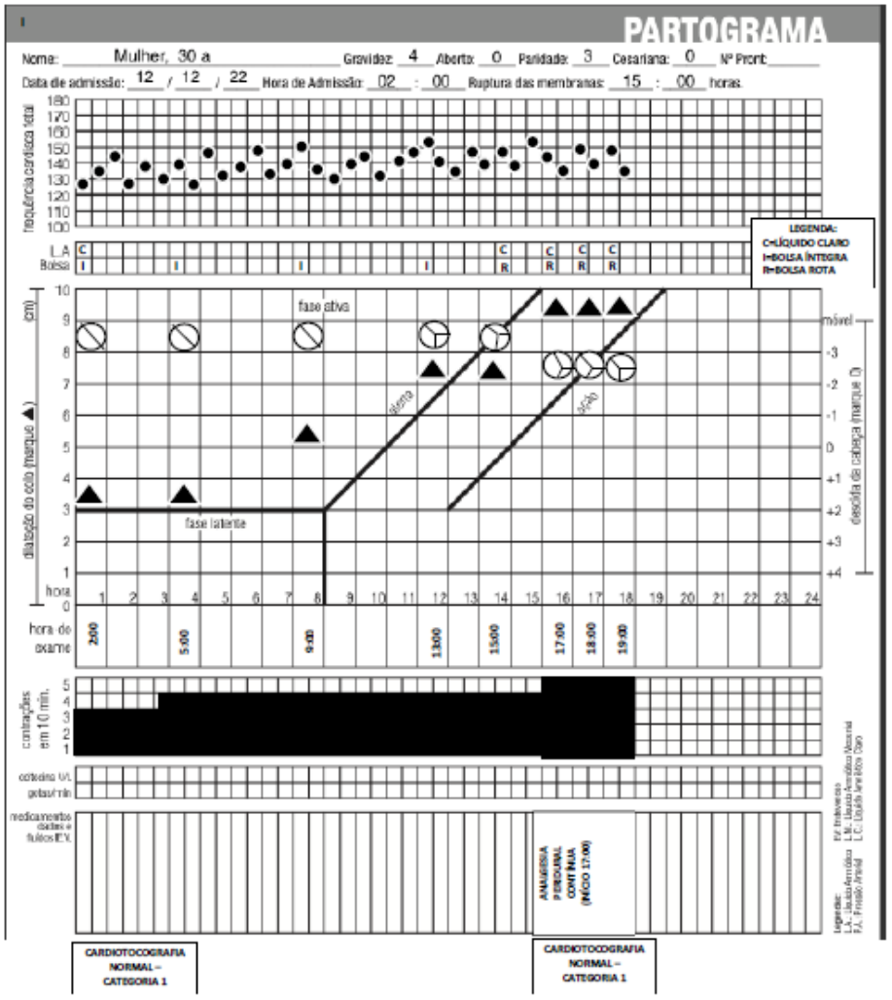

Gabarito

Parto cesárea. Aceitar cesárea, cesariana, via de parto alta, parto cesáreo. Não aceitar outras vias de resolução da gestação.

### Questão 41

Primigesta, 21a, idade gestacional de 41 semanas (E10), comparece ao Pronto Atendimento referindo perda de tampão mucoso, sem perda de líquidos, associada a endurecimento da barriga e dor moderada em baixo ventre, com piora há um dia. Antecedentes: nega comorbidades, gestação planejada e desejada. Exame físico: altura=1,67m; peso=67Kg; PA=116x75mmHg; altura uterina=37cm; feto cefálico; batimentos cardíacos fetais=137bpm; dinâmica uterina=ausente; movimentos fetais= presentes; toque vaginal= colo grosso, posterior, 1 polpa digital, feto cefálico em plano -3 de De Lee, bolsa íntegra. Amnioscopia=líquido opalescente, grumos grossos. Cardiotocografia=normal/classe I. A CONDUTA OBSTÉTRICA É:

Gabarito

Indução de parto. Indução de trabalho de parto, indução de parto com misoprostol, preparo de parto com misoprostol. Aceitar formas de indução de parto: misoprostol ou preparo do colo com balão ou ocitocina.

### Questão 42

Mulher, 19a, G0P0, chega ao Pronto Atendimento com quadro de dor abdominal e febre há dois dias. Refere que faz uso de anticoncepcional oral combinado e que a última menstruação foi há sete dias. Sexualmente ativa, não apresenta comorbidades e não faz uso de outras medicações. Exame físico: bom estado geral; FC=82bpm; PA=116x74mmHg; afebril. Abdome: plano, flácido, indolor à palpação. Especular: presença de secreção mucopurulenta fétida coletada em vagina, pequeno sangramento vaginal. Toque vaginal: útero de tamanho e forma normais, sem massas palpáveis, dor à mobilização do colo. O DIAGNÓSTICO É:

Gabarito

Doença inflamatória pélvica ou DIP ou doença inflamatória pélvica aguda ou DIPA ou cervicite ou endocervicite ou MIPA (moléstia inflamatória pélvica aguda)

### Questão 43

Mulher, 32a, G2P2A0, sem comorbidades, em acompanhamento ginecológico de rotina, apresentou os seguintes resultados de colpocitologia: Junho/22: ASCUS- células escamosas de significado indeterminado possivelmente não neoplásicas. Dezembro/22: Alterações celulares benignas. QUANDO DEVERÁ SER REALIZADA A PRÓXIMA COLETA DE EXAME?

Gabarito

6 meses ou junho de 2023.

### Questão 44

Primigesta, 24a, idade gestacional de 28 semanas, comparece à consulta de pré-natal referindo dor em baixo ventre, associada à sensação de calafrio e mal-estar, há três dias. Refere inapetência e vômito há um dia. Nega disúria ou alteração de coloração da urina. Refere hábito urinário aumentado desde o início da gestação. Exame físico: bom estado geral; descorada +/4+; desidratada +/4+; anictérica; acianótica; T=38,3°C; PA=92x62mmHg; FC=125bpm; FR=18irpm. Cardiopulmonar: bulhas rítmicas normofonéticas; murmúrio vesicular presente e sem ruídos adventícios. Abdome: gravídico, tônus normal, batimentos cardíacos fetais=165bpm; altura uterina=28cm, dinâmica uterina= ausente, movimentos fetais=presentes. Sinal de Giordano presente à direita. QUAL A HIPÓTESE DIAGNÓSTICA?

Gabarito

Pielonefrite ou infecção do trato urinário superior ou sepse de foco urinário ou infecção urinária complicada. Pielonefrite à D. Não aceitar infecção urinária ou sepse isoladas.

### Questão 45

Casal comparece ao ambulatório referindo que deseja gestação. Mulher tem 30 anos, é nuligesta, refere ciclos regulares com duração de quatro dias, intervalo de 30 dias e não apresenta comorbidades. FSH=6,7mUI/mL (3º dia do ciclo), TSH=2,0µUI/mL e prolactina=15ng/mL. Marido tem 33 anos, não apresenta comorbidades e não tem filhos. Espermograma: volume=4mL; concentração espermática=30milhões/mL; concentração total de espermatozoides=60milhões/mL; motilidade A+B=60%; vitalidade=70% vivos; morfologia >4% (critério estrito de Kruger); leucócitos=500/mL. O casal está sem métodos contraceptivos há dois anos. Mulher apresenta exame de imagem (figura Q45, anexo). A CAUSA DA ESTERILIDADE É:

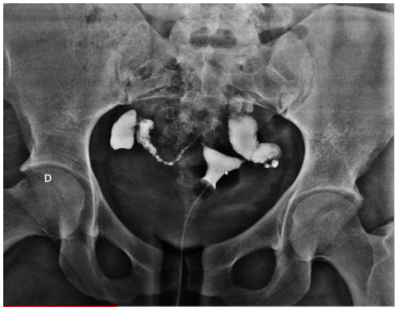

Gabarito

Fator tubáreo. Aceitar obstrução tubárea bilateral, hidrossalpinge, hidrossalpinge bilateral, tubáreo, Alteração de trompa ou tuba uterina, acúmulo de líquido em tuba uterina, causa tubária, distorção de trompas, fator tuboperitoneal, imperveidade tubárea, obstrução tubarea, tuba uterina impérvea, tuboperitoneal. Não aceitar endometriose, tuberculose ou outras etiologias.

### Questão 46

Mulher, 35a, procura atendimento por palpar nodulação indolor em mama esquerda há três meses. Nega outras queixas. Exame físico: mama sem abaulamentos ou retrações, ausência de descarga papilar; palpa-se área nodular de 1,5cm fibroelástica, móvel, não aderida a planos superficiais e profundos em quadrante superior lateral de mama esquerda, indolor à palpação; ausência de linfonodos axilares e em fossa supra clavicular. Ultrassonografia de mamas: imagem medindo 1,6cm em quadrante superior lateral de mama esquerda. (Figura Q46, anexo). CONSIDERANDO A IMAGEM ANEXA, A CONDUTA É:

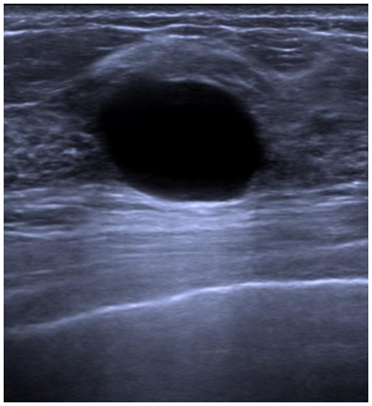

Gabarito

Alta ou seguimento ambulatorial ou manter rotina ginecológica ou expectante. Aceitar: conservador, seguimento clínico, observação e orientação sobre benignidade do quadro, seguimento ambulatorial sem necessidade de exames adicionais. Não aceitar: punção de cisto, mamografia, repetição de ultrassonografia, biopsia.

### Questão 47

Mulher, 72a, nulípara, procura atendimento com queixa de dor em baixo ventre há duas semanas, com piora progressiva e saída de corrimento fétido por via vaginal. Há dois dias apresenta febre e queda do estado geral. Exame físico: regular estado geral; emagrecida; descorada+/4+; anictérica; FC=86bpm; PA=112x74mmHg; T=37,5°C; FR=18irpm; perfusão periférica<2segundos. Abdome: doloroso à palpação de hipogastro. Exame ginecológico: vulva e vagina atróficas com conteúdo vaginal amarelo, espesso e de odor fétido. Colo uterino: aspecto normal com saída de secreção semelhante pelo orifício externo. Toque vaginal: útero aumentado para 10 semanas, doloroso à mobilização. Ultrassonografia pélvica: colo uterino normal, útero aumentado (volume=180cm³), com conteúdo heterogêneo, hipervascularizado, sem plano de clivagem com o miométrio, apresentando áreas hiperecogênicas e com sombras acústicas de permeio sugestivas de gás, linha endometrial de 12mm. Ovários não visibilizados. ALÉM DO TRATAMENTO PARA O QUADRO INFECCIOSO, A PRINCIPAL DOENÇA ASSOCIADA A SER INVESTIGADA É:

Gabarito

Câncer de endométrio, carcinoma de endométrio, neoplasia maligna de endométrio (endometrial).

### Questão 48

Mulher, 29a, gestante de nove semanas procura o Pronto Atendimento com dor em baixo ventre e pequeno sangramento via vaginal há um dia. Exame físico: bom estado geral; corada; PA=122x74mmHg; FC=88bpm. Abdome indolor à palpação, sem visceromegalias. Ginecológico: especular= presença de pequena quantidade de sangue escuro em saco vaginal, sem saída ativa de colo uterino; toque= útero em anteroversoflexão, consistência amolecida, aumentado para oito semanas, colo impérveo, anexos palpáveis e indolores. Beta HCG=5.000UI/mL. Ultrassonografia transvaginal: útero em anteversoflexão, medindo 79x48x60mm (volume=118,31cm3); miométrio de textura homogênea; endométrio heterogêneo medindo 10mm; ovário direito medindo 23x22x11mm (volume=2,9cm3) e ovário esquerdo medindo 21x14x19mm (volume=2,9cm3). A HIPÓTESE DIAGNÓSTICA É:

Gabarito

Gestação ectópica ou gestação de localização desconhecida ou prenhez ectópica.

## Saúde Coletiva

> **Enunciado para as questões 49, 50:**
>
> Uma vacina foi avaliada em um estudo randomizado e apresentou o seguinte resultado:
>
> |  | Doentes | Não doentes | Total |
> |---|---|---|---|
> | Vacina | 50 | 4.950 | 5.000 |
> | Placebo | 120 | 4.880 | 5.000 |
> | Total | 170 | 9.830 | 10.000 |

### Questão 49

A EFICÁCIA DA VACINA É:

Gabarito

Aceitar valores entre 0,58 a 0,60 ou 58% a 60%, ou 1-(50/120)

### Questão 50

QUANTAS PESSOAS, APROXIMADAMENTE, PRECISARAM SER VACINADAS PARA QUE UMA DEIXASSE DE APRESENTAR A DOENÇA?

Gabarito

71,4, será aceito 71 ou 72

### Questão 51

Para estimar a velocidade com que a covid-19 se espalhou em Campinas durante o ano de 2020, A MEDIDA DE FREQUÊNCIA MAIS INDICADA É:

Gabarito

Taxa de incidência, coeficiente de incidência, incidência ou taxa de ataque.

### Questão 52

Em um hospital foram registrados, na 32ª semana epidemiológica, dez casos de pacientes com síndrome serotoninérgica. Todos sobreviveram. O serviço de vigilância epidemiológica buscou identificar se algum fármaco poderia estar associado com essas manifestações. Os dez pacientes foram entrevistados e seus prontuários, avaliados. Os mesmos procedimentos foram feitos em um grupo de 40 pacientes internados, com características semelhantes, mas que não apresentaram a síndrome. O objetivo era comparar a proporção de indivíduos expostos àqueles fármacos nos dois grupos. O TIPO DE ESTUDO EPIDEMIOLÓGICO UTILIZADO FOI:

Gabarito

Caso-controle ou estudo caso-controle ou observacional caso-controle. Se não estiver escrito caso-controle, não pontua.

### Questão 53

A população de uma cidade é de 100.000 habitantes. No início de 2019, havia nessa cidade 100 pessoas em tratamento para tuberculose. Durante esse mesmo ano, 60 desses pacientes receberam alta do tratamento e outras 50 pessoas foram diagnosticadas com tuberculose. A PREVALÊNCIA DE TUBERCULOSE AO FINAL DE 2019 FOI DE:

Gabarito

90 para 100.000 habitantes ou 90:100.000 ou 9 para 10.000 ou 0,9 para 1.000

### Questão 54

Equipe de saúde da família diagnostica vários casos de onicomicose em pacientes que frequentam o mesmo salão de manicure. A INSPEÇÃO E FISCALIZAÇÃO DESTE ESTABELECIMENTO É ATRIBUIÇÃO DA VIGILÂNCIA:

Gabarito

Sanitária

### Questão 55

Homem, 46a, procura Unidade Básica de Saúde queixando-se de surgimento de pontos pretos pruriginosos nos membros superiores, há cerca de quatro meses. Nega quadro semelhante anterior. É mecânico há 12 anos e nunca usou equipamento de proteção individual. Exame físico: pele=presença de pápulas foliculares com pontos centrais enegrecidos localizados no dorso das mãos e na face extensora das falanges, antebraços e braços, poupando a região palmar (figura Q55, anexo) A HIPÓTESE DIAGNÓSTICA É:

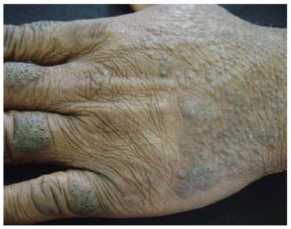

Gabarito

Elaioconiose ou dermatite folicular. Aceitar dermatose associada à manipulação de graxas e/ou óleos. Não aceitar apenas dermatose.

### Questão 56

Homem, 38a, funcionário de linha de produção de aço inoxidável, procura Unidade Básica de Saúde com queixa de respiração ruidosa, rinorreia, epistaxe, obstrução, dor, ressecamento e formação de crostas nasais. Exame físico: rinoscopia anterior = presença de perfuração septal de cerca de 1,5cm de diâmetro. O AGENTE OCUPACIONAL RELACIONADO A ESTE QUADRO CLÍNICO É:

Gabarito

Vapor de cromo ou cromo.

### Questão 57

Mulher, 90a, portadora de síndrome demencial avançada, foi trazida ao Pronto Socorro por episódio único de vômito e desidratação. Foi submetida a exames laboratoriais, tomografia de abdome, endoscopia e colonoscopia, que resultaram normais. Permaneceu internada durante uma semana, recebendo antibióticos. Após a internação, não foi mais capaz de deambular. A PROTEÇÃO CONTRA NOVAS INTERVENÇÕES DESNECESSÁRIAS, EVITANDO DANOS IATROGÊNICOS, DENOMINA-SE:

Gabarito

Prevenção quaternária, quaternário

### Questão 58

No estudo de Framingham, iniciado na década de 1940 na cidade dos Estados Unidos que leva esse nome, mais de 5.000 pessoas foram acompanhadas durante vários anos para identificar a incidência de doenças cardiovasculares e os fatores associados. ESSE ESTUDO É CLASSIFICADO COMO:

Gabarito

Observacional coorte, estudo longitudinal, observacional longitudinal, coorte prospectivo, estudo de coorte ou coorte.

### Questão 59

O avanço da biotecnologia, e suas aplicações na prática médica, tornou-se um novo paradigma na assistência à saúde. Tais avanços se concretizaram graças ao complexo médico-industrial, que se tornou uma área de negócios atrativa por sua alta lucratividade, porém geradora de conflitos de interesse. Nesse cenário, surgem conflitos éticos e legais que comprometem a organização e a gestão do sistema de saúde. A SITUAÇÃO DESCRITA CAUSA IMPACTO EM QUAL PRINCÍPIO FUNDAMENTAL DO SUS?

Gabarito

Equidade ou princípio da equidade.

### Questão 60

Homem, 54a, é encaminhado ao ambulatório de Saúde do Trabalhador com hipótese de parkisonismo secundário e queixas de perda de memória, em uso de levodopa. Previamente hígido, trabalha como vigilante em um condomínio. Há dois anos, durante aplicação de herbicida no jardim do seu local de trabalho, derramou o produto sobre o corpo acidentalmente. Refere que o produto permaneceu em contato com a pele por cerca de uma hora. No mesmo dia, ao final da jornada de trabalho apresentou indisposição geral, ardência e vermelhidão nos olhos. Uma semana depois, notou aparecimento de vesículas nas áreas cutâneas expostas ao contato com o produto, que duraram quinze dias. Após um mês, apresentou parestesias de predomínio distal nos quatro membros com resolução espontânea em 45 dias, mantendo rigidez e lentificação motora. Exame neurológico atual: síndrome acinético-rígida, Mini Exame do Estado Mental=23/30 pontos. Eletroneuromiografia dos quatro membros=normal. Ressonância magnética cerebral: hipersinal em T2 no globo pálido, na substância negra, na via nigro-estriatal e na substância cinzenta periaquedutal, bilateral e simétrica. O DIAGNÓSTICO PROVÁVEL É DE PARKINSONISMO SECUNDÁRIO POR EXPOSIÇÃO A QUAL AGROTÓXICO HERBICIDA?

Gabarito

Glifosato ou N-(fosfometil)glicina ou mata-mato.

