# UNICAMP 2024 – Acesso Direto – Prova 1 (manhã)

- Formato: Resposta curta (discursiva)
- Tipo: regular
- Data de aplicação: 2023-11-20
- Questões: 60
- Prova original: https://www.comvest.unicamp.br/residenciamedica2024/provas/dAD1.pdf
- Gabarito oficial: https://www.comvest.unicamp.br/residenciamedica2024/resp_esperadas/resp_ad1.pdf

Valores de referência dos exames laboratoriais

VALORES DE REFERÊNCIA DOS EXAMES LABORATORIAIS, UTILIZADOS NESTA AVALIAÇÃO:

| EXAME | VALOR REFERÊNCIA |
|---|---|
| Ácido úrico | Homem: 3,5 a 7,2 mg/dL; mulher: 2,6 a 6,0 mg/dL |
| Albumina plasmática | 3,5 a 5,2 g/dL |
| Bilirrubina total | 0,3 a 1,2 mg/dL |
| Cálcio sérico | 8,8 a 10,2 mg/dL |
| Creatinina | Homem: < 1,2 mg/dL, mulher: < 0,9 mg/dL |
| CPK (creatina fosfoquinase) | Homem: < 190 UI/L, mulher: < 170 UI/L |
| Colesterol total | < 200 UI/L |
| LDH (ou DHL) | Homem: < 680 UI/L, mulher: <450 UI/L |
| HDL-colesterol | Homem: ≥ 40 mg/dL; mulher: ≥ 50 mg/dL. |
| LDL-colesterol | < 100 mg/dL |
| Triglicérides | < 150 mg/dL |
| Ferro sérico | 60 a 180 ug/dL |
| Fosfatase alcalina | Homem: 40 a 129 UI/L, mulher 35 a 103 UI/L |
| Fósforo sérico | 2,5 a 4,5 mg/dL |
| Lactato | 0,5 a 1,6 mmol/L |
| Saturação transferrina | 20 a 45% |
| TSH | 0,3 a 4,2 uUI/mL |
| T3L | 0,20 a 0,44 ng/dL |
| T4L | 0,9 a 1,7 ng/dL |
| Glicemia | 60 a 99 mg/dL |
| Ureia | < 65 anos: 17-48 mg/dL. ≥ 65 anos: < 71 mg/dL. |
| Sódio (Na+) | 132 a 146 mEq/L |
| Potássio (K+) | 3,7 a 5,4 mEq/L |
| TGO | Homem: <40 UI/L, mulher: < 32 UI/L |
| TGP | Homem: < 41 UI/L, mulher: < 33 UI/L |
| TIBC | 225 a 450 ug/dL |
| Magnésio | 1,31 a 1,91 mEq/L |
| Fósforo | 3,0 a 4,5 mg/dL |

| Hemoglobina Hematócrito Leucócitos Plaquetas VCM CHCM | Homem: 14 a 18 g/dL, mulher: 12-16 g/dL Homem: 41-52%, mulher: 36-46% 4.000 a 10.000/mm3 150.000 a 400.000/mm3 81,7 a 96,8fL 32,0 a 36 g/dL |
|---|---|
| Exame de urina Densidade pH Hemácias Leucócitos Proteína | 1005 a 1035 5,0 a 8,0 Até 5/campo Até 5/campo Negativo/traços |
| Proteinúria 24 horas | < 0,15 g/24 horas |
| Albuminúria | < 30 mg/g |
| Proteína/creatinina (amostra urina) | < 0,20 |
| Gasometria venosa | pH: 7,33 a 7,43 HCO : 18 a 23 mmol/L 3 PCO : 38 a 50 mmHg 2 Cloro: 98 a 106 mmol/L |
| Hemoglobina glicada (HbA1c) | 4,5 a 5,6% |
| Gama GT | Homem < 85UI/L; mulher < 38UI/L |
| PSAtotal | < 4,0ng/mL |

## Clínica Médica

### Questão 1

Homem, 31a, procura o Pronto Atendimento por febre e tosse com escarro amarelado há quatro dias. Antecedentes pessoais: anemia falciforme com internações prévias por síndrome torácica aguda. Exame físico: PA=86/54mmHg; FC=118bpm; FR=28irpm; oximetria de pulso=88% em ar ambiente. Ausculta pulmonar com estertores em terço médio direito. Exames laboratoriais: hemoglobina=8,3g/dL; leucócitos=14.800/mm3; plaquetas=132.000/mm3; creatinina=1,56mg/dL; ureia=112mg/dL. O PRINCIPAL AGENTE ETIOLÓGICO BACTERIANO ASSOCIADO AO QUADRO É:

Gabarito

Streptococcus pneumoniae ou Pneumococo. Não será aceita classe genérica.

### Questão 2

Homem, 41a, assintomático, procura a Unidade Básica de Saúde para orientação, trazendo resultado de exames coletados em exame admissional. Nega uso de medicamentos. Exame físico: IMC=35Kg/m2; PA=124/78mmHg; FC=82bpm; FR=16irpm. Exames laboratoriais: glicemia (jejum)=96mg/dL; creatinina=1,2mg/dL; colesterol total=188mg/dL; colesterol LDL=118mg/dL; triglicérides=348mg/dL. O risco cardiovascular calculado para 10 anos foi de 2,4%. A CONDUTA É:

Gabarito

Recomendar práticas saudáveis de vida ou outras condutas de orientação de mudança de estilo de vida. Qualquer referência ao uso de medicação anula a resposta

### Questão 3

Mulher, 57a, procura a Unidade Básica de Saúde após ser mordida por cachorro em panturrilha direita há 30 minutos. O cachorro está com a vacinação atualizada, é observável e não houve mudança de comportamento. Antecedentes pessoais: diabetes há 15 anos, carteira vacinal atualizada. Nega alergias prévias. Medicamentos em uso: insulina NPH e insulina regular. Exame físico: PA=128/76mmHg; FC=84bpm; FR=18irpm. Ferimento puntiforme em panturrilha direita, com discreto eritema nas bordas. Realizada limpeza da lesão e prescrição de analgésicos, se necessário. Foi orientada a manter o animal em observação e a comunicar alteração do seu comportamento. O MEDICAMENTO INDISPENSÁVEL A SER PRESCRITO, NESTE CASO, É:

Gabarito

Prescrever Amoxicilina-clavulanato ou amoxicilina sulbactan. Antibiótico sem especificação não pontua.

### Questão 4

Sete dias após a mordedura, a paciente retorna à Unidade Básica de Saúde para avaliação do ferimento. Refere que o cachorro está desaparecido há dois dias. Exame físico: PA=110/72mmHg; FC=76bpm; FR=14irpm. Ferimento em panturrilha com boa cicatrização, sem hiperemia ou calor local. DE ACORDO COM O PROTOCOLO DE CONDUTA TERAPÊUTICA DO MINISTÉRIO DA SAÚDE, A CONDUTA É:

Gabarito

Prescrever profilaxia com soro antirrábico e vacina antirrábica.

### Questão 5

Homem, 42a, procurou Unidade Básica de Saúde com queixa de dor e inchaço em articulações interfalangianas distais de ambas as mãos. Refere rigidez matinal com duração de quatro horas. Antecedentes: lesões de pele recorrentes e dores articulares há quatro anos. Exame físico: mão direita-imagem Q5. A HIPÓTESE DIAGNÓSTICA É:

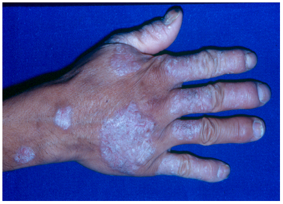

Gabarito

Artrite psoriática ou artrite psoriásica. Psoríase isoladamente não pontuará.

### Questão 6

Mulher, 68a, procura a Unidade Básica de Saúde por tosse seca há três anos e dispneia progressiva aos esforços há nove meses. Antecedentes pessoais: hipertensão arterial, dislipidemia e tabagismo 35 anos-maço. Exame físico: PA=148/88mmHg; FC=76bpm; FR=23irpm; oximetria de pulso=92% em ar ambiente. Estase venosa jugular a 45º; coração: hiperfonese da segunda bulha em foco pulmonar, sem sopros; pulmões: estertores tele inspiratórios em terço inferior e médio; extremidades: edema simétrico de membros inferiores +/4+. Radiograma de tórax: imagem Q6. A HIPÓTESE DIAGNÓSTICA É:

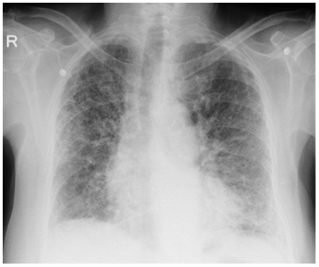

Gabarito

Fibrose pulmonar ou doença intersticial pulmonar ou cor pulmonale.

### Questão 7

Homem, 38a, procurou o Pronto Atendimento por dispneia progressiva há quatro dias, associada a tosse amarelada e febre. Exame físico: vígil e confuso. PA=138/76mmHg; FC=126bpm; FR=32irpm; T=38,2ºC; oximetria de pulso=92% sob máscara não reinalante 15L/min. Ausculta pulmonar sem alterações. O abdome eleva-se durante a inspiração. A CONDUTA IMEDIATA É:

Gabarito

Intubação orotraqueal, aceitar também via aérea definitiva ou ventilação mecânica invasiva. Não será aceita ventilação mecânica não invasiva ou via aérea avançada ou cateter nasal de alto fluxo. Ventilação mecânica apenas, não especificada, não será aceita.

### Questão 8

Mulher, 58a, procura a Unidade Básica de Saúde por dificuldade para andar nos últimos seis meses. Antecedentes pessoais: hipertensão arterial e diabetes. Medicamentos em uso: losartana; anlodipino; metformina e gliclazida. Exame físico: PA=118/78mmHg; FC=72bpm; FR=14irpm. Exame neurológico: abolição dos reflexos patelar e aquileu bilateralmente; redução da sensibilidade vibratória no primeiro pododáctilo direito e esquerdo. Exames laboratoriais: hemoglobina=12,4g/dL; VCM=110fL; CHCM=33g/dL; RDW=14%; hemoglobina glicada=7,2%; creatinina=1,1mg/dL. O EXAME INDICADO PARA A CONFIRMAÇÃO DIAGNÓSTICA É:

Gabarito

Dosagem sérica da vitamina B12 ou dosagem de B12 ou dosagem de cobalamina.

### Questão 9

Homem, 20a, procura o Pronto Atendimento após ser ferroado por abelha há 10 minutos. Queixa-se de falta de ar, tontura e náuseas. Exame físico: vígil, orientado e ansioso. PA=88/42mmHg, FC=120bpm, FR=28irpm, oximetria de pulso=92% em ar ambiente. Ausculta pulmonar: sibilos expiratórios difusos. A CONDUTA IMEDIATA É:

Gabarito

Adrenalina ou epinefrina (IM ou EV). Se responder adrenalina SC ou não especificar a via de administração, a resposta será considerada errada.

### Questão 10

Homem, 22a, procura o Pronto Atendimento por dor precordial de forte intensidade, iniciada há quatro dias e que piora com a inspiração. Apresentou coriza, odinofagia, febre e tosse há uma semana, com melhora espontânea. Antecedentes pessoais: diabetes tipo 1 há 10 anos em tratamento com insulina NPH e regular. Exame físico: regular estado geral; ansioso; PA=122/68mmHg; FC=112bpm; FR=22irpm. Ausculta pulmonar normal. Ausculta cardíaca: ritmo regular, em dois tempos, sem sopros. Realizado ECG
A HIPÓTESE DIAGNÓSTICA É:

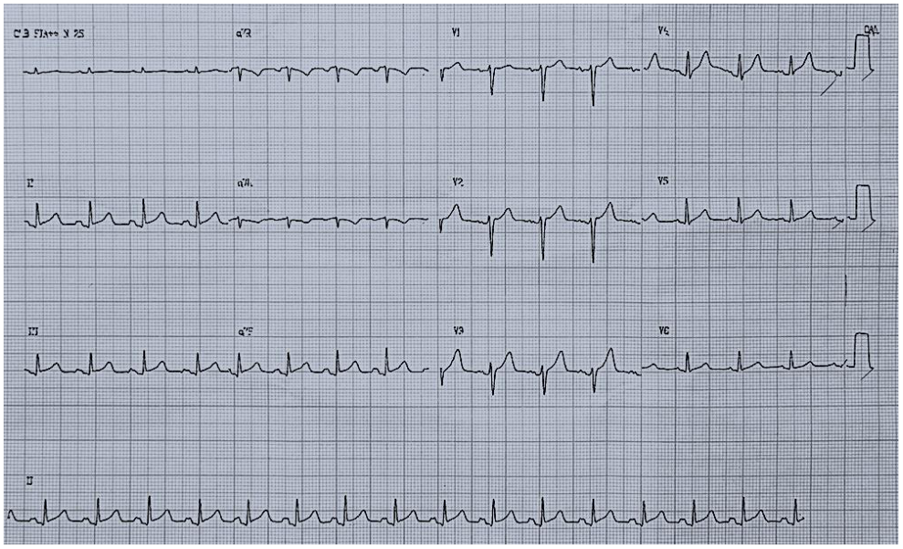

Gabarito

Gabarito: Pericardite aguda ou pericardite aguda pós viral.

### Questão 11

Mulher, 46a, procura o Pronto Atendimento por dor e fraqueza em membros superiores e inferiores há dois dias. Participou de caminhada nos últimos quatro dias para atividade religiosa. Antecedentes pessoais: hipertensão arterial em uso de hidroclorotiazida. Exame físico: PA=152/98mmHg; FC=96bpm; FR=22irpm; T=37,5ºC. Ausculta cardíaca e pulmonar normais, sem edemas. Exames laboratoriais: hemoglobina=12,2g/dL; leucócitos=14.000/mm3; ureia=107mg/dL; creatinina=3,6mg/dL; sódio=136mEq/L; potássio=5,4mEq/L; cálcio=8,8mg/dL; fósforo=4,4mg/dL; CPK=16.328UI/L. Exame de urina: pH=4,9; densidade=1009; nitrito=negativo; proteína=+/4+; hemoglobina=++/4+; leucócitos=3/campo; hemácias=2/campo. A CONDUTA TERAPÊUTICA IMEDIATA É:

Gabarito

Hidratação IV ou Cristaloide ou solução fisiológica ou Ringer serão considerados. Hidratação VO, soro glicosado ou soluções coloides não pontuam.

### Questão 12

Homem, 70a, há 45 dias foi atendido no Pronto Atendimento com quadro de tosse, expectoração amarelada e dispneia há 10 dias, além de febre não mensurada. Solicitados exames e prescrito levofloxacino 750 mg/dia por 10 dias para uso domiciliar. Antecedente pessoal: pedreiro por 40 anos, aposentado há seis meses; tabagismo ativo (90 anos-maço), tosse matutina há dois meses. Hoje, o paciente foi convocado para consulta na Unidade Básica de Saúde devido ao resultado do escarro. Refere melhora da expectoração, mas mantém dispneia. Resultado de exames: tomografia computadorizada de tórax de alta resolução: presença de enfisema centro lobular e para-septal predominando em lobos superiores; lesões em “árvore em brotamento” no segmento lateral do lobo médio. Escarro: baciloscopia=negativa; teste rápido molecular para Mycobacterium tuberculosis=negativo; cultura para Mycobacterium: positivo para Mycobacterium avium. O EXAME NECESSÁRIO PARA CONFIRMAR A HIPÓTESE DIAGNÓSTICA É:

Gabarito

Gabarito: Nova amostra de escarro para cultura de micobactéria.

## Cirurgia

> **Enunciado para as questões 13, 14:**
>
> Homem, 26a, condutor de motocicleta, teve colisão contra anteparo fixo. É trazido à Unidade de Emergência devido a perda de consciência momentânea. Exame físico: escala de coma de Glasgow=15; pupilas isocóricas e fotorreagentes; PA=132/81mmHg; FC=76bpm; FR=14irpm; oximetria de pulso=100% em ar ambiente; hematoma e escoriação na região temporoparietal direita. Foi mantido em observação. Após 70min evoluiu com rebaixamento súbito do nível de consciência e anisocoria. Foi indicado uma via aérea definitiva.

### Questão 13

O TIPO DE LESÃO INTRACRANIANA QUE SE CORRELACIONA COM ESTE QUADRO CLINICO É:

Gabarito

Hematoma extradural ou hematoma epidural

### Questão 14

NESTE TIPO DE LESÃO INTRACRANIANA, A ESTRUTURA VASCULAR MAIS FREQUENTEMENTE ACOMETIDA É:

Gabarito

Artéria meníngea média

### Questão 15

Mulher, 25a, procurou Unidade Básica de Saúde devido à presença de nódulo indolor em pescoço, que se mantém inalterado há mais de dois anos. Exame físico: nódulo de 20mm, endurecido e indolor à palpação na região inferior ao ângulo da mandíbula e ao lóbulo da orelha esquerda. A HIPÓTESE DIAGNÓSTICA É:

Gabarito

tumor de parótida ou adenoma de parótida ou tumor misto de parótida ou adenoma pleomórfico de parótida.

### Questão 16

Recém-nascido a termo, sete dias de vida, é trazido ao Pronto-Socorro com história de vômitos e distensão abdominal há dois dias. Nega febre ou outras queixas. Em aleitamento materno exclusivo. Antecedentes: primeira evacuação no terceiro dia de vida e alguns episódios de evacuação após estímulo. Exame físico: abdome distendido, sem abaulamentos, ânus tópico e pérveo. Exames laboratoriais: eletrólitos, ureia, creatinina e gasometria normais. Radiograma simples de abdome: (imagem Q16). O DIAGNÓSTICO ETIOLÓGICO DO ABDOME AGUDO É:

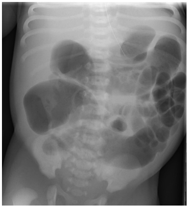

Gabarito

Megacolon congênito ou doença de Hirschsprung ou aganglionose

### Questão 17

Mulher, 20a, terceiro dia de pós operatório de craniectomia descompressiva por hematoma subdural, encontra-se na Unidade de Terapia Intensiva, sedada, PA=124/78mmHg, FC=88bpm, T=36,2oC. Diurese 24h=6.200mL, urina clara, creatinina=0,7mg/dL, ureia=32mg/dL, sódio=167mEq/L, potássio=4,1mEq/L. A ETIOLOGIA DO DISTÚRBIO HIDROELETROLÍTICO É:

Gabarito

Diabetes insipidus

### Questão 18

Mulher, 32a, é encaminhada ao ambulatório especializado com o diagnóstico de adenocarcinoma gástrico avançado, histologicamente do tipo difuso de Laurèn. Exame físico: abdome: plano, sem visceromegalias, sem sinais de ascite, presença de nodulação endurecida e dolorosa em cicatriz umbilical. ESTE EXAME FÍSICO INDICA A PRESENÇA DE:

Gabarito

carcinomatose peritoneal ou metástase peritoneal ou nódulo de sister Mary Joseph.

### Questão 19

Homem, 44a, deu entrada no Pronto-Socorro com queixa de dor torácica em região precordial de forte intensidade com irradiação para o dorso há oito horas, acompanhada de sudorese fria. Antecedente pessoal: hipertensão arterial em uso de nifedipina 40mg/dia. Exame físico: PA=212/142mmHg; FC=111bpm; estase jugular; pulsos arteriais periféricos com amplitude diminuída no membro superior esquerdo; coração: bulhas hipofonéticas e sopro diastólico suave em foco aórtico acessório; pulmões: estertores crepitantes em bases; abdome: exame normal. As dosagens de CK-mb e troponina estavam normais. Eletrocardiograma: sobrecarga de câmaras esquerdas. Radiograma de tórax: imagem Q19. O EXAME COMPLEMENTAR QUE CONFIRMA A HIPÓTESE DIAGNÓSTICA É:

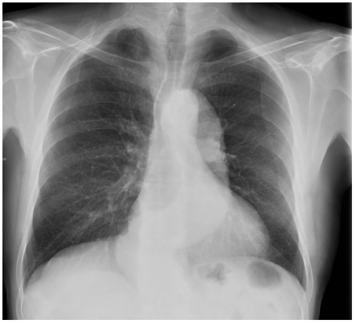

Gabarito

ecocardiograma transesofágico ou angiotomografia de tórax ou angioressonância de tórax ou tomografia de tórax com contraste. Ecocardiograma apenas ou tomografia/ressonância sem contraste serão consideradas respostas incorretas.

### Questão 20

Mulher, 18a, vítima de atropelamento, é trazida ao Centro de Trauma pelo Corpo de Bombeiros, consciente, orientada, com dor torácica, dispneia e presença de fratura exposta de fêmur à direita. Exame físico: Escala de coma de Glasgow=15; FC=118bpm; PA=80/42mmHg; FR=32irpm; oximetria de pulso=92% em ar ambiente; pulmões: murmúrio vesicular diminuído à direita com submacicez à percussão. DE ACORDO COM O ATLS, A CLASSIFICAÇÃO DE HEMORRAGIA DESTA PACIENTE É:

Gabarito

Grau III

### Questão 21

Homem, 28a, hospitalizado para tratamento de pneumonia extensa à esquerda. Ecografia transtorácica evidenciou derrame pleural volumoso livre em hemitórax esquerdo. Exames laboratoriais: leucócitos=13.480/mm3 (10% bastões, 74% segmentados); glicemia=82mg/dL; LDH=124UI/L. Líquido pleural: leucócitos 25.000/mm3 (97% neutrófilos); glicose=2mg/dL; proteína=122mg/dL; LDH=750UI/L. Iniciado antibiótico, com melhora da febre em 72 horas. A FASE EVOLUTIVA DESTE DERRAME PLEURAL É:

Gabarito

exsudativa

### Questão 22

Mulher, 56a, procura Pronto-Socorro com queixa de dispneia progressiva há um mês. Refere atendimentos médicos, pelo mesmo motivo, com melhora parcial após uso de inalações. Antecedente pessoal: infecção por covid, com internação em Unidade de Terapia Intensiva e ventilação mecânica por 14 dias. Exame físico: FR=26irpm, sinais de cornagem. Realizada inalação com simpatomimético, sem melhora efetiva do desconforto. A HIPÓTESE DIAGNÓSTICA É:

Gabarito

estenose laringotraqueal ou estenose laríngea ou estenose traqueal

### Questão 23

Homem, 48a, procura Pronto-Socorro com queixa de febre há 24 horas. Refere estar em investigação ambulatorial por quadro de dor abdominal em cólica, após alimentação há três meses. Exame físico: ictérico++/4; T=38,2oC; FC=98bpm; PA=124/72mmHg. hemoglobina=11,4g/dL, leucócitos=11.480/mm3; plaquetas=192.000/mm3; AST=124UI/L; ALT=98UI/L; fosfatase alcalina=489UI/L; gama GT=820UI/L; bilirrubina total=8mg/dL; bilirrubina direta=6,2mg/dL. Exame de urina: hemácias=6/campo, leucócitos=8/campo, proteína ausente. O EXAME QUE MELHOR AVALIA A CAUSA PROVÁVEL DESTE QUADRO É:

Gabarito

ultrassonografia de abdome ou usg de abdome. Não será aceito apenas ultrassom.

### Questão 24

Homem, 56a, procura Unidade Básica de Saúde com queixa de dificuldade para iniciar micção há oito meses, com piora no último mês. Refere que o jato urinário está mais fraco, mesmo com esforço, e que apresenta gotejamento ao final da micção, além de aumento do número de micções noturnas. Toque retal: próstata fibroelástica, cerca de 45g. PSA total=4ng/mL, PSA livre=0,88ng/mL. CONSIDERANDO A PRINCIPAL HIPÓTESE DIAGNÓSTICA, A CONDUTA INICIAL É:

Gabarito

Iniciar doxasozina ou tansulozina ou alfabloqueadores ou finasterida ou bloqueador de alfa 5 redutase

## Pediatria

### Questão 25

Menina, 3a, é trazida ao Pronto-Socorro com história de edema periorbitário, aumento de volume abdominal e edema de extremidades há cerca de duas semanas. Procurou atendimento algumas vezes neste período sendo diagnosticada com sobrepeso e alergia a alimentos. Refere que a paciente manteve boa ingesta hídrica e boa aceitação alimentar, diurese com espuma e evacuações sem alterações. Nega outras queixas. Refere uso de anti-histamínicos, sem melhora do quadro. Antecedentes pessoais: resfriado há um mês. Exame físico: bom estado geral, corada, mucosas úmidas; pulsos periféricos cheios; enchimento capilar=2s; PA=95/60mmHg; FC=110bpm; FR=31irpm; oximetria=98% em ar ambiente; edema periorbitário bilateral 4+/4+; Pulmões: murmúrio vesicular diminuído em bases, sem ruídos adventícios; Coração: bulhas rítmicas e normofonéticas, sem sopros; abdome: flácido, indolor à palpação, fígado e baço não palpáveis, sinal de piparote positivo; genitália típica feminina com edema de grandes lábios e de região pubiana; Extremidades: edema simétrico de membros inferiores com Godet depressível 3+/4 até nível de joelho. NESTE CASO, O VOLUME DO COMPARTIMENTO INTRAVASCULAR ESTÁ:

Gabarito

Reduzido, contraído, diminuído

### Questão 26

Menina, 6a, foi trazida desacordada ao Pronto-Socorro com relato de sonolência há 30 minutos, enquanto brincava em uma festa de aniversário. Pais negam trauma, engasgo, febre ou outras queixas. Antecedente pessoal: alergia a látex. Exame físico: sonolenta; pálida; PA=76/52mmHg; FC=150bpm; FR=45ipm; oximetria=89% em ar ambiente; pulsos periféricos finos; enchimento capilar=4 segundos; pulmões: sibilos difusos com tiragem intercostal e retração de fúrcula; coração: bulhas rítmicas normofonéticas sem sopros; abdome e pele sem alterações. A HIPÓTESE DIAGNÓSTICA É:

Gabarito

Choque anafilático ou choque distributivo. Anafilaxia apenas é incorreto

### Questão 27

Menino, 9a, estava no sítio dos avós e sentiu picada no pé quando caminhava pelo pomar. Saiu correndo com o susto, sem identificar o que o atacou. Nas horas seguintes, o local da ferida tinha discreto edema e sensação de formigamento. Evoluiu com mal-estar, visão turva, dificuldade de manter os olhos abertos, náuseas, dor muscular intensa e urina escura. A HIPÓTESE DIAGNÓSTICA É:

Gabarito

Acidente crotálico, ou picada por cobra cascavel ou crotalus. É imprescindível a identificação do gênero crotálico. Acidente por cobra, sem identificação do gênero, será invalidada.

### Questão 28

Você está auxiliando na reanimação de bebê de 9 meses em parada cardiorrespiratória por hipóxia. Está cuidando da via aérea, logo após o paciente ter sido intubado com sucesso. QUAL A FREQUÊNCIA RESPIRATÓRIA QUE VOCÊ DEVE APLICAR NESTA CONDIÇÃO?

Gabarito

20 a 30 ir/min ou 1 ventilação a cada 2 a 3 segundos

### Questão 29

Menina, 3a, é trazida pela mãe ao Pronto-Socorro por estar apresentando adinamia, palidez, dor em membros inferiores e manchas em face, tronco e membros inferiores há 10 dias. Nega febre. Há um dia refere sangramento gengival durante escovação dentária. Nega outros sangramentos. Antecedentes pessoais: Síndrome de Down e cardiopatia congênita sem repercussão hemodinâmica. Nega uso de medicamentos. Exame físico: descorada 2+/4+, anictérica, acianótica; presença de equimoses em face, tronco e membros; abdome: fígado não palpável, baço a 4 cm do rebordo costal esquerdo, indolor. A PRINCIPAL HIPÓTESE DIAGNÓSTICA É:

Gabarito

Leucemia aguda

### Questão 30

Menino, 7m, foi trazido ao Pronto-Socorro por choro inconsolável intercalado com períodos de melhora há 18 horas. Pais referem piora progressiva do quadro, com aumento dos episódios e evacuações com muco e laivos de sangue. Negam febre ou outros sintomas. Antecedentes pessoais: negam doenças e uso de medicamentos. Durante o exame mostra-se irritado, flexionando as pernas contra o abdome. Exame físico: regular estado geral; palidez cutânea; mucosas secas; abdome doloroso à palpação difusa, distendido, ruído hidroaéreo ausente com massa cilíndrica palpável no quadrante superior direito. Restante do exame sem alterações. Ultrassonografia de abdome (imagem Q30). A HIPÓTESE DIAGNÓSTICA É:

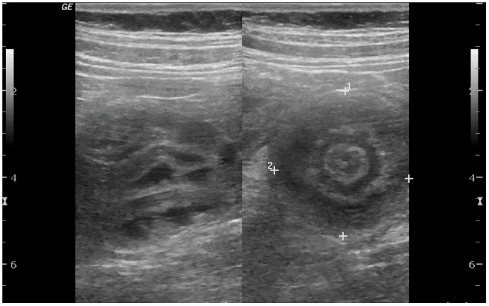

Gabarito

Intuscepção intestinal ou intuscepção ou invaginação intestinal ou invaginação

### Questão 31

Recém-nascido, 32 semanas de idade gestacional, nasce hipotônico e com choro fraco. Após o clampeamento imediato de cordão umbilical, foi submetido aos passos iniciais da reanimação e, à reavaliação, encontra-se com FC=90bpm, hipotônico e com respiração irregular. Foi submetido à ventilação com pressão positiva. A FRAÇÃO INSPIRADA DE OXIGÊNIO A SER UTILIZADA É:

Gabarito

30%. Admite-se como resposta 0,3

### Questão 32

Menino, 2m, é trazido à Unidade Básica de Saúde para primeira consulta de puericultura. Está em aleitamento materno exclusivo, mãe refere diurese clara várias vezes ao dia, apresenta bom ganho ponderoestatural e desenvolvimento neuropsicomotor adequado. Exame físico: jato urinário fraco, sem outras alterações. Traz ultrassonografia gestacional em que foi visualizada hidronefrose acentuada bilateral. O EXAME INDICADO PARA A CONFIRMAÇÃO DIAGNÓSTICA É:

Gabarito

Uretrocistografia miccional

### Questão 33

Menino, 10a, é trazido à Unidade Básica de Saúde com história de dificuldade para evacuar há seis anos. Há dois anos passou a apresentar perdas fecais em roupas íntimas, de odor fétido, cinco vezes ao dia. Está em uso de lactulose 20mL/dia há dois meses, sem melhora. Hábito intestinal: uma vez por semana, fezes endurecidas em quantidade moderada. Nega vômitos ou sangue nas fezes. Exame físico: percentil 25 de peso e 50 de estatura; abdome: distensão abdominal e palpação de fezes de consistência endurecida em fossa ilíaca esquerda. A CONDUTA INICIAL É:

Gabarito

Desimpactação ou remoção de fecaloma ou clister glicerinado ou PEG em dose de desimpactação ou PEG 1,5g/Kg. PEG apenas não será pontuado.

### Questão 34

Recém-nascido (RN), 1 dia de vida, assintomático, em aleitamento materno. Mãe apresenta VDRL=1:8 no momento do parto, com tratamento adequado durante a gestação. RN com exame físico sem alterações e VDRL=1:1. A CONDUTA É:

Gabarito

Acompanhamento ambulatorial ou acompanhamento clínico e laboratorial de puericultura; ou seguimento de puericultura; ou seguimento ambulatorial, ou puericultura. Sinonímias de seguimento conservadore serão aceitas. Respostas incorretas: coletar exames, ou realizar radiografia de ossos longos do recém-nascido e/ou iniciar tratamento do RN. Qualquer procedimento ou tratamento será considerado incorreto.

### Questão 35

Menino, 9a, é trazido à Unidade Básica de Saúde com história de sonolência e apatia há um mês. Segundo a professora, há uma semana está mais desinteressado das atividades escolares, com piora de seu rendimento em sala e nas provas. Exame físico: FC=64bpm; FR=20irpm; PA=percentil 50 para idade e estatura; corado; pele fria e seca; leve edema em mãos e pés. Restante do exame normal, estatura mantida desde a última consulta, há seis meses. A PRINCIPAL HIPÓTESE DIAGNÓSTICA É:

Gabarito

Hipotireoidismo adquirido ou hipotireoidismo. Hipotireoidismo congênito será considerado incorreto.

### Questão 36

Menino, 8a, é trazido para avaliação na Unidade Básica de Saúde com história de manchas vermelhas pelo corpo há três semanas. Mãe refere aparecimento de lesão eritematosa de formato ovalado com 3cm de diâmetro em transição tóraco-abdominal no início do quadro. Há duas semanas, refere aparecimento de erupção generalizada e simétrica em tronco e membros com lesões róseas ligeiramente elevadas, ovaladas, menores de 1cm, recobertas por uma fina escama. Algumas apresentam uma área central mais clara. Nega prurido ou outras queixas. Refere uso de loratadina por 10 dias, sem melhora. (imagem Q36). A HIPÓTESE DIAGNÓSTICA É:

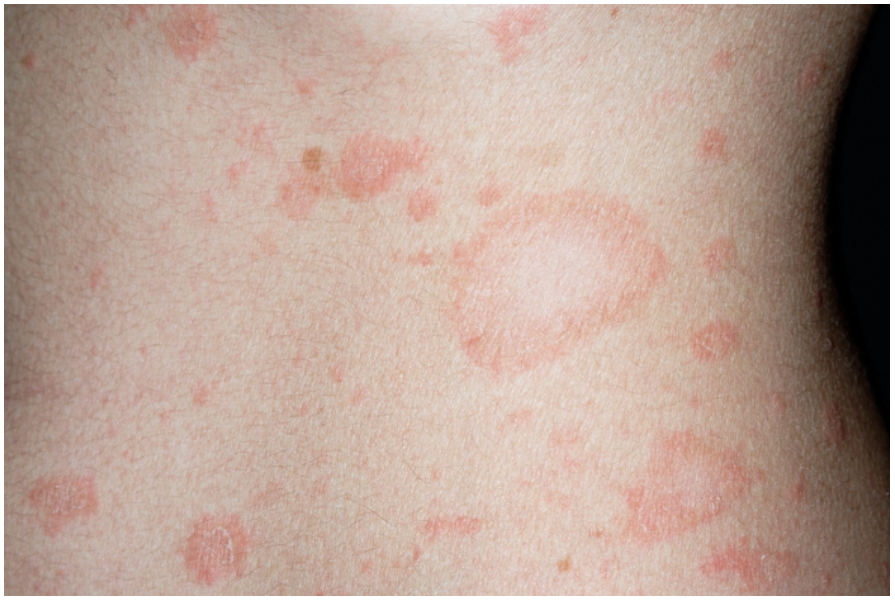

Gabarito

Ptiríase rosea

## Ginecologia e Obstetrícia

### Questão 37

Mulher, 51a, teve sua última menstruação há cerca de 13 meses. Refere fogachos intensos, especialmente durante a noite, que interferem na qualidade do sono. Queixa-se de diminuição da lubrificação vaginal, dispareunia e redução do desejo sexual. Antecedentes pessoais: hipertensão arterial controlada com medicação; histerectomia e retosigmoidectomia por endometriose. Faz atividade física cinco vezes por semana e considera sua alimentação bastante saudável. Exame físico: PA=122/80mmHg; IMC=21Kg/m2; exame de mamas sem anormalidades e exame ginecológico com mucosa vaginal hipotrófica. O MELHOR TRATAMENTO PARA ALÍVIO DA SINTOMATOLOGIA É:

Gabarito

Terapia hormonal combinada ou terapia estroprogestativa ou associação de estrogênio e progestagenio ou tibolona. Estrogenio ou progesterona isoladamente não pontuarão.

### Questão 38

Mulher, 37a, com idade gestacional de 34 semanas e 5 dias, vem para consulta pré-natal. Possui diabetes gestacional, em uso de 20 unidades de insulina NPH pela manhã e 10 unidades de insulina NPH às 22 horas, dose mantida desde as 30 semanas, pois estava bem controlada. Apresenta ainda hipertensão arterial gestacional, diagnosticada às 30 semanas, em uso de metildopa 750mg/dia. Notou diminuição da movimentação fetal, refere que a pressão está bem controlada e traz o seguinte perfil glicêmico (com uso inalterado da dieta e da insulina).

| Data | Jejum | 1 hora pós café | 1 hora pós almoço | 1 hora pós jantar |
|---|---|---|---|---|
| 08/11/2023 | 77 | 120 | 144 | 132 |
| 10/11/2023 | 66 | 142 | 110 | 96 |
| 13/11/2023 | 80 | 116 | 68 | 88 |
| 15/11/2023 | 72 | 114 | 86 | 120 |
| 17/11/2023 | 70 | 118 | 92 | 68 |

A CAUSA MAIS PROVÁVEL PELA QUAL A GESTANTE APRESENTA ESTE PERFIL GLICÊMICO É:

Gabarito

Insuficiência placentária

### Questão 39

Mulher, 23a, G2P0A1, idade gestacional de 10 semanas, que apresentou teste rápido de sífilis positivo na primeira consulta de pré-natal, retorna para avaliação de resultado de exames complementares. Nega qualquer sintoma ou tratamento prévio da doença. VDRL=negativo e CMIA=positivo. DE ACORDO COM O PROTOCOLO CLÍNICO E DIRETRIZES TERAPÊUTICAS (PCDT) DO MINISTÉRIO DA SAÚDE, A PRESCRIÇÃO INDICADA PARA A GESTANTE É:

Gabarito

Penicilina Benzatina IM 2.400.000UI por semana, por 3 semanas. Ou 7.200.000 UI em três tomadas. Resposta parcial não será aceita, devendo constar droga, via e tempo. Referência: manual CFM.

### Questão 40

Mulher, 31a, nuligesta, está tentando engravidar há dois anos. Refere sangramento menstrual regular com volume aumentado. Traz exames de dosagens hormonais normais; espermograma sem alterações. Ultrassonografia transvaginal=útero com volume de 125cm3 com mioma de 1cm (FIGO 0) e ovários sem anormalidades. Realizada histerossalpingografia: (imagem Q40) A CONDUTA TERAPÊUTICA É:

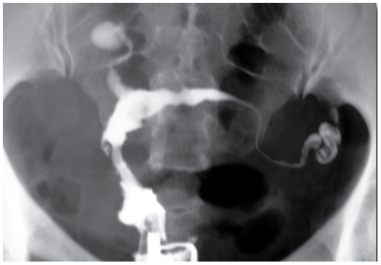

Gabarito

Miomectomia histeroscópica. Miomectomia isoladamente, ou por laparotomia, está incorreta.

### Questão 41

Mulher, 35a, G2P1A0, IG=35 semanas e 6 dias, procura Maternidade em trabalho de parto espontâneo. Ao exame: dinâmica uterina=3x35seg em 10min, altura uterina=35cm; BCF=148bpm; toque=colo dilatado 4,0cm, 70% esvaecido, medianizado, amolecido, bolsa íntegra. Antecedentes: sem comorbidades, pré-natal na Unidade Básica de Saúde. Evoluiu para parto vaginal após 5 horas. Após 65 minutos do nascimento sem dequitação placentária, iniciou com sangramento intenso. No exame físico, foi constatado ausência de área de clivagem placentária. Além do suporte básico de vida, A CONDUTA TERAPÊUTICA ESPECÍFICA NESTE MOMENTO É:

Gabarito

Histerectomia

### Questão 42

Mulher, 38a, primigesta, IG= 28 semanas, procura Pronto Atendimento com queixa de inchaço nas mãos e pés há uma semana. Há dois dias vem apresentando dor abdominal, principalmente no flanco direito, redução de volume urinário, com coloração escura. Antecedentes: acompanhamento de pré-natal regular em Unidade Básica de Saúde, sem comorbidades. Exame físico: PA=130/92mmHg; FC=100bpm; FR=18irpm; abdome=útero normotônico, uma contração de 35seg em 10min, altura uterina=23cm, BCF=152bpm, pouco doloroso difusamente à palpação, descompressão brusca negativa. Toque vaginal=colo uterino grosso, posterior, impérvio. Membros inferiores= edema de 2+/4+ bilateralmente, pulsos simétricos. Exames laboratoriais: hemoglobina=13,7g/dL; hematócrito=39,5%; leucócitos=11.990/mm3; plaquetas=98.000/mm3; LDH=3.803UI/L; ALT=533UI/L; bilirrubina total=3,22mg/dL; CK=193UI/L; creatinina=1,62mg/dL; relação proteína/creatinina urinária=0,32. A HIPÓTESE DIAGNÓSTICA É:

Gabarito

Sindrome HELLP

### Questão 43

Mulher, 38a, apresenta lesão vulvar multicêntrica redicivante. (imagem Q43) Anatomopatológico: lesão intraepitelial escamosa de alto grau da vulva. O PRINCIPAL FATOR DE RISCO ASSOCIADO A ESTA LESÃO É:

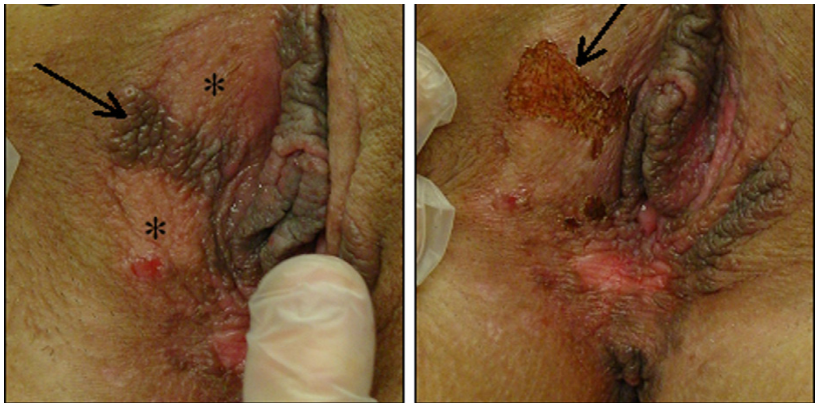

Gabarito

Papilomavirus humano ou HPV

### Questão 44

Mulher, 35a, G3P2A0, IG=37 semanas e 1 dia (A=E), retorna à consulta de pré-natal em hospital terciário, sem queixas, com boa movimentação fetal, trazendo resultado de exames, realizados ontem. É hipertensa crônica, em uso de metildopa 750mg/dia. Exame físico: PA=134/82mmHg, AU=33cm; BCF=148 bpm. Toque vaginal=colo 50% esvaecido, 2cm de dilatação, polpa, cefálico, bolsa integra. Ultrassonografia obstétrica com Doppler=gestação de 37 semanas, cefálico, peso fetal estimado < percentil 8, com aumento da resistência na artéria umbilical (índice de pulsatilidade>percentil 95); Doppler em artéria cerebral média e líquido amniótico normais. Cardiotocografia: boa vitalidade (Categoria 1). Exames laboratoriais: hemoglobina=13,4g/dL; hematócrito=38,6%; plaquetas=307.000/mm3; AST=10UI/L; creatinina=0,71mg/dL; bilirrubina total=0,17mg/dL; LDH=112UI/L; relação proteína/creatinina urinária=0,42. A CONDUTA É:

Gabarito

Indução de parto ou interrupção da gestação ou resolução da gestação. Não será aceito parto cesárea.

### Questão 45

Mulher, 19a, nuligesta, sem problemas de saúde, iniciou anticoncepcional oral combinado com cartela de 24 dias e pausa de 4 dias, associado a preservativo. Após seis meses de uso regular, não está mais apresentando sangramento de privação na pausa da cartela. QUAL A ORIENTAÇÃO QUE DEVE SER FORNECIDA PARA ESTA MULHER?

Gabarito

Orientar que é normal. Qualquer orientação diferente da normalidade, não pontua.

### Questão 46

Mulher, 50a, G2P1C1A0, comparece à Unidade Básica de Saúde com queixa de perda de urina aos esforços, sem urgência miccional. Refere uso de estradiol (creme vaginal) duas vezes por semana. Antecedentes: diabetes tipo 2, controlado com dieta e metformina. Exame ginecológico: hipotrofia vulvar, ausência de lesões genitais e manobra de Valsalva negativa. A CONDUTA INICIAL É:

Gabarito

Fisioterapia ou exercícios pélvicos. Qualquer outra medida terapêutica ou exame adicional não pontua.

### Questão 47

Mulher, 68a, procura o Pronto-Socorro com quadro de dispneia aos esforços há 20 dias, com piora há dois dias. Nega febre e tosse. Tem antecedente de câncer de mama: carcinoma ductal invasivo, estadio clínico IIa, tratado com quadrantectomia e biópsia de linfonodo sentinela, quimioterapia e radioterapia há seis anos. Atualmente sem uso de medicação. Radiograma de tórax (imagem Q47) ESTE ACHADO RADIOLÓGICO OCORRE COMO CONSEQUÊNCIA DE:

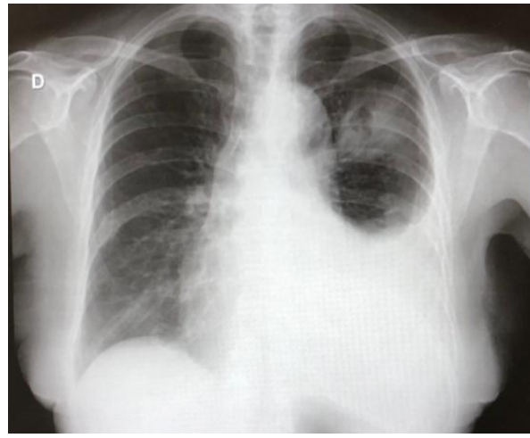

Gabarito

Metástase pleural de câncer de mama, metástase pleural, metástase pulmonar, câncer de mama metastático. Tem que ser citada metástase na resposta.

### Questão 48

Mulher, 28a, procurou o Pronto Atendimento com queixa de dor pélvica de moderada intensidade há dois dias. Nega leucorreia, febre ou disúria. Refere ciclos menstruais regulares, com última menstruação há 14 dias. Método contraceptivo=condom. Exame físico: dor à palpação profunda de hipogastro, sem outras alterações. Beta-HCG=negativo. Ultrassonografia pélvica: cisto ovariano à esquerda medindo 6cm, multiloculado, com paredes lisas, sem projeções ou fluxo ao doppler (IC=1) IOTA-B. Paciente apresentou melhora do quadro após analgesia. A CONDUTA EM RELAÇÃO AO CISTO OVARIANO É:

Gabarito

Seguimento ou repetir ultrassonografia ou expectante. Não será aceito alta.

## Saúde Coletiva

> **Enunciado para as questões 49, 50, 51, 52:**
>
> O Departamento de Vigilância em Saúde (DVS) de um município constatou que, entre os anos de 2010 e 2019, houve um aumento significativo na incidência de internações por doenças respiratórias entre os moradores adscritos às quatro Unidades Básicas de Saúde (UBS) da região sul da cidade. Dentre essas está a UBS do Jardim Alvim que em 2019 tinha uma população de 20.000 pessoas. A equipe de vigilância epidemiológica desta UBS constatou que nesse ano foram registrados 200 óbitos e que, na declaração de óbito estava registrado, em 40 deles, que a causa de morte foi insuficiência respiratória. Várias foram as hipóteses para explicar esse problema de saúde, tais como: o crescimento e o adensamento populacional desordenado; a ampliação e o aumento das operações de transporte de passageiros e de cargas no aeroporto internacional que fica nessa região. Existem três grandes rodovias estaduais que cortam o território dessa UBS e nelas ocorreu um aumento constante no tráfego diário de veículos. A equipe de vigilância também cogitou a possibilidade de alguma falha no atendimento prestado pelas equipes de saúde da família. Diante disto, o DVS e a UBS planejaram e executaram um inquérito populacional cujo objetivo era descrever a frequência de pessoas que apresentavam sintomas respiratórios nos últimos 15 dias e se havia associação entre morar próximo ao aeroporto e apresentar sintomas respiratórios. A coleta de dados foi realizada pelos agentes comunitários de saúde em uma data específica.

### Questão 49

QUAL O MODELO DE ESTUDO EPIDEMIOLÓGICO UTILIZADO NA CONSTATAÇÃO DE QUE HOUVE AUMENTO DA INCIDÊNCIA DE INTERNAÇÕES POR DOENÇA RESPIRATÓRIA ENTRE 2010 E 2019?

Gabarito

Ecológico

### Questão 50

QUAL O MODELO DE ESTUDO EPIDEMIOLÓGICO EXECUTADO PELO DVS, UBS E AGENTES COMUNITÁRIOS DE SAÚDE?

Gabarito

Seccional ou transversal

### Questão 51

Os resultados do estudo feito pelos agentes comunitários de saúde identificaram que a maior prevalência entre as pessoas com sintomas respiratórios ocorreu entre aqueles que residiam mais próximo das rodovias e do aeroporto. QUAL DOS CRITÉRIOS DE BRADFORD HILL PODE SER ASSOCIADO COM ESSE ACHADO?

Gabarito

gradiente

### Questão 52

A informação de insuficiência respiratória como causa de morte, utilizada neste estudo, foi retirada dos atestados de óbito. SEGUNDO O MANUAL DE INSTRUÇÕES PARA O PREENCHIMENTO DA DECLARAÇÃO DE ÓBITO DO MINISTÉRIO DA SAÚDE DE 2022, ESTA INFORMAÇÃO ESTAVA ANOTADA EM QUAL LINHA DESTE ATESTADO?

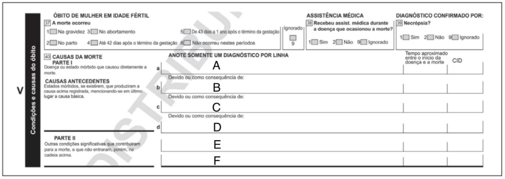

Gabarito

Linha A

### Questão 53

Mulher, 42a, comparece em consulta de rotina em Unidade Básica de Saúde com queixa de edema de membros inferiores. Antecedentes: tabagista ativa; uso regular de anticoncepcional oral combinado; tireoidectomia por câncer há um ano; trombose na perna direita, tratada corretamente. Durante a consulta, foi orientada outra forma de contracepção e a participar do programa antitabagismo. O CONCEITO ATRIBUÍDO A ESTAS CONDUTAS É:

Gabarito

Prevenção primária

### Questão 54

Homem, 50a, tabagista, morador de município com cerca de 29.000 habitantes, desenvolve câncer de bexiga e é encaminhado para outro município a fim de ter acesso a tratamento especializado. A DIRETRIZ DO SUS ENVOLVIDA NESSE CASO É:

Gabarito

Regionalização

> **Enunciado para as questões 55, 56:**
>
> O Ministério da Saúde tem uma equipe de profissionais que avalia as notícias relacionadas a doenças em jornais e na mídia eletrônica. Periodicamente, a equipe constata indícios de que uma doença está atingindo grande número de pessoas e causando preocupação nos gestores. Segundo o Manual de Vigilância Epidemiológica do Ministério da Saúde (2022):

### Questão 55

CITE UMA MEDIDA DE FREQUÊNCIA EPIDEMIOLÓGICA QUE JUSTIFICARIA A INCLUSÃO DESSA DOENÇA NA LISTA DAS DOENÇAS DE NOTIFICAÇÃO COMPULSÓRIA.

Gabarito

Prevalência ou incidência

### Questão 56

CITE UM INDICADOR EPIDEMIOLÓGICO QUE JUSTIFICARIA A INCLUSÃO DESSA DOENÇA NA LISTA DAS DOENÇAS DE NOTIFICAÇÃO COMPULSÓRIA.

Gabarito

Mortalidade ou letalidade

### Questão 57

Homem, 71a, em boa saúde, procura médico para consulta de rotina. São solicitados exames de hemograma, glicemia de jejum, colesterol, antígeno prostático específico total (PSAt), ureia, creatinina, hormônio tireoestimulante, radiograma de tórax, eletrocardiograma, Holter, teste ergométrico e ultrassonografia de abdome total. Resultados: glicemia=102mg/dL; PSAt=4,5ng/mL; restante dentro da normalidade. Foi prescrita metformina e indicada biópsia de próstata. Apresentou hematospermia no primeiro mês após a realização da biópsia e desconforto abdominal persistente. O CONCEITO QUE DEVERIA TER SIDO APLICADO, PARA EVITAR DANOS NESTE CASO, É:

Gabarito

Prevenção quaternária

### Questão 58

Homem, 51a, permaneceu internado em Unidade de Terapia Intensiva durante mais de dois meses após acidente vascular encefálico hemorrágico. Recebeu alta com hemiplegia esquerda e dependência de terceiros para atividades da vida diária. Foi transferido temporariamente para casa de repouso, pois a companheira não conseguia cuidar dele em casa. Tem quatros filhos adultos, com os quais mantinha pouco contato nos últimos anos. A equipe de Saúde da Família se reuniu para elaborar Projeto Terapêutico Singular: elencaram os diagnósticos e problemas e definiram as ações e metas. O caso foi rediscutido apenas após três meses e nenhum membro da equipe realizou qualquer ação programada, pois considerava ser atribuição de outro. QUAL FASE DO PROJETO TERAPÊUTICO SINGULAR NÃO FOI CUMPRIDA?

Gabarito

Fase 3 ou definição de responsabilidades

> **Enunciado para as questões 59, 60:**
>
> Para descrever e analisar a mortalidade por covid em Manaus em 2021, Silva e colaboradores (2021) padronizaram o coeficiente de mortalidade geral dessa capital, utilizando a estrutura etária da população brasileira estimada em 2020. Os dados estão na tabela a seguir:
>
> | Cidade/Idade (anos) | Óbitos observados | População |  | Taxa específica |  | Óbitos esperados |  |
> |---|---|---|---|---|---|---|---|
> |  |  | n | % |  |  |  |  |
> | Manaus |  |  |  |  |  |  |  |
> | 0-9 | 25 | 355.277 | 16,01 |  | 7,04 |  | 21,67 |
> | 10-19 | 19 | 395.462 | 17,82 |  | 4,81 |  | 15,41 |
> | 20-29 | 74 | 405.722 | 18,28 |  | 18,24 |  | 65,42 |
> | 30-39 | 245 | 377.118 | 16,99 |  | 64,97 |  | 233,11 |
> | 40-49 | 546 | 303.661 | 13,68 |  | 179,81 |  | 551,37 |
> | 50-59 | 889 | 197.099 | 8,88 |  | 451,04 |  | 1.128,75 |
> | 60-69 | 1.457 | 115.258 | 5,19 |  | 1.264,12 |  | 2.217,16 |
> | 70-79 | 1.342 | 49.724 | 2,24 |  | 2.698,90 |  | 2.552,55 |
> | 80+ | 1.032 | 20.259 | 0,91 |  | 5.094,03 |  | 2.371,28 |
> | Total | 5.629 | 2.219.580 | 100 |  |  |  | 9.156,73 |
>
> Em relação às questões abaixo, basta montar a fórmula com os valores adequados, não sendo necessário o cálculo final.

### Questão 59

QUAL É A TAXA DE MORTALIDADE BRUTA POR COVID EM MANAUS EM 2021?

Gabarito

(5.629/2.219.580) x 100.000 (óbitos observados/população). Pontua mesmo que não multiplique por 100.000

### Questão 60

QUAL É A TAXA DE MORTALIDADE PADRONIZADA POR COVID EM MANAUS EM 2021?

Gabarito

(9.156,73/2.219.580) x 100.000 (óbitos esperados/população). Pontua mesmo que não multiplique por 100.000

