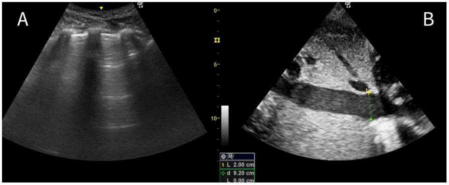
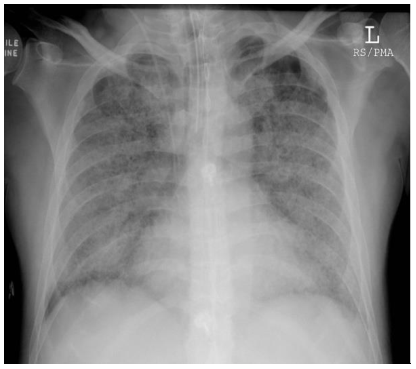
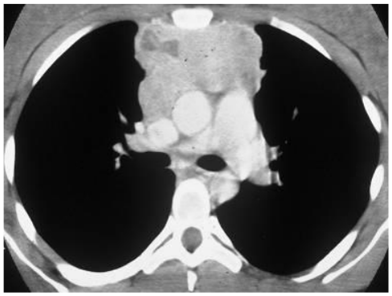
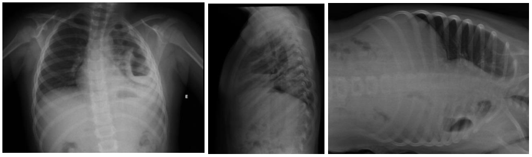
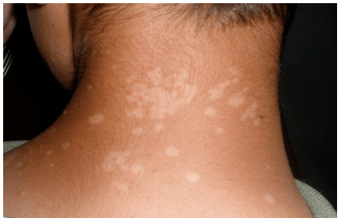
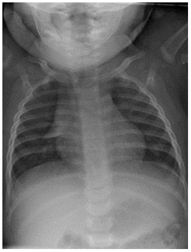
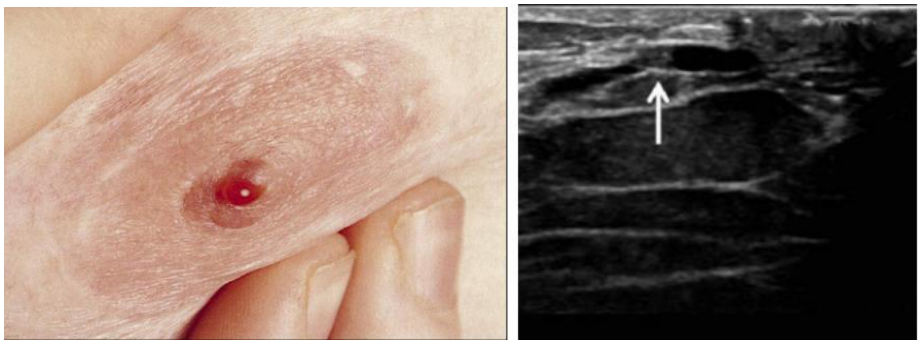
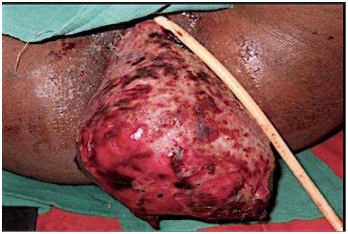

# UNICAMP 2025 – Acesso Direto – Prova 1 (manhã)

- Formato: Resposta curta (discursiva)
- Tipo: regular
- Data de aplicação: 2024-11-17
- Questões: 50
- Prova original: https://www.comvest.unicamp.br/residenciamedica2025/provas/dAD1.pdf
- Gabarito oficial: https://www.comvest.unicamp.br/residenciamedica2025/resp_esperadas/resp_ad1.pdf (retificado em 27/11/2024)

Valores de referência dos exames laboratoriais

| Valores de referência dos exames laboratoriais |  |
|---|---|
| Parâmetro | Valor de normalidade |
| Ácido fólico | 3,1 a 20,5 ng/dL |
| Adenosina deaminase | Pleural: < 30,0 UI/L |
| Albumina plasmática | 3,5 a 5,2 g/dL |
| ALT (TGP) | Homem <41 UI/L; mulher <33 UI/L |
| AST (TGO) | Homem <40 UI/L; mulher <33 UI/L |
| Atividade plasmática de renina | 0,6 a 4,18 ng/mL/h (ortostática) 0,32 a 1,84 ng/mL/h (supino) |
| Bilirrubina total | 0,3 a 1,2 mg/dL |
| Cálcio | 8,8 a 10,2 mg/dL |
| CK‐mb (creatinoquinase fração mb) | 0 a 24 UI/L |
| Clearance de creatinina | homem: 75 a 115mL/min/1,73m2; mulher: 85 a 125mL/min/1,73m2 |
| Cloro | 98 a 106 mmol/L |
| Colesterol HDL | Homem ≥ 40 mg/dL; mulher ≥ 50mg/dL |
| Colesterol LDL | < 100 mg/dL |
| Colesterol total | < 200 mg/dL |
| Cortisol urinário | 3,5 a 4,5 mcg/24h |
| CPK (creatina fosfoquinase) | 0,7 a 171 UI/L |
| Creatinina | Homem ≤ 1,2 mg/dL Mulher ≤ 0,8mg/dL |
| D‐dímero | <500ng/mL |
| Desidrogenase láctica (LDH) | 230 a 460 UI/L |
| Exame de urina | Leucócitos <5/campo Hemácias <5/campo Proteína negativo/traços pH: 5,5 a 7,5 densidade: 1,005 a 1,030 mOsm/Kg. |
| Ferritina | Homem: 30 a 400 ng/mL; mulher 13 a 150 ng/mL |
| Ferro sérico | Homem: 70 a 180 mcg/dL; mulher 60 a 180 mcg/dL |
| Fibrinogênio | 175 a 400 mg/dL |
| Fosfatase alcalina | Homem: 40 a 129 UI/L; mulher 35 a 103 UI/L |
| Fósforo | 2,5 a 4,5 mg/dL |
| Glicemia de jejum | 60 a 99 mg/dL |
| Hemoglobina glicada (HbA1c) | 4,0 a 5,6% |

| Valores de referência dos exames laboratoriais |  |
|---|---|
| Hemograma | Hemoglobina: homem 14 a 18 g/dL; mulher 12 a 16 g/dL Hematócrito: homem 41 a 52%; mulher 36 a 46% Leucócitos: 4.000 a 10.000/mm3 (segmentados 2.000 a 8.000/mm3; linfócitos 1.000 a 4.000/mm3; monócitos 200 a 800/mm3, eosinófilos < 450/mm3; basófilos <200/mm3) Plaquetas: 150.000 a 450.000/mm3 VCM: 80 a 99 fL HCM 27 A 32 pg Reticulócitos: 50.000 a 100.000/mm3 RDW: 11 a 14% |
| Magnésio | 1,9 a 2,5 mg/dL |
| Metanefrinas urina | < 400 mcg/24h (totais < 1300 mcg/24h) |
| Osmolaridade sérica | 275 a 295mOsm/Kg |
| Osmolaridade urinária | 300 a 900mOsm/Kg |
| Paratormônio (PTH) | 15 a 65 pg/mL |
| Potássio | 3,5 a 5,1 mEq/L |
| Proteína C reativa | Processo inflamatório: 10 a 50 mg/L (leve); 50 a 100 mg/dL (moderado); > 100 mg/dL (grave) Risco cardiovascular: < 1 mg/dL (baixo), 1 a 3 mg/dL (médio), > 3 mg/dL (alto) |
| PSA total | < 4 ng/mL |
| R (TTPA) | Até 1,3 |
| Relação albumina/creatinina urinária | < 30 mg/g |
| Relação proteína/creatinina urinária | < 0,2 |
| RNI (TP) | Até 1,25 |
| Sódio | 135 a 145 mEq/L |
| T4 livre | 0,9 a 1,7 ng/dL |
| TAP | 10 a 14s |
| TIBC | 255 a 450mcg/dL |
| Triglicérides | < 150 mg/dL |
| Troponina T | 0 a 14 ng/L |
| TSH | 0,3 a 4,2 mcUI/mL |
| TTPa | 24 a 40s |
| Uréia | 17 a 43 mg/dL |
| Velocidade de hemossedimentação | homem: <20mm/h; mulher: <30mm/h |
| Vitamina B12 | 200 a 900 pg/mL |
| Vitamina D | 31 a 10 ng/mL |

| Gasometria | Arterial | Venosa |
|---|---|---|
| pH | 7,35 a 7,45 | 7,33 a 7,43 |
| pO 2 | 83 a 108 mmHg | 38 a 50 mmHg |
| pCO 2 | 32 a 48 mmHg | 31 a 54 mmHg |
| HCO 3 | 18 a 23 mmol/L | 18 a 23 mmol/L |
| Lactato | 0,5 a 1,6 mmol/L | 0,5 a 1,6 mmol/L |
| Cálcio iônico | 1,15 a 1,29 mmol/L | 1,15 a 1,29 mmol/L |

.

## Clínica Médica

### Questão 1

Homem, 47a, procurou a unidade básica de saúde por tosse que iniciou há 18 dias, associado a cefaleia, obstrução nasal e febre. Destes sintomas, apenas a tosse seca persistiu, mais frequente no início da manhã e ao deitar-se. Antecedentes pessoais: hipertensão arterial. Medicamentos em uso: losartana. Exame físico: PA=128/76mmHg, FR=14irpm, FC=78bpm. Orofaringe, ausculta pulmonar e cardíaca sem alterações. A CONDUTA É:

Gabarito

orientações OU conduta expectante. Ampliação: alta ou lavagem com soro fisiológico. (gabarito ampliado após recursos)

### Questão 2

Mulher, 71a, apresentou episódio de tontura e queda há uma semana. Há dois meses ela teve um episódio diagnosticado como vertigem posicional paroxística benigna. Antecedentes pessoais: hipertensão arterial e dislipidemia. Medicamentos em uso: losartana, sinvastatina e meclizina. Exame físico: PA deitada=126/84mmHg, PA após dois minutos em pé=110x76mmHg, FC=84bpm. O exame cardiológico mostra ritmo regular, sem sopros. Exame neurológico normal. O teste de levantar-se e andar está prolongado (16 segundos). A paciente é submetida a manobra de reposicionamento canalicular de Epley. A CONDUTA É:

Gabarito

suspender a meclizina.

### Questão 3

Mulher, 47a, encontra-se na Unidade de Emergência por sepse de foco urinário. Após a expansão volêmica, antibioticoterapia e início de noradrenalina em veia periférica, apresentou PA=96/72mmHg, FC=98bpm, FR=22irpm, T=38ºC e oximetria=96% sob cateter O2 2L/min. Foi submetida a passagem de acesso venoso central em veia jugular interna esquerda. Exame físico após o procedimento: PA=76/56mmHg, FC=124bpm, FR=28irpm, T=38,1ºC, oximetria=93% sob máscara não reinalante a 15L/min. Ausculta pulmonar: murmúrio vesicular reduzido à esquerda e bulhas hipofonéticas. O EXAME INDICADO PARA CONFIRMAÇÃO DIAGNÓSTICA É:

Gabarito

ultrassonografia de tórax OU ultrassonografia point of care pulmonar. Abreviaturas: US, POCUS ou FAST= indeferidos

### Questão 4

Homem, 60a, comparece à Unidade Básica de Saúde referindo fraqueza, indisposição, aumento do volume abdominal e edema de membros inferiores há três meses. Exame físico: afebril, acianótico, anictérico, eupneico, hidratado. PA=124/82mmHg, FC=82bpm. Ausculta pulmonar e cardíaca sem alterações. Abdômen: ascite volumosa, membros inferiores com edema moderado. Presença de ginecomastia. Exames laboratoriais: sorologia para Hepatite C=não reagente; sorologia para hepatite B: HBsAg=positivo, anti-HBs=negativo, anti-HBc=positivo, anti-HBe=positivo, HBeAg=negativo, HIV=negativo. A HIPÓTESE DIAGNÓSTICA, QUE DETERMINA A CONDUTA, É:

Gabarito

hepatopatia crônica secundária a Hepatite B OU cirrose hepática secundária a Hepatite B. Ampliação: Hepatite B crônica com hipertensão portal; Hepatite B crônica com disfunção hepática; Hepatopatia por infecção pelo vírus B; insuficiência hepática secundaria a hepatite B. não serão considerados hepatite crônica isolado E/OU hepatite por vírus B isolada. (gabarito ampliado após recursos)

### Questão 5

Mulher, 72a, engenheira, apresenta queixa progressiva de desatenção há cerca de dois anos, sem sintomas motores. Apresenta dificuldade de planejamento, de tomar conta de suas finanças e de iniciativa para conversas. Há um ano, começou a se perder em locais novos e a enxergar animais e pessoas que não existem, além de ideias infundadas sobre traição de sua esposa. Esporadicamente fica excessivamente sonolenta, dormindo algumas horas durante o dia, mesmo tendo dormido bem à noite. Nega uso de medicamentos. Exame neurológico: marcha com pequenos passos, rigidez com roda denteada em membros superiores e bradicinesia. Exame cognitivo de Montreal (MoCA)=22/30. Ressonância de crânio mostra discreta atrofia cortical posterior. A HIPÓTESE DIAGNÓSTICA É:

Gabarito

demência por corpos de Lewy OU demência por corpúsculos de Lewy OU síndrome Parkinson plus. Ampliação: doença de Lewy; Demência de Lewy; Doença dos corpúsculos de Lewy; encefalopatia de Lewy Não serão aceitos demência isolada OU corpúsculos de Lewy isolado OU doença de Parkinson OU apenas Parkinsonismo. (gabarito ampliado após recursos)

### Questão 6

Mulher, 30a, previamente hígida, procurou a Unidade Básica de Saúde em junho de 2023 por apresentar lesões elevadas e acinzentadas na região perianal. A investigação mostrou anti-HIV=negativo, teste treponêmico=positivo e VDRL=1:128. Foi tratada com benzilpenicilina benzatina 2.400.000 UI em dose única. Retornou em junho de 2024, referindo não ter tido atividade sexual desde o diagnóstico, e estar assintomática, com VDRL=1:8. O DIAGNÓSTICO EM JUNHO DE 2024 ERA:

Gabarito

sífilis tratada OU cicatriz sorológica de sífilis. Ampliação: cicatriz sorológica; cura; sífilis recente tratada. Somente sífilis OU VDRL tratado não serão aceitos. (gabarito ampliado após recursos)

### Questão 7

Mulher, 27a, procurou o Pronto Atendimento por dor torácica precordial iniciada há dois dias, pior à inspiração profunda, com enzimas cardíacas normais e eletrocardiograma mostrando taquicardia sinusal associada a supradesnivelamento difuso do segmento ST. Após três dias de internação, a paciente apresentou piora da precordialgia, associada a dispneia e mal-estar. Exame físico: sonolenta e orientada, extremidades frias. PA=86/46mmHg; FC=132bpm; FR=24irpm; saturação de oxigênio=94% em ar ambiente; tempo de enchimento capilar=5s. Ausculta pulmonar normal. Ausculta cardíaca: ritmo regular em dois tempos, bulhas hipofonéticas, sem sopros. Dímero-d=400ng/mL. Ultrassonografia pulmonar (Imagem Q7-A) e de veia cava inferior (Imagem Q7-B) variação no diâmetro < 50%. A HIPÓTESE DIAGNÓSTICA É:

Gabarito

choque obstrutivo por tamponamento cardíaco OU tamponamento cardíaco OU derrame pericárdico com tamponamento cardíaco. Ampliação: choque obstrutivo; choque obstrutivo por derrame pericárdico É mandatório constar tamponamento cardíaco na resposta. (gabarito ampliado após recursos)

### Questão 8

Homem, 38a, procura atendimento médico na Unidade Básica de Saúde com queixa de perda de força em pé direito e mão esquerda. Refere que há cerca de uma semana tem notado dificuldade na extensão do pé, em que ele tem “arrastado a ponta no chão”, com piora progressiva. Hoje apresenta fraqueza na mão esquerda, começando a derrubar objetos. Quando questionado, refere que tem sensação de formigamento na mão e no pé, mas não soube especificar área exata de acometimento. Nega comorbidades, não está em uso de nenhum medicamento. Exame físico: hipoestesia em território de nervo ulnar em mão esquerda, associado a fraqueza de flexão de 4º e 5º dedo da mesma mão (força grau III); hipoestesia em território de nervo fibular comum à direita, associado a pé caído por fraqueza de dorsiflexão plantar (força grau III); espessamento dos nervos ulnar bilateral e fibular comum à direita e auriculotemporal esquerdo. Presença de duas máculas hipocrômicas de bordos elevados e bem definidos, com anestesia para todas as modalidades sensitivas em seu interior, uma em região de mão esquerda e outra em pé direito. O EXAME INDICADO PARA AVALIAÇÃO TOPOGRÁFICA DA LESÃO DO SISTEMA NERVOSO PERIFÉRICO É:

Gabarito

eletroneuromiografia de quatro membros OU eletroneuromiografia OU estudo de condução neurofisiológica OU eletroneuromiograma.

### Questão 9

Homem, 35a, natural do Ceará e procedente de Sumaré/SP, comparece à Unidade Básica de Saúde com nódulos eritematosos e dolorosos nos membros superiores e inferiores há cinco dias, associado à febre de 38ºC, artralgia em punhos e parestesia no trajeto do nervo ulnar direito, distalmente. Exame físico: além das lesões cutâneas, o paciente encontrava-se prostrado e com dor a palpação do nervo ulnar direito ao nível da fossa epitrocleana. De acordo com a hipótese diagnóstica mais provável, A MEDICAÇÃO QUE PODE PREVENIR A SEQUELA DESTE PACIENTE É:

Gabarito

corticoterapia OU corticoide OU prednisona por via oral. Ampliação: corticosteroide, corticoide sistêmico, dexametasona, prednisona Qualquer outro medicamento isolado OU via de administração serão considerados errados. Rifampicina isolada não pontua. (gabarito ampliado após recursos)

### Questão 10

Homem, 47a, durante investigação para pneumonia no Pronto Atendimento evoluiu com insuficiência respiratória aguda e necessidade de ventilação mecânica. Encontra-se em uso de noradrenalina 0,2mcg/Kg/h e antibioticoterapia. Exame físico: peso=100Kg; altura=1,80m; PA=118/64mmHg; FC=88bpm. Ultrassonografia pulmonar evidencia linhas B coalescentes em todos os campos pulmonares. Parâmetros ventilatórios: ventilação controlada a pressão, volume corrente=340mL, frequência respiratória=35irpm, fração inspirada de oxigênio=50%, PEEP titulada=12cmH20, pressão de platô=27cmH20. Gasometria arterial: pH=7,30, PaO2=88mmHg, PaCO2=55mmHg, Bicarbonato=15mEq/L, BE=-5mEq/L e oximetria=94%. A CONDUTA EM RELAÇÃO AOS PARÂMETROS VENTILATÓRIOS É:

Gabarito

manter os parâmetros. Ampliação: manter, manter estratégia de ventilação protetora. (gabarito ampliado após recursos)

## Cirurgia

### Questão 11

Mulher, 40a, apresentou febre e edema no lado esquerdo do pescoço há quatro semanas. Exame físico: linfonodos supraclaviculares esquerdos e axilares esquerdos aumentados de volume, indolores à palpação, móveis e de consistência aumentada. Fígado palpável a 2cm do rebordo costal direito, baço palpável. Exames laboratoriais: LDH=628UI/dL; sorologias: mononucleose IgG+, IgM negativa; HIV negativo; Citomegalovírus IgG +, IgM negativo; hemoculturas negativas. Radiograma de tórax normal. O EXAME QUE CONFIRMA A HIPÓTESE DIAGNÓSTICA É:

Gabarito

biopsia em linfonodo OU histopatológico de linfonodo OU sinonímia. Ampliação: biopsia excisional Não serão aceitos punção aspirativa OU exames relacionados ao estadiamento da doença. (gabarito ampliado após recursos)

### Questão 12

Mulher, 79a, é acompanhada com diagnóstico de cirrose criptogênica, traz em consulta ultrassonografia de abdome mostrando nódulo hipoecogênico de 2,0cm de diâmetro em segmento hepático III. Exames complementares: alfafetoproteína elevada. Tomografia computadorizada de abdome: nódulo com realce intenso pelo contraste na fase arterial e hipodenso na fase portal. A HIPÓTESE DIAGNÓSTICA É:

Gabarito

hepatocarcinoma OU carcinoma hepatocelular. Ampliação: carcinoma hepático Apenas carcinoma não será aceito. (gabarito ampliado após recursos)

### Questão 13

Homem, 66a, internado há 24h na Unidade de Terapia Intensiva com diagnóstico de insuficiência respiratória aguda e pneumonia viral. Na admissão hospitalar, relatava febre e dispneia há 72h. Na última hora, foi submetido a entubação orotraqueal, iniciado sedoanalgesia contínua e ventilação mecânica invasiva. Parâmetros ventilatórios iniciais: ventilação controlada a pressão; volume corrente=6 ml/kg de peso predito; frequência respiratória=18irpm; PEEP=5cmH2O e fração inspirada de oxigênio=0,5. Após uma hora de ventilação nestes parâmetros: gasometria arterial: PaO2=100mmHg; radiograma do tórax (Imagem Q13). O DIAGNÓSTICO SINDRÔMICO É:

Gabarito

síndrome do desconforto respiratório agudo OU síndrome da angústia respiratória aguda. Ampliação: síndrome respiratória aguda grave; síndrome da angústia respiratória do adulto Não será aceito lesão pulmonar aguda isoladamente. (gabarito ampliado após recursos)

### Questão 14

Mulher, 42a, retorna para reavaliação do quadro de febre persistente, perda de peso e prurido cutâneo há três meses. Exames laboratoriais: alfa-feto proteína normal, beta hCG negativo, IGRA negativo. Tomografia computadorizada de tórax com contraste. (Imagem Q14). A HIPÓTESE DIAGNÓSTICA É:

Gabarito

Linfoma Ampliação: linfoma mediastinal; linfoma de Hodgkin; linfoma não Hodgkin (gabarito ampliado após recursos)

### Questão 15

Mulher, 58a, tabagista e hipertensa, sem outras comorbidades, realizou exames de rotina. Ultrassonografia de abdome: presença de lesão nodular hiperecogênica, de 2cm, em rim esquerdo. Encaminhada para avaliação especializada, foi realizada tomografia computadorizada de abdômen com contraste: lesão nodular sólida, exofítica, anterior, sem componente gorduroso associado, em polo superior de rim esquerdo, medindo 2,9x2,0x2,6cm (LxAPxT), com intenso realce pelo meio de contraste na fase arterial. O TRATAMENTO INDICADO PARA ESTA PACIENTE É:

Gabarito

nefrectomia parcial. Ampliação: cirurgia poupadora de nefrons; exérese completa de nódulo renal com estudo histopatológico; exérese de nódulo com preservação de parênquima renal. Apenas nefrectomia não pontua. (gabarito ampliado após recursos)

### Questão 16

Menino, 8a, com antecedente de constipação intestinal, é trazido ao Pronto Socorro pela mãe referindo que a criança apresentou febre de 38,2ºC, tosse e dor de garganta há três dias. Há 24 horas desenvolveu quadro de dor abdominal em região de fossa ilíaca direita, associada à diminuição do apetite. Exame físico: hiperemia de orofaringe, dor à palpação e descompressão brusca dolorosa em fossa ilíaca direita. O EXAME COMPLEMENTAR MAIS INDICADO PARA CONFIRMAR O DIAGNÓSTICO É:

Gabarito

ultrassonografia abdominal. Ampliação: ultrassonografia (gabarito ampliado após recursos)

### Questão 17

Mulher, 25a, vítima de acidente automobilístico, com trauma cranioencefálico grave é trazida ao Pronto Socorro com colar cervical, prancha rígida, entubação endotraqueal e acesso venoso. Tomografia computadorizada realizada na admissão: presença de hematoma subdural extenso com desvio das estruturas da linha média maior que 5mm; fratura do corpo vertebral de C3 com desalinhamento; demais segmentos corpóreos sem alterações. Foi submetida ao procedimento neurocirúrgico e encaminhada para Unidade de Terapia Intensiva. No terceiro dia pós operatório, apresenta pupilas midriáticas não fotorreagentes, mantida em ventilação mecânica (oximetria de pulso=98%); PAM=86mmHg; FC=62bpm em uso de droga vasoativa. Exames laboratoriais dentro dos parâmetros de normalidade, culturas negativas. O FATOR QUE CONTRAINDICA O INÍCIO DO PROTOCOLO DE MORTE ENCEFÁLICA, NESTE CASO, É:

Gabarito

trauma raquimedular cervical OU fratura de C3. Ampliação: fratura cervical; fratura do corpo vertebral com desalinhamento; fratura do corpo vertebral de C3 com desalinhamento; lesão medular. Não será aceito trauma cervical, traumatismo crânio encefálico ou traumatismo de coluna sem a localização cervical. (gabarito ampliado após recursos)

### Questão 18

Adolescente, 15a, durante prática de skate, sofre queda ao solo com impacto no cotovelo direito e ferimento corto contuso. É levada a Unidade de Pronto Atendimento queixando de dor e edema no local. Exame físico direcionado: perda da força motora e parestesia da metade medial da palma direita. A ESTRUTURA ANATÔMICA LESIONADA FOI:

Gabarito

nervo ulnar.

### Questão 19

Mulher, 36a, é trazida ao Pronto Socorro com lesão corto contusa no couro cabeludo, após queda da própria altura. Durante a sutura foi encontrado um vaso sangrante no interior do ferimento. No conjunto de instrumentos para o procedimento de sutura, encontram-se: Kelly curvo, Kelly reto, Kocher curvo, Halsted curvo, tesoura e porta agulha. A PINÇA QUE NÃO TEM A FUNÇÃO DE HEMOSTASIA É:

Gabarito

Kocher curvo

### Questão 20

Homem, 37a, procura Unidade Básica de Saúde queixando-se de pequena lesão muito dolorosa em queimação, na ponta do hálux direito que não cicatriza, há dois meses. Refere que nas últimas semanas não está conseguindo dormir, necessitando sentar-se na cama para ter algum alívio da dor, que melhora friccionando o pé com as mãos. Antecedentes: tabagismo=21 anos/maço; episódio de tromboflebite superficial da safena do membro inferior esquerdo há sete meses. Uso de medicamentos: apenas analgésicos. Exame físico: bom estado geral, emagrecido. Membros com fâneros preservados, com exceção dos pés onde não apresenta pelos e a pele é mais adelgaçada e brilhante. Eritema ao nível da falange distal de hálux direito. Pulsos: femorais e poplíteos presentes bilateralmente; pedioso e tibial posterior presentes à esquerda, ausentes à direita. O DIAGNÓSTICO ETIOLÓGICO É:

Gabarito

trombangiite obliterante OU doença de Buerger. OBS: precisa constar trombangiite na resposta.

## Pediatria

### Questão 21

Menino, 5a, está internado há sete dias para tratamento de pneumonia complicada com derrame pleural por pneumococo sensível à penicilina, recebendo ampicilina endovenosa (200mg/kg/dia). Foi realizada drenagem de tórax há quatro dias com dreno flexível, e infusões diárias de alteplase até hoje, quando ocorreu retirada acidental do dreno de tórax. Mantém prostração, inapetência, picos febris diários e ausculta persistentemente reduzida na base pulmonar esquerda. Hoje foi realizado novo radiograma de tórax (Imagem Q21). A HIPÓTESE DIAGNÓSTICA É:

Gabarito

abscesso pulmonar. Ampliação: abscesso; pneumonia necrosante com provável abscesso pulmonar (gabarito ampliado após recursos)

### Questão 22

Menina, 2a, é trazida à Unidade de Emergência por apresentar episódios de epistaxe, sangramento gengival e equimoses por todo o corpo há três dias. Mãe refere que manteve bom estado geral e nega outros sintomas. Antecedentes pessoais: quadro febril e prostração há um mês, com duração de dois dias, quando foi coletado hemograma. Nega uso de medicamentos. Exame físico: bom estado geral, corada, linfonodos não palpáveis; Abdome=indolor, fígado e baço não palpáveis, sem massas; pele=lesões purpúricas em tronco e membros. Exames laboratoriais: RNI=1,03; R=1,09; CK=59UI/L; AST=13UI/L, ALT=21UI/L. Resultado dos hemogramas (anterior e atual) na tabela abaixo.

| data | Hemoglobina (g/dL) | Hematócrito (%) | Leucócitos (/mm3) | Plaquetas (/mm3) |
|---|---|---|---|---|
| 21/10/24 | 13,5 | 40,2 | 5.680 | 155.000 |
| 18/11/24 | 12,2 | 35,1 | 9.700 | 2.000 |

A HIPÓTESE DIAGNÓSTICA É:

Gabarito

púrpura trombocitopênica idiopática OU púrpura trombocitopênica imune OU púrpura trombocitopênica autoimune. Ampliação: púrpura trombocitopênica imunomediada; trombocitopenia imune. Não será aceito púrpura isolada ou apenas púrpura trombocitopênica. (gabarito ampliado após recursos)

### Questão 23

Menina,8a, comparece com a mãe ao ambulatório de pediatria com queixa de dor abdominal há um ano. Relata dor difusa no abdome, com episódios mensais a quinzenais, medicada com dipirona e repouso no quarto, por uma a duas horas. Refere dor de cabeça associada à dor abdominal. Nega relação com jejum, com a ingestão de alimentos e nega também a associação com algum alimento específico. Refere ter retirado lactose e glúten da dieta, sem melhora. Refere hábito intestinal diário (Bristol 4). Nega diarreia, vômitos, emagrecimento, sintomas urinários e apresenta ganho pondero estatural adequado. Exame físico: sem alterações, com peso, estatura e desenvolvimento puberal adequados para a idade (M1P1). Ultrassonografia abdominal sem alterações. A HIPÓTESE DIAGNÓSTICA É:

Gabarito

dor abdominal funcional OU migrânea abdominal. Ampliação: enxaqueca abdominal Não será aceito dor abdominal isolada. (gabarito ampliado após recursos)

### Questão 24

Menino, 10a, foi trazido à Unidade Básica de Saúde com história de lesões de pele há três meses. Refere uso tópico de neomicina e também ácido fusídico associado a valerato de betametasona por 10 dias, há um mês, sem melhora. Exame físico: bom estado geral; pele= Imagem Q24. O AGENTE ETIOLÓGICO É:

Gabarito

fungos do gênero Malassezia OU Pityosporum (P.) ovale OU Pityosporum (P.) orbiculare OU malassezia globosa. Ampliação: Malassezia furfur ou M. furfur Fungo isoladamente não será aceito. (gabarito ampliado após recursos)

### Questão 25

Criança de 38 semanas de gestação, nascida de parto vaginal, com líquido meconial espesso. Ao nascimento, apresenta-se hipotônica, com movimentos respiratórios irregulares e choro ausente. Após os passos iniciais da reanimação, ela se encontra com FC=80bpm, hipotônica e com respiração irregular. A CONDUTA É:

Gabarito

ventilação com pressão positiva em ar ambiente. Ampliação: ventilação com pressão positiva a 21%; ventilação com pressão positiva em máscara em ar ambiente Qualquer método invasivo ou oxigênio > 21% serão considerados errados. (gabarito ampliado após recursos)

### Questão 26

Menino, 6a, iniciou quadro gripal com febre alta, tosse, coriza e hiperemia ocular há quatro dias. Há um dia passou a apresentar manchas vermelhas em todo o corpo. Nega doenças ou uso de medicamentos, refere ter tomado algumas vacinas, mas não sabe quais. Exame físico: T=38,5°C; FC=102bpm; FR=21irpm; Oroscopia=pequenas manchas brancas sobre um fundo vermelho; olhos=hiperemia conjuntival leve bilateralmente; Pele=exantema maculopapular em rosto, tronco e membros. A HIPÓTESE DIAGNÓSTICA É:

Gabarito

sarampo

### Questão 27

Menina, 2a, foi trazida à Unidade Básica de Saúde por quadro de choro repentino com dor e limitação de movimento de braço direito. A criança estava brincando no escorregador com a mãe, que a segurava pelo braço direito. Nega queda. Exame físico: bom estado geral, chorando, com o braço em uma posição semiflexionada junto ao corpo. Os movimentos ativos do cotovelo e do punho estão limitados devido à dor, sem sinais visíveis de edema, hematoma ou deformidade, havendo sensibilidade à palpação ao redor do cotovelo, especialmente na cabeça do rádio. A HIPÓTESE DIAGNÓSTICA É:

Gabarito

pronação dolorosa OU subluxação de cotovelo OU luxação de cabeça de rádio. Ampliação: luxação em articulação radio umeral; luxação radio umeral; luxação de radio proximal; luxação proximal do radio; subluxação da cabeça do radio; subluxação da epífise proximal do rádio. Luxação de cotovelo não será aceito. (gabarito ampliado após recursos)

### Questão 28

Menino, 3 horas de vida, filho de mãe com diabetes, apresenta tremores leves e hipotonia. A glicemia neste momento é 35mg/dL. A PRESCRIÇÃO MÉDICA É:

Gabarito

administração de glicose 200mg/kg endovenosa em bolus OU glicose 5% 4ml/kg endovenoso OU glicose 10% 2ml/kg endovenosa. Não serão aceitos: ofertar leite OU glicose em bolus. Não serão consideradas respostas incompletas. Por solicitar prescrição, deve constar medicamento, dose e via de administração.

### Questão 29

Menino, 2a, é trazido à Unidade de Pronto Atendimento após ser encontrado junto à caixa de remédios, com várias cartelas abertas e consumidas pelo chão. Segundo a mãe, havia medicações de uso eventual, sem medicamentos de uso controlado. Exame físico: T=38,2ºC; FC=154bpm; FR=31irpm; PA=142/98mmHg; agitação psicomotora, rubor facial, boca e mucosas secas, midríase bilateral. A CLASSE DO MEDICAMENTO INGERIDO É:

Gabarito

anti-histamínico. Ampliação: anticolinérgico; antiespasmódico; antimuscarínico; relaxante muscular. Não serão aceitos como resposta antialérgicos E/OU nomes de drogas específicas. A comanda solicita classe medicamentosa. (gabarito ampliado após recursos)

### Questão 30

Menina, 2m, é trazida ao Pronto Socorro com história de coriza e tosse há cinco dias, com dois episódios de febre no primeiro dia. Mãe refere que há dois dias a criança apresenta dificuldade para mamar e falta de ar. Nega doenças e uso de medicamentos. Exame físico: regular estado geral, FR=71irpm; FC=165bpm; PA=82/50mmHg; oximetria de pulso=90% (cateter nasal com 2L O2/min); batimento de aletas nasais; retração de fúrcula; retração subcostal moderada; pulsos cheios; enchimento capilar=2 segundos; pulmões: murmúrio vesicular presente com sibilos expiratórios. Radiograma de tórax (imagem Q30) O DIAGNÓSTICO ETIOLÓGICO MAIS PROVÁVEL É:

Gabarito

vírus sincicial respiratório. Ampliação: bronquiolite viral aguda por vírus sincicial respiratório. (gabarito ampliado após recursos)

## Ginecologia e Obstetrícia

### Questão 31

Mulher, 23a, G2P1C1A0, com idade gestacional de 35 semanas e 2 dias (amenorreia), procura Maternidade com queixa de contrações uterinas e muita cólica, refere perda de secreção mucosa pela vagina, nega perda de líquido e conta boa movimentação fetal. Antecedentes pessoais: nega comorbidades, não fez consultas ou exames pré-natais. Exame físico: bom estado geral; descorada+/4+; eupneica; fácies de dor; PA=103/68mmHg; FC=88bpm; T=36,2oC; altura uterina=33cm; BCF=144bpm; dinâmica uterina=4contrações fortes x 45segundos x 10minutos; toque vaginal=colo medianizado, 100% esvaecido, 6cm de dilatação, cefálico, bolsa íntegra. Amnioscopia=líquido claro com grumos finos. Cardiotocografia=categoria 1. Solicitada a internação e coletados exames laboratoriais. Tipagem sanguínea O+, teste rápido de HIV positivo, demais exames normais. Solicitada sorologia de HIV para confirmar o diagnóstico, iniciado zidovudina e penicilina cristalina intravenosos. A CONDUTA OBSTÉTRICA É:

Gabarito

parto por via obstétrica OU parto vaginal OU parto normal OU assistência ao parto. Qualquer outra conduta será considerada errada.

### Questão 32

Mulher, 19a, não teve a sexarca, deseja orientação sobre método anticoncepcional hormonal. Antecedentes pessoais: em investigação com o neurologista por crises epilépticas focais, fazendo uso de carbamazepina. O MÉTODO CONTRACEPTIVO INDICADO É:

Gabarito

progestagênio injetável OU Depoprovera OU implante etonogestrel OU sinonímia. Ampliação: injetável trimestral; Implanon Dispositivo intrauterino está contraindicado por não ter vida sexual até o momento. (gabarito ampliado após recursos)

### Questão 33

Mulher, 39 a, procura Unidade Básica de Saúde com queixa de saída de secreção sanguinolenta espontânea pelo mamilo direito, há três meses. Os aspectos clínico (A) e ultrassonográfico (B) estão representados na imagem Q33. A HIPÓTESE DIAGNÓSTICA É:

Gabarito

papiloma intraductal ampliação: neoplasia intraductal papilar; papiloma; papiloma ductal. (gabarito ampliado após recursos)

### Questão 34

Mulher, 53a, apresenta urgência miccional, disúria e polaciúria há dois anos. Nega perda urinária aos esforços e enurese. Já fez mudanças comportamentais e tratamento fisioterápico, sem melhora. Antecedentes: tercigesta com dois partos vaginais e um aborto anterior; função sexual normal e sem queixas intestinais. Faz uso de terapia hormonal sistêmica e tópica. Exame ginecológico=sem alterações. Urocultura= negativa. A CONDUTA É:

Gabarito

anticolinérgico (oxibutinina OU tolderina OU darifenacina OU solifenacida) OU agonista beta- 3 adrenérgico (mirabegrona) ampliação: antimuscarínico; antagonista muscarínico; beta 3 adrenérgico; toltetoridina (gabarito ampliado após recursos)

### Questão 35

Mulher, 35a, G1P0A0, idade gestacional=24 semanas, realizando pré-natal regularmente em Unidade Básica de Saúde. Antecedentes pessoais: nega doenças crônicas, tabagismo, etilismo ou uso de substâncias psicoativas. Em uso de ácido fólico e sulfato ferroso. Exame físico: IMC=35kg/m2; PA=120/72mmHg; FC=86bpm; altura uterina=26cm; membros inferiores=sem edema. Ultrassonografia obstétrica morfológica de rotina: feto no P97 de peso, presença de maior bolsão vertical (MBV)=10 mm. DIANTE DESTES ACHADOS, A CONDUTA É:

Gabarito

teste de tolerância oral à glicose OU curva glicêmica (gestacional) OU teste de tolerância oral com 75g de glicose. Ampliação: exame especular; glicemia de jejum; pesquisa de malformação fetal. (gabarito ampliado após recursos)

### Questão 36

Mulher, 28a, G3P2A0, idade gestacional=39 semanas, procura Pronto Atendimento com contrações regulares e intensas, que começaram subitamente e rapidamente aumentaram em intensidade e frequência. Apresentou evolução do trabalho de parto, com dilatação cervical passando de 4cm para 10cm em aproximadamente duas horas. Parto vaginal, sob analgesia peridural contínua, com nascimento de um recém-nascido saudável (Apgar 9 no primeiro minuto e 10 no quinto minuto) e dequitação após 32 minutos. Após o parto apresentou sangramento intenso, com tontura e mal-estar. Exame físico: PA=88/62mmHg; FC=112bpm; T=35,7°C; oximetria de pulso=97% (ar ambiente). Avaliação obstétrica=imagem Q36. APÓS ALERTAR A EQUIPE, OFERECER MEDIDAS BÁSICAS DE SUPORTE À VIDA E SOLICITAR EXAMES, O TRATAMENTO DESSA CONDIÇÃO É:

Gabarito

manobra de Taxe, OU manobra de Huntington OU manobra de Johnson OU correção de inversão uterina. Ampliação: analgesia e medidas de inversão uterina; correção cirúrgica de inversão uterina por laparotomia; correção de inversão uterina; manobra de reversão uterina; redução manual do útero; redução manual do fundo uterino; reversão uterina com ou sem procedimento cirúrgico associado. (gabarito ampliado após recursos)

### Questão 37

Mulher, 37a, vítima de violência sexual há 20 horas (com penetração vaginal), em atendimento médico. EM RELAÇÃO À VACINAÇÃO PARA HPV A ORIENTAÇÃO É:

Gabarito

vacinação com esquema de três doses ou vacinação em zero-2 e 6 meses. Ampliação: tomar vacina em 3 doses, se não foi vacinada. Pontua apenas se houver referência às três doses. (gabarito ampliado após recursos)

### Questão 38

Mulher, 27a, procura Ambulatório de Ginecologia Especializado em Violência Sexual para orientações, pois está gestante e deseja interromper a gravidez. Refere ter sido vítima de estupro em 05 de outubro de 2024, porém não procurou ajuda e nem fez boletim de ocorrência, por medo. Antecedentes pessoais: nuligesta, sem doenças crônicas, sexualmente ativa, usa preservativo de forma irregular, não se lembra da data da última menstruação. Foi realizado acolhimento multidisciplinar, solicitados exames laboratoriais e ultrassonografia (14/11/2024), que evidenciou gestação tópica de 11 semanas e 2 dias, feto vivo e com morfologia normal. A ORIENTAÇÃO COM RELAÇÃO AO ABORTO LEGAL (POR ESTUPRO) É:

Gabarito

não pode ser realizado. (incluída sinonímia)

### Questão 39

Mulher, 59a, G7P4A3, comparece à Unidade Básica de Saúde para coleta de exame de colpocitologia oncológica. Antecedentes: método anticoncepcional: laqueadura, menopausa aos 50 anos, última citologia oncótica de colo uterino há 10 anos. Exame ginecológico: especular=colo aumentado de tamanho, ulcerado, friável, com vascularização aumentada e área sangrante; toque vaginal=colo de 4cm móvel, útero de tamanho normal e anexos livres. Toque retal=mucosa lisa e deslizante, paramétrios livres. A CONDUTA É:

Gabarito

realizar biopsia de colo uterino OU biopsia. Ampliação: colposcopia com biopsia Qualquer outra conduta será considerada errada. (gabarito ampliado após recursos)

### Questão 40

Mulher, 35a, retorna assintomática para consulta ambulatorial de acompanhamento por diagnóstico de mola hidatiforme. Em uso de injetável trimestral como método contraceptivo desde a alta. Antecedentes: esvaziamento uterino aspirativo há 40 dias. Anatomopatológico=mola hidatiforme completa. Exame físico e ginecológico: normais. Radiograma de tórax: normal. Ultrassonografia (realizada há 5 dias): útero em anteroversoflexão, medindo 84x41x56mm com volume de 100,29cm3, miométrio de textura heterogênea, apresentando área heterogênea em parede posterior, medindo 24x17x3mm, com vasos com trajeto irregular visualizados ao Doppler colorido, e linha endometrial de 3,6mm; ovários sem alterações. Exames de hCG seriado, conforme tabela abaixo:

| Período de realização (relativo ao esvaziamento) | Antes | 15 dias após | 21 dias após | 28 dias após | 35 dias após |
|---|---|---|---|---|---|
| hCG (mUI/mL) | 80.000 | 15.000 | 15.700 | 16.300 | 18.200 |

Valor de referência hCG: < 5mUI/mL A CONDUTA É:

Gabarito

quimioterapia OU monoquimioterapia OU quimioterapia com Metotrexate OU metotrexate. Ampliação: quimioterapia sistêmica (gabarito ampliado após recursos)

## Saúde Coletiva

> **Enunciado para as questões 41, 42:**
>
> O médico de família está consolidando os dados epidemiológicos da população adstrita à sua Unidade Básica de Saúde. A distribuição da população por faixa etária está na tabela abaixo. A partir dos dados descritos abaixo, responda:
>
> | População residente na área | 19.998 |
> |---|---|
> | População residente do sexo feminino | 10.296 |
> | População residente menor de 15 anos | 3.950 |
> | População residente entre 15 e 65 anos | 14.638 |
> | População residente maior de 65 anos | 1.410 |
> | Número de óbitos no ano anterior | 120 |
> | Número de nascidos vivos no ano anterior | 150 |
> | Número de crianças que morreram com menos de 1 ano de idade | 2 |
> | Número de óbitos por doença isquêmica do coração | 12 |

### Questão 41

O ÍNDICE DE ENVELHECIMENTO NESSA POPULAÇÃO É:

Gabarito

número de pessoas > 65 anos/número de pessoas < 15 anos=0,356 OU 1410/3950 OU arredondamentos. Ampliação: 35 a 36%; 0,35 a 0,36 (gabarito ampliado após recursos)

### Questão 42

O COEFICIENTE DE MORTALIDADE PROPORCIONAL POR DOENÇA ISQUÊMICA DO CORAÇÃO NESSA POPULAÇÃO É:

Gabarito

mortalidade por doença isquêmica/número de mortos=12/120 OU 0,1 OU 10%. Ampliação: apenas a fórmula: mortalidade por doença isquêmica/número de mortos (gabarito ampliado após recursos)

### Questão 43

Homem, 30a, relata dor no ombro direito há um ano com piora há seis meses e dificuldade em elevar o braço. História ocupacional: operador industrial, destro, refere que desde 2019 seu trabalho, em turnos de 8 horas, consiste em pegar uma peça de aproximadamente 1,2Kg de uma esteira à sua frente, na altura da cintura, e colocá-la em um torno na altura dos ombros e, depois de 30 segundos, colocar a peça torneada em outra esteira atrás dele. Relata que sua produção individual é de 960 peças por turno. Exame físico: dor à flexão do ombro entre 90 e 130º, teste de Neer positivo. CONSIDERANDO AS LESÕES ASSOCIADAS AO ESFORÇO REPETITIVO, O DIAGNÓSTICO SINDRÔMICO É:

Gabarito

síndrome do impacto do ombro OU síndrome do impacto OU síndrome do impacto acromial. Ampliação: síndrome do impacto; (gabarito ampliado após recursos)

### Questão 44

A Resolução CFM 2336/2023, que regulamenta a Publicidade Médica, passou a permitir a emissão de comentário genérico em redes sociais sobre o prazer com o trabalho, a alegria em receber os pacientes e acompanhantes, as motivações com os desafios do dia a dia da profissão, gerando uma corrente positiva para a boa imagem da medicina, desde que não haja possibilidade de identificação de pacientes ou terceiros. É CONSIDERADA INFRAÇÃO ÉTICA SE A POSTAGEM TIVER CONOTAÇÃO:

Gabarito

pejorativa OU desrespeitosa OU ofensiva OU sensacionalista OU concorrência desleal OU promocional. Ampliação: autopromoção, autopromocional. (gabarito ampliado após recursos)

### Questão 45

Estudos evidenciam diversas dificuldades de acesso e permanência de pessoas transgênero nos serviços oferecidos pelo Sistema Único de Saúde, como o desrespeito ao nome social e a trans/travestifobia. O PRINCÍPIO DOUTRINÁRIO DO SUS NÃO RESPEITADO É:

Gabarito

Equidade Ampliação: igualdade (gabarito ampliado após recursos)

### Questão 46

Equipe de saúde da família constata que número expressivo de moradores de determinado bairro apresenta uma ou várias das seguintes condições: obesidade, hipertensão arterial e diabetes melito não controlados, crises de asma, ansiedade e sintomas depressivos. Os profissionais atribuem tais problemas às condições sociais nas quais os moradores vivem e trabalham. COMO SE DENOMINAM ESSAS CONDIÇÕES?

Gabarito

determinantes sociais de saúde ampliação: determinantes sócio estruturais em saúde; determinantes sociais; determinantes socioeconômicos em saúde; determinantes sociais para adoecimento; determinantes sociais de Dahlgern e Whitehead; determinantes sociais de saúde e doença; (gabarito ampliado após recursos)

### Questão 47

A tabela abaixo mostra que o risco de morrer antes de completar um ano é 21 vezes maior para os filhos de mães sem escolaridade quando comparados com mães com 12 ou mais anos de escolaridade. Taxa de mortalidade infantil (1.000 nascidos vivos (NV), segundo a escolaridade materna

| Escolaridade materna | Taxa (1.000NV) | X |
|---|---|---|
| Nenhuma | 144,11 | 21,1 |
| 1 a 3 anos | 15,78 | 2,3 |
| 4 a 7 anos | 11,27 | 1,7 |
| 8 a 11 anos | 8,07 | 1,2 |
| 12 anos ou mais | 6,83 | 1,0 |

NV=nascidos vivos. O INDICADOR (X) UTILIZADO É:

Gabarito

risco relativo

### Questão 48

Para investigar os mecanismos de transmissão, fontes de infecção, incidência e letalidade dos casos de Mpox, entre os sistemas de informação em saúde disponíveis no país, O MAIS ADEQUADO É:

Gabarito

Sistema de Informação sobre Agravos Notificáveis.

### Questão 49

De acordo com o Boletim do Projeto de Monitorização dos Óbitos de um município, há maior concentração de população negra nas áreas mais pobres, chegando a mais de 60% em alguns bairros. A DOENÇA NÃO TRANSMISSÍVEL, CUJA TAXA DE MORTALIDADE É CERCA DE 30% MAIS ELEVADA NA POPULAÇÃO NEGRA DESSES BAIRROS EM RELAÇÃO À POPULAÇÃO BRANCA, É:

Gabarito

acidente vascular cerebral ou acidente vascular encefálico. Ampliação: doença cerebrovascular (gabarito ampliado após recursos)

### Questão 50

Mulher, 21a, deu entrada no Pronto-Socorro com ferimentos na cabeça e nos braços. Refere que as lesões foram causadas pelo namorado, com quem se relaciona há cerca de dois anos. Pediu ao médico que tratasse apenas os ferimentos, mantendo o sigilo das informações narradas. DE ACORDO COM A VIGILÂNCIA EPIDEMIOLÓGICA, E FRENTE AO PERFIL DO ATENDIMENTO, A CONDUTA MÉDICA É:

Gabarito

notificação compulsória OU notificar OU realizar notificação.

