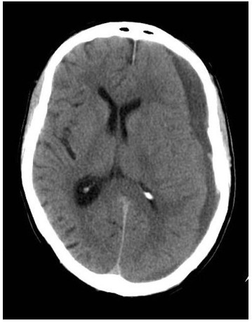
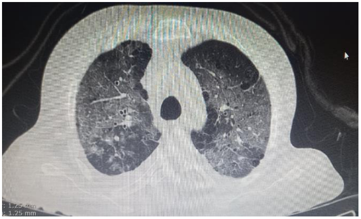
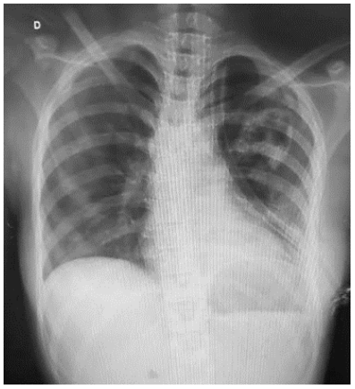
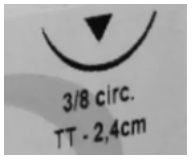
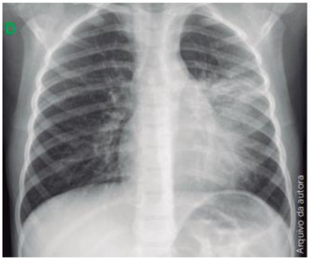
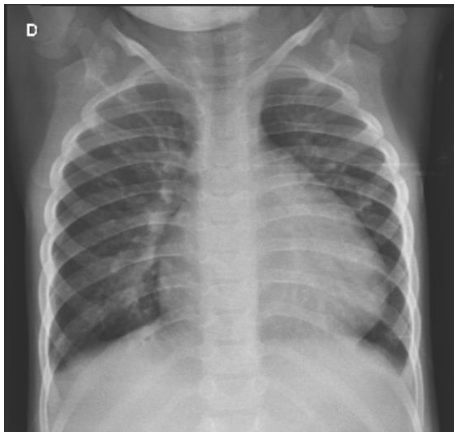
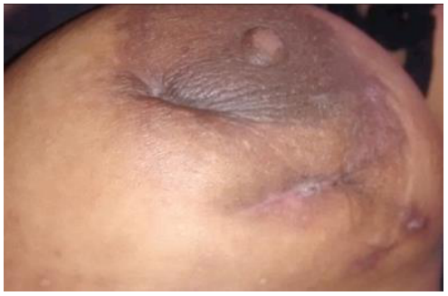

# UNICAMP 2025 – Acesso Direto – Prova 2 (tarde)

- Formato: Resposta curta (discursiva)
- Tipo: regular
- Data de aplicação: 2024-11-17
- Questões: 50
- Prova original: https://www.comvest.unicamp.br/residenciamedica2025/provas/dAD2.pdf
- Gabarito oficial: https://www.comvest.unicamp.br/residenciamedica2025/resp_esperadas/resp_ad2.pdf (retificado em 02/12/2024)

Valores de referência dos exames laboratoriais

| Valores de referência dos exames laboratoriais |  |
|---|---|
| Parâmetro | Valor de normalidade |
| Ácido fólico | 3,1 a 20,5 ng/dL |
| Adenosina deaminase | Pleural: < 30,0 UI/L |
| Albumina plasmática | 3,5 a 5,2 g/dL |
| ALT (TGP) | Homem <41 UI/L; mulher <33 UI/L |
| AST (TGO) | Homem <40 UI/L; mulher <33 UI/L |
| Atividade plasmática de renina | 0,6 a 4,18 ng/mL/h (ortostática) 0,32 a 1,84 ng/mL/h (supino) |
| Bilirrubina total | 0,3 a 1,2 mg/dL |
| Cálcio | 8,8 a 10,2 mg/dL |
| CK‐mb (creatinoquinase fração mb) | 0 a 24 UI/L |
| Clearance de creatinina | homem: 75 a 115mL/min/1,73m2; mulher: 85 a 125mL/min/1,73m2 |
| Cloro | 98 a 106 mmol/L |
| Colesterol HDL | Homem ≥ 40 mg/dL; mulher ≥ 50mg/dL |
| Colesterol LDL | < 100 mg/dL |
| Colesterol total | < 200 mg/dL |
| Cortisol urinário | 3,5 a 4,5 mcg/24h |
| CPK (creatina fosfoquinase) | 0,7 a 171 UI/L |
| Creatinina | Homem ≤ 1,2 mg/dL Mulher ≤ 0,8mg/dL |
| D‐dímero | <500ng/mL |
| Desidrogenase láctica (LDH) | 230 a 460 UI/L |
| Exame de urina | Leucócitos <5/campo Hemácias <5/campo Proteína negativo/traços pH: 5,5 a 7,5 densidade: 1,005 a 1,030 mOsm/Kg. |
| Ferritina | Homem: 30 a 400 ng/mL; mulher 13 a 150 ng/mL |
| Ferro sérico | Homem: 70 a 180 mcg/dL; mulher 60 a 180 mcg/dL |
| Fibrinogênio | 175 a 400 mg/dL |
| Fosfatase alcalina | Homem: 40 a 129 UI/L; mulher 35 a 103 UI/L |
| Fósforo | 2,5 a 4,5 mg/dL |
| Glicemia de jejum | 60 a 99 mg/dL |
| Hemoglobina glicada (HbA1c) | 4,0 a 5,6% |

| Valores de referência dos exames laboratoriais |  |
|---|---|
| Hemograma | Hemoglobina: homem 14 a 18 g/dL; mulher 12 a 16 g/dL Hematócrito: homem 41 a 52%; mulher 36 a 46% Leucócitos: 4.000 a 10.000/mm3 (segmentados 2.000 a 8.000/mm3; linfócitos 1.000 a 4.000/mm3; monócitos 200 a 800/mm3, eosinófilos < 450/mm3; basófilos <200/mm3) Plaquetas: 150.000 a 450.000/mm3 VCM: 80 a 99 fL HCM 27 A 32 pg Reticulócitos: 50.000 a 100.000/mm3 RDW: 11 a 14% |
| Magnésio | 1,9 a 2,5 mg/dL |
| Metanefrinas urina | < 400 mcg/24h (totais < 1300 mcg/24h) |
| Osmolaridade sérica | 275 a 295mOsm/Kg |
| Osmolaridade urinária | 300 a 900mOsm/Kg |
| Paratormônio (PTH) | 15 a 65 pg/mL |
| Potássio | 3,5 a 5,1 mEq/L |
| Proteína C reativa | Processo inflamatório: 10 a 50 mg/L (leve); 50 a 100 mg/dL (moderado); > 100 mg/dL (grave) Risco cardiovascular: < 1 mg/dL (baixo), 1 a 3 mg/dL (médio), > 3 mg/dL (alto) |
| PSA total | < 4 ng/mL |
| R (TTPA) | Até 1,3 |
| Relação albumina/creatinina urinária | < 30 mg/g |
| Relação proteína/creatinina urinária | < 0,2 |
| RNI (TP) | Até 1,25 |
| Sódio | 135 a 145 mEq/L |
| T4 livre | 0,9 a 1,7 ng/dL |
| TAP | 10 a 14s |
| TIBC | 255 a 450mcg/dL |
| Triglicérides | < 150 mg/dL |
| Troponina T | 0 a 14 ng/L |
| TSH | 0,3 a 4,2 mcUI/mL |
| TTPa | 24 a 40s |
| Uréia | 17 a 43 mg/dL |
| Velocidade de hemossedimentação | homem: <20mm/h; mulher: <30mm/h |
| Vitamina B12 | 200 a 900 pg/mL |
| Vitamina D | 31 a 10 ng/mL |

| Gasometria | Arterial | Venosa |
|---|---|---|
| pH | 7,35 a 7,45 | 7,33 a 7,43 |
| pO 2 | 83 a 108 mmHg | 38 a 50 mmHg |
| pCO 2 | 32 a 48 mmHg | 31 a 54 mmHg |
| HCO 3 | 18 a 23 mmol/L | 18 a 23 mmol/L |
| Lactato | 0,5 a 1,6 mmol/L | 0,5 a 1,6 mmol/L |
| Cálcio iônico | 1,15 a 1,29 mmol/L | 1,15 a 1,29 mmol/L |

.

## Clínica Médica

### Questão 51

Homem, 39a, é trazido ao Pronto Atendimento por confusão mental há um dia e rebaixamento do nível da consciência há duas horas. Antecedentes pessoais: hipertensão arterial em uso de losartana e transtorno depressivo sem acompanhamento. Trabalha como engenheiro químico há três anos. Exame físico: escala de coma de Glasgow=7; pupilas isocóricas e fotorreagentes; fundoscopia com borramento de papila óptica. PA=148/96mmHg, FR=34irpm, FC=112bpm, T=37,9oC, oximetria de pulso=95% (ar ambiente). Exames laboratoriais: glicemia capilar=112mg/dL; cloreto=99mEq/L, Na=137mEq/L; K=4,8mEq/L; ureia=48mg/dL; creatinina=1,1mg/dL; Osmolaridade=350mOsm/Kg.Gasometria arterial: pH=7,10; PaO2=74mmHg; PaCO2=21mmHg; HCO3=9mEq/L; oximetria=95%; lactato=1,8mmol/L. Exame de urina sem alterações. ECG: taquicardia sinusal. A HIPÓTESE DIAGNÓSTICA ETIOLÓGICA É:

Gabarito

intoxicação por metanol, OU intoxicação por etilenoglicol, OU intoxicação por álcool tóxico. Apenas intoxicação não será pontuado. Ampliação: tentativa de autoexterminio por metanol; intoxicação por dietilenoglicol; intoxicação por benzeno; intoxicação por ácido acetilsalicilico (gabarito ampliado após recursos)

### Questão 52

Mulher, 66a, procura a Unidade Básica de Saúde com história de sete dias de dor articular em punho direito. A dor iniciou de maneira relativamente súbita, com edema e calor local, associada a dor de repouso e rigidez. Nos últimos dois anos, vem experimentando dores articulares em joelhos, tornozelos, punhos, dedos das mãos e dos pés. Por vezes as articulações incham, com melhora espontânea ou após injeções que toma no Pronto Atendimento, cujos nomes não se recorda. Antecedentes pessoais: hipertensão arterial e obesidade. Medicamentos em uso: hidroclorotiazida. Exame físico: bom estado geral, sem alterações no exame cardíaco, pulmonar e abdominal. Exame articular: calor e dor à palpação e mobilização do punho direito. As demais articulações não se apresentam inflamadas. Foi realizada punção articular que excluiu infecção. Pesquisa de fator reumatoide=negativo. Considerando aspectos clínicos e epidemiológicos, A MEDICAÇÃO QUE MAIS PROVAVELMENTE CONTROLARÁ A DOENÇA ARTICULAR, A LONGO PRAZO, É:

Gabarito

alopurinol OU inibidor de xantina oxidase OU hipouricemiante oral.

### Questão 53

Homem, 27a, procura atendimento por episódios de dor em região retro orbicular e frontal à esquerda, intensa, com duração aproximada de uma hora e meia, associada a lacrimejamento ipsilateral, que ocorreram seis vezes nos últimos três dias. Refere episódios semelhantes no ano passado, quando foi investigado com neuroimagem com resultado normal. Apresenta melhora com uso de triptano, mas sem resposta à dipirona. A HIPÓTESE DIAGNÓSTICA É:

Gabarito

cefaleia em salvas. Não será aceito enxaqueca. Ampliação: não será aceito outro tipo de cefaleia (gabarito ampliado após recursos)

### Questão 54

Homem, 75a, é trazido ao pronto socorro por parada de eliminação das fezes há 10 dias e aumento do volume abdominal, mantendo eliminação de gases. Nega febre, náuseas, vômitos, sintomas respiratórios ou urinários. Antecedentes pessoais: hipertensão arterial, depressão e etilismo (ingesta diária de destilados). Medicações em uso: losartana, hidroclorotiazida e amitriptilina. Exame físico: regular estado geral, corado, desidratado, anictérico. Ausculta cardíaca e respiratória sem alterações. Abdome: distendido, com ruídos hidroaéreos presentes e doloroso a palpação profunda difusamente, sem sinais de irritação peritoneal. Toque retal com fecaloma. Na percussão há presença de macicez nos flancos e ausência do sinal da macicez móvel quando o paciente é colocado em decúbito lateral. A CONDUTA TERAPÊUTICA INICIAL É:

Gabarito

desimpactação fecal OU retirada manual de fecaloma OU lavagem intestinal OU clister. Inclui sinonímia.

### Questão 55

Mulher, 52a, tratou infecção de trato urinário com ciprofloxacino há cerca de três semanas, apresentando há uma semana redução da diurese, dispneia em repouso, inapetência, náuseas e diarreia. Antecedentes pessoais: diabetes melito, hipertensão arterial e doença renal crônica. Medicamentos em uso: metformina e losartana. Exame físico: PA=126/74mmHg, T=36,8ºC, FC=76 bpm, edema de membros inferiores bilateral e simétrico 2+/4+, auscultas cardíaca e pulmonar sem alterações, dor leve à palpação profunda de abdome, indolor à manobra de punho percussão lombar. Exames laboratoriais: hemoglobina=9,8g/dL, hematócrito=33%, leucócitos=7.500/mm³, plaquetas=380.000/mm³, ureia=110mg/dL, creatinina=3,0mg/dL, Na=134mEq/L, K=4,2mEq/L, Cloro=105mmol/L, albumina=4g/dL, glicemia=82mg/dL; gasometria venosa: pH=7,21, pCO2=38mmHg, pO2=44mmHg, HCO3=15,2mmol/L, BE=-11,9, Lactato=8,5mmol/L; exame de urina: proteína 1+, hemácias 10 por campo, leucócitos 30 por campo. A PRINCIPAL CAUSA PARA O DISTÚRBIO ÁCIDO-BASE APRESENTADO É:

Gabarito

uso de metformina.

### Questão 56

Mulher, 63a, trazida por familiares ao Pronto Atendimento com febre, cefaleia e vômitos há dois dias. Antecedentes pessoais: diabetes melito em uso de metformina. Exame físico: regular estado geral, acianótica, anictérica, febril, descorada +/4, desidratada 2+/4, eupneica, sonolenta, PA=102/64mmHg, T=38,5oC, FC=110bpm, FR=24irpm, glicemia capilar=300mg/dL. Sinal de Kernig presente; ausculta cardíaca e pulmonar sem alterações. Exames laboratoriais: hemoglobina=11g/dL, leucócitos=15.420/mm3, plaquetas=110.000/mm3, creatinina=1,5mg/dL, potássio=3,4=mEq/L, sódio=130mEq/L, hemoglobina glicada=10%. Coletadas culturas. O AGENTE ETIOLÓGICO QUE DIRECIONA O TRATAMENTO INICIAL É:

Gabarito

Streptococcus pneumoniae OU pneumococo. Ampliação: S pneumoniae (gabarito ampliado após recursos)

### Questão 57

Homem, 76a, mora sozinho, trazido pela filha à emergência por desorientação em tempo e espaço e agitação psicomotora há três dias. Tem história de perda de memória há cerca de dois anos, associado à dificuldade de reconhecer objetos pessoais. Possui episódios de quedas da própria altura não presenciadas há dois meses. Antecedentes pessoais: dois episódios de acidentes vasculares cerebrais isquêmicos há 10 anos e hipertensão arterial. Medicações em uso: AAS 100mg/dia, enalapril 10mg 12/12h, anlodipina 5mg 12/12h e propranolol 40mg 12/12h. Exame físico: hidratado, corado, agitado e desorientado em tempo e espaço. PA=90/60mmHg; FC=68bpm; FR=19irm; Temperatura axilar=36ºC. Exame neurológico: Kernig=negativo; sem rigidez de nuca; força motora grau 5 em membros superiores e inferiores. Tomografia de crânio (IMAGEM Q57) A CONDUTA TERAPÊUTICA IMEDIATA É:

Gabarito

drenagem de hematoma OU trepanação OU conduta cirúrgica OU craniotomia. Ampliação: manitol; solução salina hipertônica Craniectomia será considerada errada. (gabarito ampliado após recursos)

### Questão 58

Homem, 53a, comparece à unidade de emergência por tosse seca, febre e dispneia progressiva há 10 dias. Antecedente pessoal: artrite reumatoide há oito anos. Medicações em uso: prednisona 40mg ao dia há 60 dias. Nega tabagismo. Exame físico: regular estado geral, descorado +/4+, desidratado +/4+, consciente, orientado, sonolento. PA=100/70mmHg, temperatura axilar=39ºC, FC=110bpm, FR=32irpm, oximetria de pulso=85% (ar ambiente). Ausculta cardíaca sem alteração. Ausculta pulmonar com estertores crepitantes em base direita, em uso de musculatura respiratória acessória. Abdome sem visceromegalias. Sem edema ou empastamento de panturrilhas. Exames laboratoriais: hemoglobina=11g/dL, leucócitos=13.000/mm3, plaquetas=200.000/mm3, ureia=60mg/dL, creatinina=1,3mg/dL, sódio=138mEq/L, potássio=4,5mEq/L, glicemia=180 mg/dL, LDH=600mg/dL. Gasometria arterial: pH=7,4, paO2=60mmHg, paCO2=37mmHg, HCO3=23mmHg. Testes rápidos de Covid e influenza negativos. Tomografia computadorizada de tórax (Imagem Q58). O ANTIMICROBIANO DE ESCOLHA É:

Gabarito

sulfametoxazol-trimetoprim OU bactrim OU clotrimoxazol.

### Questão 59

Homem, 45a, com diagnósticos de hipertensão arterial, diabetes melito e doença renal crônica. Comparece à consulta ambulatorial de rotina, assintomático. Exame físico sem alterações. Exames laboratoriais: ureia sérica=86mg/dL, creatinina sérica=2,0mg/dL, creatinina urinária=80mg/dL, volume urinário=1.440mL/24h, relação albumina/creatinina urinária=60mg/g. O ESTÁGIO DA DOENÇA RENAL CRÔNICA É:

Gabarito

G3bA2 OU 3b OU 3 Ampliação: GIII ou GIIIA2 (gabarito ampliado após recursos)

### Questão 60

Homem, 38a, admitido em Unidade de Emergência sonolento, com extremidades frias, com teste rápido positivo para dengue. Os sintomas de febre e mialgia se iniciaram há cinco dias, com piora progressiva. PA=94/76mmHg, FC=112bpm, FR=25irpm, oximetria de pulso=95% (ar ambiente) e T=38,2oC, enchimento capilar=4 segundos. Pulsos fracos e filiformes. Iniciada infusão de solução salina, 20mL/Kg em 20 minutos. Exames laboratoriais: hemoglobina=16,4g/dL, hematócrito=51%, leucócitos=3.400/mm3(45% segmentados, 40% linfócitos, 10% linfócitos atípicos); plaquetas=76.000/mm3. Após expansões rápidas e repetidas com solução salina, os sinais vitais se mantiveram inalterados e foram coletados novos exames após 2 horas: hematócrito=54% e coagulograma normal. DE ACORDO COM O MANUAL DENGUE - DIAGNÓSTICO E MANEJO CLÍNICO ADULTO E CRIANÇA, DO MINISTÉRIO DA SAÚDE, 2023, O PRÓXIMO PASSO PARA O CONTROLE VOLÊMICO NESTE CASO É:

Gabarito

expansor plasmático OU albumina OU coloide sintético. A dose, correta ou não, não será considerada na correção da questão.

## Cirurgia

### Questão 61

Homem, 82a, em investigação de quadro de icterícia obstrutiva e emagrecimento há três meses. Retorna com exames: endoscopia digestiva alta: papila duodenal sem alterações. Ressonância magnética de abdome: lesão expansiva de 4cm em topografia de cabeça do pâncreas. O EXAME INDICADO PARA O ESTADIAMENTO LOCORREGIONAL É:

Gabarito

ultrassonografia endoscópica OU ecoendoscopia. Ampliação: endoultrassonografia ou tomografia computadorizada com contraste ou angiotomografia. (gabarito ampliado após recursos)

### Questão 62

Adolescente, 13a, vítima de acidente automobilístico, foi ejetado no momento do acidente. Apresentava trauma torácico com pneumotórax volumoso à esquerda, submetido à drenagem tubular. No terceiro dia pós drenagem, mantinha fuga aérea. Realizada revisão do sistema de drenagem fechada em aspiração, que estava adequado. Solicitado radiograma de tórax. (Imagem Q62) A HIPÓTESE DIAGNÓSTICA É:

Gabarito

rotura brônquica OU fístula broncopleural. Ampliação: fístula aérea broncopleural; fístula brônquica; laceração brônquica; lesão brônquica; lesão de arvore brônquica; lesão de brônquio, lesão de brônquio fonte; lesão de brônquio principal; lesão de brônquio fonte principal; rotura de árvore brônquica e sinonímia. (gabarito ampliado após recursos)

### Questão 63

Homem, 65a, comparece ao consultório para exame de rotina anual. Nega sintomas urinários significativos e está em bom estado geral. Não tem antecedentes familiares de câncer de próstata. Exame físico: próstata de tamanho aumentado, cerca de 70cm3 e consistência normal. PSA total=4,5ng/mL. A CAUSA MAIS PROVÁVEL DO AUMENTO DO PSA TOTAL DESTE PACIENTE, VISTO QUE NÃO HOUVE TRAUMA PROSTÁTICO, EXERCÍCIOS VIGOROSOS E/OU PROSTATITE, É:

Gabarito

hiperplasia prostática benigna OU hiperplasia benigna de próstata. Ampliação: aumento de massa prostática; aumento de volume prostático; aumento difuso da próstata; hiperplasia prostática. (gabarito ampliado após recursos)

### Questão 64

Homem, 47a, apresentava tumor em região parotídea à esquerda, com crescimento assintomático há cerca de oito meses e medindo cerca de 45mm. Foi submetido à ressecção cirúrgica. Evoluiu no pós operatório com fechamento ocular incompleto e desvio do sulco nasolabial à esquerda. A ESTRUTURA ANATÔMICA COMPROMETIDA FOI:

Gabarito

nervo facial ou VII nervo craniano

### Questão 65

Prematuro, 32 semanas, com peso de 1,2kg, Apgar 4 e 6, foi alimentado com leite materno a partir de 48hs de vida. Aos sete dias de vida apresentou distensão abdominal, evacuação com sangue e vômitos biliosos. Foi mantido em jejum e com sonda nasogástrica. A CONDUTA INDICADA, A SEGUIR, É:

Gabarito

iniciar antibioticoterapia. Ampliação: radiograma de abdome (gabarito ampliado após recursos)

### Questão 66

Homem, 32a, vítima de ferimento por arma branca em hemitórax direito, é trazido por populares à Unidade de Emergência, com queixa de falta de ar. Exame físico: ansioso; PA=73/52mmHg; FC=142bpm; FR=48irpm; oximetria de pulso=86% (máscara não reinalante 12L/min). Cervical=desvio da traqueia para esquerda e presença de turgência das veias jugulares; tórax=ferimento cortante no terceiro espaço intercostal direito, não soprante, ausência de murmúrio vesicular e hipertimpanismo. Foram realizados: acessos venosos; reanimação volêmica (sem alteração dos sinais vitais) e coleta de exames laboratoriais. A CONDUTA IMEDIATA É:

Gabarito

toracocentese ou toracostomia de alívio (quinto espaço intercostal). Não será aceito drenagem torácica, pela condição de instabilidade hemodinâmica apresentada no enunciado. Ampliação: descompressão torácica; punção de alívio de tórax; punção de pneumotórax; punção torácica de alívio; toracocentese de alívio e sinonímia. (gabarito ampliado após recursos)

### Questão 67

Homem, 21a, teve um ferimento cortante na coxa direita por estilete, com aproximadamente 2cm, acometendo pele e subcutâneo. Foi indicada a sutura e escolhido um fio inabsorvível 4-0 com as seguintes descrições na figura abaixo:
A CARACTERÍSTICA INFORMADA DA EXTREMIDADE DA AGULHA REPRESENTADA NA FIGURA É:

Gabarito

traumática OU triangular OU cortante OU lanceolada. Ampliação: agulha circular com ponta triangular; curva e triangular; sinonímia. (gabarito ampliado após recursos)

### Questão 68

Mulher, 31a, vítima de acidente automobilístico, é trazida ao Pronto Socorro com queixa de dor na perna direita. Exame físico: PA=84/63mmHg; FC=125bpm; FR=24irpm; oximetria de pulso=93% (ar ambiente); Exame físico: Extremidades: deformidade na coxa direita com edema e dor local, e pulso pedioso presente. Restante do exame físico sem anormalidades. Entre as condutas iniciais, é importante o acesso venoso. Na sala de emergência estão disponíveis cateteres para acesso venoso central e periférico, de diversos calibres. DE ACORDO COM O ATLS 10ª. EDIÇÃO, O DISPOSITIVO (TIPO E CALIBRE) QUE PROPORCIONA MAIOR VELOCIDADE DE FLUXO DE ADMINISTRAÇÃO DE SOLUÇÕES INTRAVENOSAS É:

Gabarito

cateter periférico calibre 18G OU 16G OU 14G. ampliação: jelco (calibres 18, 16 e 14) e sinonímia. Outro calibre OU grosso calibre OU cateter venoso central não serão aceitos. (gabarito ampliado após recursos)

### Questão 69

Mulher, 25a, procura Pronto Socorro por apresentar febre alta (40ºC), acompanhada de calafrios seguidos de sudorese profusa e dor intensa em perna direita, que está quente e avermelhada. Refere que tem recorrentemente tratado micose nos espaços interdigitais dos pés. Exame Físico: edema de todo membro inferior direito, mais proeminente em perna e pé, área circular de eritema em face ântero-medial da perna, com aumento de temperatura local. Presença de trajeto avermelhado em toda a face medial do membro, acompanhando o trajeto da veia safena e linfonodos aumentados na região inguinal. Pulsos presentes e normais, musculatura da perna flácida e indolor. O AGENTE ETIOLÓGICO MAIS FREQUENTE NESTA DOENÇA É:

Gabarito

Streptococcus pyogenes Ampliação: Staphilococus aureus, S. aureus; S. epidermidis; Streptococcus grupo A (gabarito ampliado após recursos)

### Questão 70

Mulher, 57a, comparece à Unidade Básica de Saúde com queixa de dor em panturrilha esquerda para deambular em torno de três quarteirões há cinco meses. A dor inicia após dois quarteirões e vai aumentando de intensidade até obrigá-la a parar de andar porque a perna trava. Antecedentes: diabetes melito controlado com hipoglicemiantes orais, cessou o tabagismo há 10 anos após episódio de isquemia miocárdica. Exame físico: pulso femoral presente, poplíteo e distais ausentes no membro inferior esquerdo, presentes à direita. PARA OBTER MAIOR GANHO DE DISTÂNCIA DE MARCHA NESTA PACIENTE, A RECOMENDAÇÃO É:

Gabarito

realizar caminhadas diárias. ampliação: outras medidas, desde que associadas à caminhada (gabarito ampliado após recursos)

## Pediatria

### Questão 71

Menina, 7a, com história de perfuração plantar acidental por prego enferrujado na região do calcâneo há duas semanas. Situação vacinal atualizada segundo o Calendário Nacional de Vacinação. Foi avaliada na Unidade Básica de Saúde no mesmo dia, sendo prescrito cefalexina por sete dias, durante os quais houve aumento da reação inflamatória local, com drenagem de secreção purulenta pelo óstio da lesão. Procurou Pronto Atendimento, onde foram prescritos cuidados locais e ceftriaxone intramuscular por cinco dias. Apesar do tratamento proposto, houve aumento progressivo da dor e dos sinais inflamatórios locais, impossibilitando a deambulação. Realizada bacterioscopia da secreção local, que evidenciou grande quantidade de bacilos gram-negativos. O AGENTE ETIOLÓGICO É:

Gabarito

Pseudomonas aeruginosa OU Pseudomonas.

### Questão 72

Menino, 9a, é trazido ao ambulatório de pediatria com queixa de diarreia. Mãe refere que há um ano o paciente apresenta evacuações nas roupas íntimas, 4 a 5 vezes por dia e, por vezes, no período noturno. Evacua sempre fezes escuras na cueca, quase pretas, mucoides, não formadas, de odor fétido e que impregnam as roupas da criança de maneira indelével. Não apresenta sangue ou restos alimentares nas fezes, nega emagrecimento, febre ou relação com a ingesta de alimentos associados ao quadro. Refere bom aproveitamento escolar, porém várias vezes precisa se ausentar para higiene. Exame físico: bom estado geral, corado, hidratado, eupneico; peso, estatura e desenvolvimento puberal adequados para a idade; abdome plano, indolor, fígado, baço e massas não palpáveis. A HIPÓTESE DIAGNÓSTICA É:

Gabarito

constipação intestinal funcional com incontinência fecal retentiva OU constipação intestinal funcional OU impactação fecal OU constipação funcional OU incontinência fecal retentiva. Apenas incontinência fecal não será aceito. Ampliação: constipação com soiling fecal; constipação intestinal associada a soiling; escape fecal; fecaloma; incontinência fecal retentiva; impactação fecal; soiling (gabarito ampliado após recursos)

### Questão 73

Menina, 7a, previamente hígida, é trazida à Unidade Básica de Saúde com queixa de febre baixa (37,8°C), tosse seca e persistente associada à cefaleia há cerca de uma semana. Mãe refere que dois dias antes do início da febre teve dor de garganta, dor de ouvido e olho lacrimejando. Nos últimos dois dias, refere dor torácica quando respira fundo e quando tosse. Na sala de aula há duas crianças com quadro semelhante, que foram afastadas há dois dias. Exame Físico: bom estado geral, corada, hidratada; FC=110bpm; FR=24irpm; T=38ºC; Pulmões=murmúrio vesicular presente com crepitações finas bilateralmente. Radiograma simples de tórax (Imagem Q73). O AGENTE ETIOLÓGICO BACTERIANO É:

Gabarito

Mycoplasma pneumoniae OU M. pneumoniae OU Micoplasma. Qualquer outro agente etiológico não será aceito. Ampliação: Clamydia pneumoniae; C. pneumoniae (gabarito ampliado após recursos)

### Questão 74

Você presencia um afogamento de uma criança de 3 anos na piscina do clube que frequenta e vai atender à vítima. Ao avaliar a criança após ser retirada da água, identifica que está arresponsiva e sem respirar. ENQUANTO AGUARDA O SERVIÇO DE ATENDIMENTO MÓVEL DE URGÊNCIA, A CONDUTA IMEDIATA É:

Gabarito

oferecer cinco ventilações “boca a boca” OU cinco ventilações OU ventilação. Não será aceito ressuscitação cardiopulmonar. Ampliação: reanimação que se inicie por ventilação; ventilação de resgate e sinonímia (gabarito ampliado após recursos)

### Questão 75

Menino, 3a, previamente hígido, é trazido à Unidade de Emergência com história de vômitos e diarreia há dois dias. Mãe refere ter dado metoclopramida e dipirona, sem melhora. Hoje observou que a criança está estranha, inquieta, apresentando movimentos anormais e caretas. Nega febre. Exame físico: bom estado geral, orientado; FC=110bpm; FR=24ipm; PA=90/70mmHg; pulsos cheios; enchimento capilar=2segundos; sem sinais meníngeos; pele sem lesões; observados movimentos involuntários de membros e espasmos musculares, além de protusão de língua. O DIAGNÓSTICO SINDRÔMICO É:

Gabarito

síndrome extrapiramidal ampliação: síndrome de liberação extrapiramidal. (gabarito ampliado após recursos)

### Questão 76

Menino, 1a, é trazido ao Pronto Socorro com história de irritabilidade há dois dias. Nega febre, vômitos, diarreia ou outras queixas. Refere diurese abundante e frequente. Nega uso de medicamentos. Antecedente pessoal: malformação de sistema nervoso central. Exame físico: irritado, com mucosas secas, choro sem lágrimas, turgor normal e boa perfusão periférica. Exames: sódio sérico=156mEq/L. PARA ATINGIR O EQUILÍBRIO OSMÓTICO, O COMPARTIMENTO QUE SOFRE MAIOR CONTRAÇÃO COM O DESVIO DE LÍQUIDOS É:

Gabarito

compartimento intracelular OU intracelular ampliação: compartimento celular (gabarito ampliado após recursos)

### Questão 77

Recém-nascido termo adequado para idade gestacional, 23 dias de vida, em aleitamento materno exclusivo. Diurese e evacuação normais. Ganho de peso de 45g/dia. Exame físico: bom estado geral, corado, icterícia até cicatriz umbilical. Exames laboratoriais: hemoglobina=14,3g/dL; hematócrito=40%; leucócitos=8.200/mm3; plaquetas=320.000/mm3; bilirrubina total=10,5mg/dL; bilirrubina direta=0,5mg/dL; tipagem sanguínea mãe=O+; tipagem sanguínea recém-nascido=O+; exame do pezinho normal. A HIPÓTESE DIAGNÓSTICA É:

Gabarito

icterícia do leite materno OU síndrome da icterícia do leite materno OU icterícia prolongada associada à amamentação com leite materno. Para ser considerada correta, DEVE constar leite materno na resposta.

### Questão 78

Recém-nascido, 50 horas de vida, será submetido à punção de calcanhar para coleta de sangue para triagem biológica neonatal. COMO MEDIDA NÃO FARMACOLÓGICA PARA ALÍVIO DA DOR, RECOMENDA-SE ADMINISTRAR, DOIS MINUTOS ANTES DO PROCEDIMENTO:

Gabarito

solução de sacarose OU solução glicosada OU glicose por via oral. Ampliação: glicose em dedo de luva, leite materno. (gabarito ampliado após recursos)

### Questão 79

Menina, 2m, é trazida ao Pronto Socorro com história de piora do padrão respiratório há um dia. Nega febre ou outras queixas. Antecedentes pessoais: Síndrome de Down e cardiopatia congênita. Exame físico: FC=130bpm; FR=61irpm; oximetria de pulso=98% (ar ambiente); Coração: ritmo regular com sopro sistólico 4+/6+, mais audível em rebordo esternal esquerdo, e segunda bulha normal; Pulmões: murmúrio vesicular simétrico e sem ruídos adventícios; Abdome: fígado palpável a 3cm do rebordo costal direito; Pulsos periféricos palpáveis e simétricos. Radiograma: Imagem Q79 O ACHADO RADIOLÓGICO REFERENTE AOS CAMPOS PULMONARES É:

Gabarito

hiperfluxo OU fluxo pulmonar aumentado. Ampliação: aumento de trama vascular; congestão de vasos pulmonares; congestão peri hilar; congestão pulmonar; dilatação dos vasos pulmonares; engurgitamento peri hilar; edema hilar; edema pulmonar interlobular; hiperfluxo pulmonar; ingurgitamento perihilar. (gabarito ampliado após recursos)

### Questão 80

Menina, 8a, é trazida para puericultura sem queixas. Antecedentes pessoais: anóxia neonatal grave e convulsões, paralisia cerebral grau V pelo Gross Motor Function Classification System. Alimentação diária: consome regularmente 240ml de leite de vaca integral com achocolatado em mamadeira duas vezes ao dia, além de duas papas preparadas no liquidificador, com ingredientes semelhantes aos consumidos pela sua família. Nega dificuldades para engolir ou episódios de vômito. Exame físico: IMC=10Kg/m2. A CONDUTA É:

Gabarito

suporte nutricional OU gastrostomia OU sonda nasogástrica OU sonda nasoentérica. Serão aceitas vias para suporte nutricional enteral. Ampliação: internação hospitalar para suporte nutricional; fórmula alimentar; suplemento alimentar. (gabarito ampliado após recursos)

## Ginecologia e Obstetrícia

### Questão 81

Mulher, 32a, G3P1A1, com idade gestacional de 12 semanas, é encaminhada ao pré-natal de alto risco para avaliação. Antecedentes pessoais: nega histórico de doenças crônicas, tabagismo ou uso de drogas; relata uso de bebida alcoólica ocasional. Medicações: ácido fólico e polivitamínico desde o início desta gravidez. Antecedentes obstétricos: G1=parto prematuro com 26 semanas, bebê com complicações respiratórias graves, mas sobrevivente; G2=aborto espontâneo com 18 semanas, associado à dilatação cervical completa. Exame físico: PA=112/70mmHg; FC=82bpm; T=36,6°C. Ultrassonografia transvaginal=saco gestacional em cavidade uterina, com embrião único, compatível com 12 semanas de gestação, com morfologia normal para a idade gestacional, BCF=162bpm. Comprimento cervical=35mm, sem sinais de afunilamento ou sludge. A CONDUTA OBSTÉTRICA É:

Gabarito

cerclagem de colo uterino OU cerclagem (considerar apenas sinonímia). Qualquer outra conduta será considerada errada. Ampliação: cerclagem e progestágeno vaginal; cerclagem eletiva entre 12 e 16 semanas. (gabarito ampliado após recursos)

### Questão 82

Mulher,17a, G1P0A0, idade gestacional= 34 semanas e 5 dias, procura o Pronto Atendimento com queixa de cefaleia occipital intensa e náusea iniciadas hoje. Refere edema de membros inferiores e ganho ponderal de 3Kg há duas semanas. Iniciou pré-natal tardiamente, com consultas irregulares. Na última consulta, há quatro semanas, apresentava PA=100/62mmHg e ganho de peso adequado. Antecedentes pessoais: nega patologias anteriores, uso de medicações, tabagismo ou uso de substâncias psicoativas. Exame físico: PA=132/80mmHg; FC=90bpm; T=36,8°C; altura uterina=32cm, movimentos fetais presentes; BCF=140bpm; membros inferiores=edema 3+/4+; reflexos tendinosos profundos exacerbados (4+). A CONDUTA TERAPÊUTICA IMEDIATA É:

Gabarito

sulfato de magnésio

### Questão 83

Mulher, 23a, nuligesta, apresenta ciclos menstruais irregulares e sua última menstruação foi há ́ nove meses. Nega atividade sexual há ́ três anos. Não faz uso de método contraceptivo. Nega patologias, uso de medicações ou de substâncias psicoativas. Exame físico: PA=102/70mmHg; IMC=19Kg/m2, exame físico geral e ginecológico sem anormalidades. Exames laboratoriais: hCG negativo; FSH=0,3mUI/mL; prolactina=15ng/mL; TSH=2,5mUI/mL. A HIPÓTESE DIAGNÓSTICA É:

Gabarito

amenorreia hipotalâmica funcional OU disfunção hipotálamo-hipofisária OU amenorreia central. Ampliação: amenorreia central; amenorreia de causa hipotalâmica; amenorreia secundaria central; anovulação de origem central. (gabarito ampliado após recursos)

### Questão 84

Mulher, 49a, é trazida à Unidade de Pronto Atendimento (UPA) com queixa de sangramento genital intenso. Traz resultado de biópsia coletada há 14 dias com diagnóstico de carcinoma epidermoide de colo uterino. Nega uso de medicamentos. Exame físico: descorada 2+/4+; FC=108bpm; PA=102/50mmHg. Exame ginecológico= lesão tumoral de 5cm no colo uterino, com sangramento ativo em moderada quantidade. ALÉM DA ESTABILIZAÇÃO HEMODINÂMICA, A CONDUTA IMEDIATA NA UPA DEVE SER:

Gabarito

tamponamento vaginal OU tamponamento vaginal com vasoconstritor ampliação: compressas por via vaginal; hemostasia mecânica; tampão com adrenalina. (gabarito ampliado após recursos)

### Questão 85

Mulher, 19a, primigesta, idade gestacional de 30 semanas, vem para consulta pré-natal de rotina, trazendo exames laboratoriais realizados às 28 semanas. Nega queixas, refere boa movimentação fetal, em uso de sulfato ferroso 40mg/dia. Antecedentes: nega doenças crônicas, refere alergia a dipirona e penicilina, exames de rotina de pré-natal de primeiro trimestre todos normais (incluindo a sorologia de sífilis negativa). Exames laboratoriais: hemoglobina=11,6mg/dL; glicemia de jejum=88mg/dL; exame de urina=normal; urocultura=negativa. Sorologias: HIV=negativa; toxoplasmose=IgG e IgM negativas; sífilis: (CMIA)=positivo; VDRL=1:64. DE ACORDO COM O PROTOCOLO CLÍNICO E DIRETRIZES TERAPÊUTICAS PARA PREVENÇÃO DA TRANSMISSÃO VERTICAL DE HIV, SÍFILIS E HEPATITES VIRAIS, 2022, O TRATAMENTO INDICADO PARA ESTA PACIENTE É:

Gabarito

penicilina benzatina 2.400.000 UI intramuscular. Serão aceitos complementação de dessensibilização OU penicilina oral antecedendo a IM. Qualquer outro antibiótico OU dose fracionada de penicilina não será considerada. A resposta só será considerada correta se constar medicamento, dose e via de administração.

### Questão 86

Mulher, 36a, G3P3, procura a Unidade Básica de Saúde para orientação por quadro de drenagem espontânea de secreção mucopurulenta periareolar, por três vezes nos últimos dois anos. No momento está assintomática. Em dois episódios anteriores utilizou ampicilina, no último apresentou drenagem espontânea e cura. Antecedentes pessoais: tabagismo=15anos/maço, uso de anticoncepcional oral combinado. Exame físico: mama acometida (Imagem Q86) e mama contralateral sem alterações. A CONDUTA PARA EVITAR NOVAS RECIDIVAS É:

Gabarito

orientar cessar tabagismo OU cessar tabagismo. Qualquer outra conduta, como antibiótico, drenagem, etc. será considerada errada.

### Questão 87

Mulher, 62a, apresentando ondas de calor e insônia, que estão comprometendo suas atividades diárias. Antecedentes pessoais: menopausa há 14 anos; primigesta com um parto vaginal; nega uso de medicações e doenças crônicas. Antecedentes familiares: nega câncer de mama na família. Exames: mamografia BIRADS 2; densitometria óssea: coluna lombar T-score=–1,0 desvio-padrão e colo de fêmur T-score=–0,5 desvio-padrão; glicemia jejum=89mg/dL; colesterol total=164mg/dL; triglicérides=158mg/dL. PARA O TRATAMENTO DOS SINTOMAS, A MEDICAÇÃO MAIS ADEQUADA É:

Gabarito

terapia não hormonal. Serão aceitos inibidores seletivos de recaptação de serotonina – ISRS (paroxetina, escitalopran, citalopran, sertralina, fluoxetina) E/OU inibidores seletivos de recaptação de serotonina e da norepinefrina – ISRSNs (venlafaxina, desvenlafaxina, duloxetina) OU gabapentina. Qualquer resposta contendo terapia hormonal OU apenas antidepressivos será considerada incorreta. Ampliação: inibidor de receptação de serotonina; inibidor seletivo de recaptação de serotonina. (gabarito ampliado após recursos)

### Questão 88

Mulher, 39a, secundigesta com dois partos vaginais anteriores, queixa-se de sangramento abundante com saída de coágulos há quatro meses, com duração de nove dias e dismenorreia. Antecedentes pessoais: câncer de mama com receptor hormonal positivo, tratada com mastectomia, quimioterapia e radioterapia. Método contraceptivo: laqueadura. Ultrassonografia: útero com volume de 324,32cm³, miométrio de textura heterogênea com múltiplas imagens nodulares de localização intramural e imagem submucosa corporal posterior medindo 1,78x1,40cm. Ovários de aspecto ecográfico normal. A OPÇÃO TERAPÊUTICA MAIS ADEQUADA É:

Gabarito

histerectomia. Miomectomia será considerada errada. Ampliação: histerectomia com biopsia; histerectomia cirúrgica; histerectomia total; histerectomia videolaparoscopica; histerectomia vaginal. (gabarito ampliado após recursos)

### Questão 89

Mulher, 30a, G2P1C0A0, evolui para parto vaginal às 37 semanas e 5 dias, sem intercorrências. Em alojamento conjunto, foi observado que possui tipagem sanguínea A, Rh negativo, Coombs indireto positivo (anti-D), coletado na admissão ao parto, e seu recém-nascido apresenta tipagem sanguínea A, Rh positivo. Antecedentes obstétricos: pré-natal realizado em Unidade Básica de Saúde com nove consultas, Coombs indireto no início do pré-natal e com 28 semanas=negativos; refere ter feito Imunoglobulina anti-Rh no puerpério imediato da primeira gestação e às 32 semanas dessa gestação. A CONDUTA É:

Gabarito

administrar OU prescrever imunoglobulina anti Rh. Ampliação: Imunoglobulina anti D (gabarito ampliado após recursos)

### Questão 90

Mulher, 25a, procura Pronto Atendimento com queixa de febre e dor intensa no baixo-ventre. Exame ginecológico: refere dor à mobilização do colo uterino ao toque bimanual; palpa-se massa anexial à direita. Exames laboratoriais= leucocitose com desvio à esquerda, VHS e proteína C reativa elevados. Ultrassonografia transvaginal=imagem cística anexial à direita de conteúdo espesso, medindo 5cm de diâmetro. Indicada hospitalização e iniciada terapia antimicrobiana. O ESQUEMA ANTIMICROBIANO INDICADO É:

Gabarito

ceftriaxone, doxiciclina e metronidazol. Esquemas incompletos ou resposta parcial serão considerados errados. Ampliação: ampicilina sulbactam + doxicilina; clindamicina + gentamicina. (gabarito ampliado após recursos)

## Saúde Coletiva

### Questão 91

Adamson et al. (2022) estudaram a associação de um novo teste para o diagnóstico de transtorno do espectro autista (TEA) em mulheres. Utilizando outro método tradicional como padrão ouro para o diagnóstico de TEA, esse novo teste obteve sensibilidade de 76% em 48 mulheres que já tinham aquele diagnóstico, e especificidade de 92% em 118 mulheres que não tinham esse diagnóstico. A ACURÁCIA DO TESTE É:

Gabarito

87% ou 0,87 ou 144/166. Ampliação: aproximadamente 86%; 145/166; 0,8 a 0,9; fórmula= verdadeiros positivos+ verdadeiros negativos/verdadeiro positivo + falso negativo+ falso positivo + verdadeiro negativo; ou: (76%x48) + (92%x118)/total (gabarito ampliado após recursos)

### Questão 92

Homem, 48a, relata falta de ar aos grandes esforços há dois anos e chiado no peito há seis meses. Nega quadros respiratórios semelhantes, anteriormente. História ocupacional: carpinteiro há 12 anos em empresa de móveis, foi demitido há três anos durante a pandemia de Covid-19, quando começou a fazer móveis por encomenda na garagem de sua residência, em local pouco ventilado. Teste de peak flow: na primeira semana de trabalho 21% inferior à semana de repouso. A HIPÓTESE DIAGNÓSTICA É:

Gabarito

asma ocupacional ampliação:asma induzida pelo trabalho; asma relacionada ao trabalho; asma desencadeada por atividade laboral (gabarito ampliado após recursos)

### Questão 93

Durante as atividades realizadas em uma ocupação urbana, caracterizada por barracos de madeira, fornecimento precário de água e eletricidade, ausência de esgotamento sanitário e presença de grande quantidade de cães e gatos, os alunos de um projeto de extensão universitária constataram a presença de várias crianças, entre 4 e 6 anos de idade, apresentando lesões no couro cabeludo com placa de alopécia sem prurido. Essas lesões provavelmente estavam associadas às condições ambientais, notadamente nos domicílios escuros e úmidos, com pouca ventilação. A HIPÓTESE DIAGNÓSTICA É:

Gabarito

tinea capitis OU tinea do couro cabeludo ampliação: alopecia tonsurante; alopecia tonsurante por tinea capitis; tinea capilar. (gabarito ampliado após recursos)

### Questão 94

Equipe da Unidade Básica de Saúde (UBS) realiza busca ativa de pessoas com hipertensão arterial nos bairros sob sua responsabilidade e faz diagnóstico de 20 pacientes com essa doença, assintomáticos, ainda sem tratamento. Iniciam precocemente o tratamento com orientação de dieta com pouco sal, atividade física durante 30 minutos, pelo menos cinco vezes por semana, e participação no grupo de hipertensos da UBS. DE ACORDO COM O MODELO DA HISTÓRIA NATURAL DA DOENÇA, PROPOSTO POR LEAVELL E CLARK, AS AÇÕES TOMADAS PELA EQUIPE DE SAÚDE CORRESPONDEM AO NÍVEL DE PREVENÇÃO:

Gabarito

secundário

### Questão 95

Em um estudo retrospectivo observacional, foram analisadas as medidas de pressão arterial sistólica de 240 indivíduos atendidos em uma Unidade Básica de Saúde, sendo obtidos os seguintes resultados: média=119,2mmHg;  mediana=105mmHg;  desvio-padrão=22,3mmHg;  mínimo=98mmHg; máximo=175mmHg. O VALOR QUE MELHOR EXPRESSA O CONJUNTO DE DADOS É:

Gabarito

mediana ou 105mmHg

### Questão 96

Homem, 43a, vítima de afogamento em lagoa foi resgatado em parada cardiorrespiratória, recebeu reanimação cardiopulmonar e cerebral pela equipe de atendimento pré-hospitalar, com retorno da circulação espontânea. Encaminhado para internação em Unidade de Terapia Intensiva, onde permaneceu sob ventilação mecânica, uso de drogas vasoativas e antibiótico, evoluindo para óbito no oitavo dia de internação. QUEM DEVERÁ ASSINAR A DECLARAÇÃO DE ÓBITO?

Gabarito

Instituto médico legal OU médico legista

### Questão 97

Durante uma consulta de rotina de puericultura, uma criança de 4 anos é submetida à triagem de acuidade visual. O exame detecta acuidade visual reduzida em um dos olhos. A anamnese e o exame físico sugerem a presença de um possível erro refratométrico e desvio ocular. Estrabismo, erros refratométricos (como hipermetropia, miopia e astigmatismo) e opacidades de meios (como catarata) são causas comuns de ambliopia em crianças. A IDADE IDEAL PARA TRATAMENTO E PREVENÇÃO DE AMBLIOPIA É ATÉ:

Gabarito

seis anos ampliação: sete anos (gabarito ampliado após recursos)

### Questão 98

A pandemia de Covid-19 revelou para grande parcela da população brasileira a importância do Sistema Único de Saúde (SUS) para a prevenção e tratamento de epidemias, quando não bastam as ações individuais, sendo indispensáveis as ações coletivas. Tendo como base os dados epidemiológicos, uma das ações tomadas foi o redirecionamento das Unidades Básicas de Saúde para atendimento inicial de casos suspeitos de Covid-19, com redução ou interrupção do atendimento regular das doenças crônicas. DENTRE AS ÁREAS DA SAÚDE COLETIVA, ESTA READEQUAÇÃO DO SISTEMA DE SAÚDE SE ENQUADRA EM:

Gabarito

gestão e planejamento OU gestão OU planejamento OU administração em saúde.

### Questão 99

Médico, enfermeiro e agente comunitário da equipe de um centro de saúde planejam ações de promoção de saúde, visando prevenir casos de acidente vascular encefálico e infarto agudo do miocárdio na população adscrita a essa equipe, caracterizada por 20% de idosos. Para isso, esperam contar com a colaboração de educador físico e nutricionista. O DISPOSITIVO INSTITUCIONAL, PREVISTO PELO MINISTÉRIO DA SAÚDE, QUE CONTA COM TAIS PROFISSIONAIS É:

Gabarito

E-multi OU equipes multiprofissionais OU Núcleo de apoio à saúde da família OU núcleo ampliado de saúde da família. Ampliação: equipe multidisciplinar; núcleo ampliado de saúde da familia (gabarito ampliado após recursos)

### Questão 100

Homem, 30a, vítima de acidente de motocicleta contra anteparo fixo, é trazido para Unidade de Pronto Atendimento. Exame inicial: escala de coma de Glasgow=7; PA=128/82mmHg. Transferido para hospital de referência em trauma, com hidratação por veia periférica, respiração espontânea em máscara não inalante e cânula de Guedel. Durante o transporte, apresentou vômitos com broncoaspiração, evoluindo com parada cardiorrespiratória e óbito. DE ACORDO COM O CÓDIGO DE ÉTICA MÉDICA, A INFRAÇÃO ÉTICA COMETIDA FOI:

Gabarito

negligência.

