# UNICAMP 2026 – Acesso Direto – Prova 1 (manhã)

- Formato: Resposta curta (discursiva)
- Tipo: regular
- Data de aplicação: 2025-11-16
- Questões: 50
- Prova original: https://www.comvest.unicamp.br/residenciamedica2026/provas/dAD1.pdf
- Gabarito oficial: https://www.comvest.unicamp.br/residenciamedica2026/resp_esperadas/resp_ad1.pdf (retificado em 01/12/2025)

Valores de referência dos exames laboratoriais

VALORES DE REFERÊNCIA DOS EXAMES LABORATORIAIS,

| EXAME | VALOR REFERÊNCIA |
|---|---|
| Ácido úrico | Homem: 3,5 a 7,2 mg/dL; mulher: 2,6 a 6,0 mg/dL |
| Albumina plasmática | 3,5 a 5,2 g/dL |
| Bilirrubina total | 0,3 a 1,2 mg/dL |
| Cálcio sérico | 8,8 a 10,2 mg/dL |
| Creatinina | Homem: < 1,2 mg/dL, mulher: < 0,9 mg/dL |
| CPK (creatina fosfoquinase) | Homem: < 190 UI/L, mulher: < 170 UI/L |
| Colesterol total | < 200 UI/L |
| LDH (ou DHL) | Homem: < 680 UI/L, mulher: <450 UI/L |
| HDL-colesterol | Homem: ≥ 40 mg/dL; mulher: ≥ 50 mg/dL. |
| LDL-colesterol | < 100 mg/dL |
| Triglicérides | < 150 mg/dL |
| Ferro sérico | 60 a 180 ug/dL |
| Fosfatase alcalina | Homem: 40 a 129 UI/L, mulher 35 a 103 UI/L |
| Fósforo sérico | 2,5 a 4,5 mg/dL |
| Lactato | 0,5 a 1,6 mmol/L |
| Saturação transferrina | 20 a 45% |
| TSH | 0,3 a 4,2 uUI/mL |
| T3L | 0,20 a 0,44 ng/dL |
| T4L | 0,9 a 1,7 ng/dL |
| Glicemia | 60 a 99 mg/dL |
| Ureia | < 65 anos: 17-48 mg/dL. ≥ 65 anos: < 71 mg/dL. |
| Sódio (Na+) | 132 a 146 mEq/L |
| Potássio (K+) | 3,7 a 5,4 mEq/L |
| TGO | Homem: <40 UI/L, mulher: < 32 UI/L |
| TGP | Homem: < 41 UI/L, mulher: < 33 UI/L |
| TIBC | 225 a 450 ug/dL |
| Magnésio | 1,31 a 1,91 mEq/L |
| Fósforo | 3,0 a 4,5 mg/dL |
| Hemoglobina Hematócrito Leucócitos Plaquetas VCM CHCM | Homem: 14 a 18 g/dL, mulher: 12-16 g/dL Homem: 41-52%, mulher: 36-46% 4.000 a 10.000/mm3 150.000 a 400.000/mm3 81,7 a 96,8fL 32,0 a 36 g/dL |
| Exame de urina Densidade pH Hemácias Leucócitos Proteína | 1005 a 1035 5,0 a 8,0 Até 5/campo Até 5/campo Negativo/traços |
| Proteinúria 24 horas | < 0,15 g/24 horas |
| Albuminúria | < 30 mg/g |
| Proteína/creatinina (amostra urina) | < 0,20 |
| Gasometria venosa | pH: 7,33 a 7,43 HCO : 18 a 23 mmol/L 3 PCO: 38 a 50 mmHg 2 Cloro: 98 a 106 mmol/L |
| Hemoglobina glicada (HbA1c) | 4,5 a 5,6% |
| Gama GT | Homem < 85UI/L; mulher < 38UI/L |
| PSAtotal | < 4,0ng/mL |

CPK (creatina fosfoquinase)  Homem: < 190 UI/L, mulher: < 170 UI/L

## Clínica Médica

### Questão 1

Homem, 62a, procurou atendimento em Unidade Básica de Saúde por dor intensa e sensação de queimação em região torácica direita há três dias e que pioram com a tosse. Antecedentes pessoais: hipertensão arterial e diabetes melito. Medicações em uso: losartana 50mg/dia e metformina 850mg 3x/dia. Exame físico: PA=134/82mmHg; FC=84bpm; FR=16irpm; temperatura axilar=37,1ºC. Ausculta pulmonar sem alterações. Presença de vesículas agrupadas sobre base eritematosa, em região torácica direita, respeitando linha média, com 4cm de distribuição máxima vertical. Exames complementares: glicemia capilar=146mg/dL. O FÁRMACO INDICADO É:

Gabarito

Aciclovir VO ou Valaciclovir VO. Sinonímia.

### Questão 2

Homem, 68a, procura a Unidade Básica de Saúde por dor nas mãos e joelhos. Refere que a dor iniciou há dois anos, associada a rigidez matinal de cinco minutos, piorando com atividade física. Antecedentes: dislipidemia. Medicamentos: sinvastatina. Exame físico: PA=124/76mmHg; FC=82bpm; FR=16irpm; temperatura axilar=36,8oC. Apresenta dor à palpação de joelhos, com crepitação e aumento da área óssea. Há também dor à palpação de interfalangianas distais. Radiograma dos joelhos (IMAGEM Q02): CITE UMA ALTERAÇÃO NESTA IMAGEM RADIOLÓGICA QUE CORROBORA A HIPÓTESE DIAGNÓSTICA:

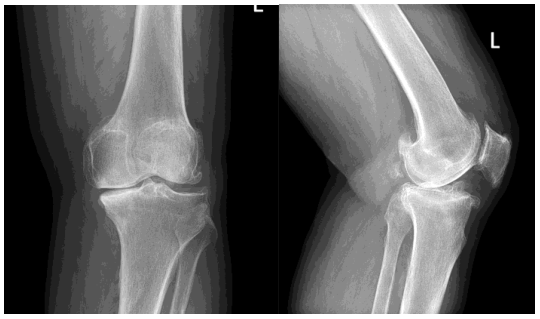

Gabarito

esclerose subcondral ou osteófitos ou cisto subcondral ou diminuição do espaço articular ou deformidade em varo. Sinonímia.

### Questão 3

Mulher, 59a, é trazida para Unidade de Emergência Referenciada por dor precordial e dispneia há três horas. Antecedentes pessoais: hipertensão arterial. Medicamento em uso: hidroclorotiazida. Exame físico: Escala de coma de Glasgow=15; PA=84/52mmHg; FC=124bpm; FR=25irpm; oximetria de pulso=94% (ar ambiente); extremidades frias; tempo de enchimento capilar=4segundos. Pulmões=estertores crepitantes em bases. Realizado eletrocardiograma. Recebeu aspirina e clopidogrel na sala de emergência.
O TRATAMENTO INDICADO É:

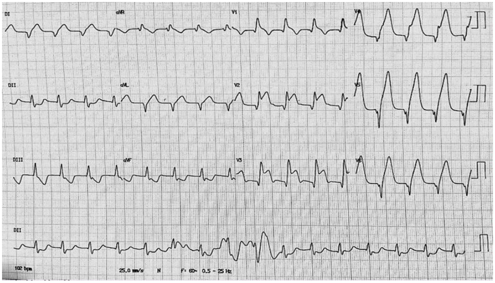

Gabarito

angioplastia primária, cateterismo cardíaco. Sinonímia.

### Questão 4

Homem, 16a, foi levado ao Pronto-Socorro por episódios de queda com rigidez muscular súbita e alterações comportamentais progressivas há três meses. Mãe relata que ele se tornou retraído, com fala arrastada e desinteresse escolar. Antecedentes pessoais: sem doenças conhecidas. Medicações em uso: nenhuma. Exame físico: alerta; com fala baixa e presença de rigidez em membros; PA=118/76mmHg; FC=84bpm; FR=17irpm; temperatura axilar=36,9ºC. Exame oftalmológico com presença de pigmentação na periferia da córnea bilateralmente. Exames laboratoriais: hemoglobina=14,1g/dL; hematócrito=42%; leucócitos=6.800/mm³; plaquetas=264.000/mm³; TGO=65U/L; TGP=58U/L; fosfatase alcalina=96U/L; bilirrubina total=1,2mg/dL (direta=0,7mg/dL); gamaGT=32U/L;  albumina=3,5g/dL;  ceruloplasmina=10mg/dL;  TSH=1,9µUI/mL; creatinina=0,8mg/dL. O DIAGNÓSTICO NOSOLÓGICO É:

Gabarito

Doença de Wilson. Sinonímia.

### Questão 5

Mulher, 60a, sem comorbidades, procurou atendimento na Unidade Básica de Saúde para avaliação de resultados de exame admissional. Relata esquema vacinal completo para hepatite B, porém não se recorda de infecção prévia. Medicações em uso: nega. Exame físico: sem alterações. Exames complementares: anti-HBsAg=reagente, anti-HBcAg=reagente, HBsAg=não reagente. O DIAGNÓSTICO É:

Gabarito

cura da infecção pelo vírus da hepatite B, cicatriz sorológica para hepatite B, hepatite B resolvida. sinonímia.

### Questão 6

Homem, 29a, procurou o Pronto-Socorro com queixa de febre, dor de cabeça progressiva, náuseas, vômitos e sonolência há sete dias. Antecedentes pessoais: sem comorbidades. Medicações em uso: nenhuma. Exame físico: sonolento; escala de coma de Glasgow=11; presença de rigidez de nuca; paralisia de VI par craniano à esquerda. PA=124/76mmHg, FC=94bpm, FR=18irpm, temperatura axilar=38,2ºC. Tomografia de crânio: hidrocefalia leve. Líquor: células=180céls/mm³ (90% linfócitos), proteína=210mg/dL, glicose=28mg/dL (glicemia=88mg/dL), bacilos álcool-ácido resistentes positivos na coloração de Ziehl-Neelsen. Iniciado tratamento específico. O MEDICAMENTO ADJUVANTE INDICADO É:

Gabarito

dexametasona ou metilprednisolona. Sinonímia.

### Questão 7

Mulher, 58a, apresenta-se ao Pronto Atendimento por dor facial intensa em região mandibular esquerda, iniciada há duas semanas. A dor é descrita como um "choque elétrico", intensificada ao falar, mastigar ou lavar o rosto. Refere episódios curtos e recorrentes. Antecedentes pessoais: diabetes melito e dislipidemia. Medicações em uso: metformina 850mg 2x/dia e sinvastatina 20mg/noite. Exame físico: dor desencadeada por toque leve na região mandibular esquerda, sem déficits neurológicos ou alterações sensoriais evidentes. PA=130/82mmHg, FC=82bpm, FR=17irpm, temperatura axilar=36,6ºC. Exames laboratoriais recentes normais. Ressonância magnética de encéfalo sem alterações estruturais. O MEDICAMENTO DE PRIMEIRA ESCOLHA PARA ESTA PACIENTE É:

Gabarito

carbamazepina ou oxcarbazepina. Sinonímia.

### Questão 8

Homem, 50a, procura atendimento por inchaço nas pernas há 15 dias. Antecedentes pessoais: hipertensão arterial em uso de atenolol. Exame físico: PA=126/84mmHg; edema 3+/4+ bilateral e simétrico em membros inferiores; panturrilhas sem sinais de empastamento; auscultas cardíaca e pulmonar sem alterações. Exames laboratoriais: ureia=45mg/dL; creatinina=1,2mg/dL; albumina=2,5g/dL; exame de urina: proteína=3+; hemácias=3/campo; leucócitos=2/campo. Relação proteína/creatina urinária=5g/g. Pesquisa de anticorpos anti-receptor de fosfolipase A2 sérico=positiva. Indicada biópsia renal. O DIAGNÓSTICO HISTOPATOLÓGICO ESPERADO É:

Gabarito

glomeruloparia (ou glomerulonefrite) membranosa; espessamento de membrana basal glomerular. Sinonímia.

### Questão 9

Homem, 37a, procurou o Pronto Socorro por queixa de dor e edema em tornozelo direito há cinco dias. Refere que buscou serviço médico previamente, tendo feito uso de anti-inflamatórios, sem melhora. Nega outros sintomas ou quadro semelhante em outras articulações. Conta que, há 15 dias, sofreu um corte perfurante, na pele de antebraço direito, não tendo procurado atendimento médico ou feito uso de medicação. Exame físico: temperatura axilar=36,7ºC; FC=80bpm; presença de lesão cicatricial em antebraço direito; tornozelo direito com edema importante, dor intensa à palpação e limitação completa da mobilização ativa e passiva. Exames laboratoriais: hemoglobina=15,2g/dL; leucócitos=28.000/mm³; plaquetas=197.000/mm³; creatinina=0,95mg/dL. A punção articular mostrou presença de líquido espesso amarelado. O PATÓGENO MAIS PROVÁVEL É:

Gabarito

Staphylococcus aureus; S. aureus

### Questão 10

Mulher, 42a, com queixa de fadiga intensa, inchaço, dor abdominal difusa, constipação, inapetência e dificuldade para dormir nas últimas semanas. Antecedentes pessoais: nega doenças e uso regular de medicamentos. Exame físico: bom estado geral; hidratada; eupneica; PA=142/84mmHg; FC=94bpm; FR=14irpm; temperatura axilar= 36,5ºC. Presença de nódulos palpáveis em região cervical bilateral, de consistência fibroelástica, móveis e indolores. Restante do exame físico sem alterações. Exames laboratoriais: hemoglobina=11,8g/dL; hematócrito=36,2%; leucócitos=4.700/mm3; plaquetas=167.000/mm3; creatinina=2,1mg/dL; cálcio=11,5mg/dL; lactato desidrogenase=128UI/L, paratormônio=8pg/mL; 25-hidroxivitamina D=30 ng/mL; 1,25-dihidroxivitamina D=78 pg/mL; exame de urina=proteína 1+, hemácias 6/campo, leucócitos 15/campo, presença de cristais de oxalato de cálcio. Teste de Mantoux: não reator. Radiograma de tórax: linfadenomegalia hilar bilateral e discretas opacidades reticulonodulares em campos pulmonares superiores. Radiograma de abdome (IMAGEM Q10). O DIAGNÓSTICO NOSOLÓGICO É:

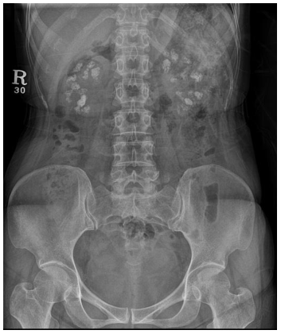

Gabarito

Sarcoidose. Sinonímia.

## Cirurgia

### Questão 11

No atendimento inicial ao traumatizado é necessário obter acessos venosos para reposição volêmica. Uma das opções é a punção da veia femoral guiada ou não por ultrassonografia. EM QUAL POSIÇÃO ESTA VEIA SE ENCONTRA EM RELAÇÃO À ARTÉRIA FEMORAL?

Gabarito

medial. Sinonímia.

### Questão 12

Homem, 83a, é trazido por familiares à Unidade de Emergência com confusão mental. Referem quedas recorrentes da própria altura há dois meses, sendo a última há dois dias. Antecedentes: diabetes melito e hipertensão arterial. Exame físico: corado; acianótico; PA=153/88mmHg; FR=16irpm; FC=82bpm; oximetria de pulso=97% (ar ambiente). Neurológico: Escala de Coma de Glasgow=14, pupilas fotorreagentes. Restante do exame sem alterações. Tomografia computadorizada de crânio (IMAGEM Q12): A HIPERDENSIDADE LOCALIZADA NO ESPAÇO SUBDURAL É SUGESTIVA DE:

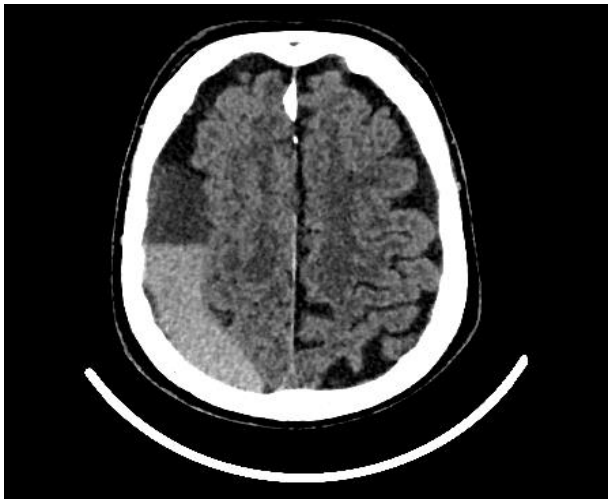

Gabarito

hemorragia recente e sinonímia. O componente agudo da hemorragia é fundamental para a pontuação da resposta. Hematoma subdural crônico ou subagudo pontuam APENAS se referida a agudização ou sangramento recente.

### Questão 13

Homem, 62a, procurou atendimento referindo dois episódios de sangramento retal há dois dias. Exame físico: consciente; PA=130/82mmHg; FC=72bpm. Exame proctológico normal. Endoscopia digestiva alta de urgência: normal. Traz colonoscopia realizada há um mês (IMAGEM Q13). A HIPÓTESE DIAGNÓSTICA É:

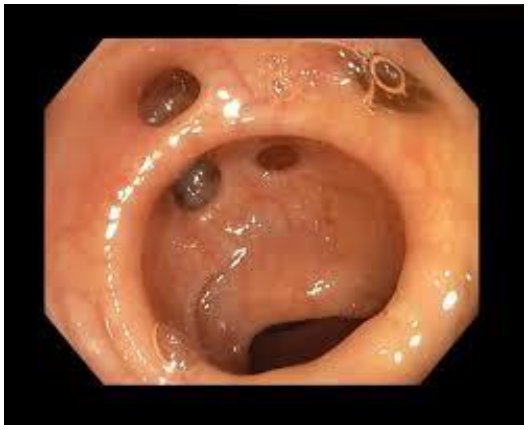

Gabarito

doença diverticular de colons ou diverticulose de colons. Diverticulite não pontua. Hemorragia diverticular, sangramento de origem diverticular e sinonímia.

### Questão 14

Mulher, 40a, é recebida na Unidade de Emergência, vítima de incêndio em ambiente fechado. Exame físico: agitada; membros superiores e tronco com lesão cutânea expondo a área queimada, de coloração esbranquiçada. Nega dor nas áreas afetadas. EM RELAÇÃO À PROFUNDIDADE DA LESÃO, A ÁREA QUEIMADA É CLASSIFICADA COMO:

Gabarito

terceiro grau. Espessura total e sinonímia.

### Questão 15

Recém-nascido, 28 dias, nascido a termo, vem evoluindo com distensão abdominal desde o nascimento. Apresentou a primeira eliminação de mecônio após 48 horas de vida. Toque retal: ampola retal vazia, com eliminação de fezes explosivas após o exame. A HIPÓTESE DIAGNÓSTICA É:

Gabarito

megacolon congênito (doença de Hirschprung); aganglionose e sinonímia.

### Questão 16

Homem, 62a, foi diagnosticado com tumor de orofaringe à esquerda. É importante avaliar as possíveis metástases linfonodais para a região cervical. A imagem abaixo demonstra os níveis de drenagem dos linfonodos cervicais à esquerda.
O PRINCIPAL NÍVEL DE ACOMETIMENTO LINFONODAL NESTE CASO É:

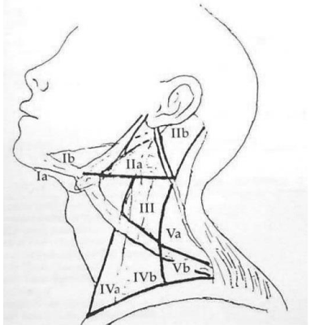

Gabarito

II ou IIb, IIa. EXPANSÃO DE GABARITO (gabarito ampliado após recursos)

### Questão 17

Homem, 78a, etilista, apresentou tosse, febre, queda do estado geral e dispneia progressiva há duas semanas. Foi diagnosticado com pneumonia lobar inferior à esquerda e tratado com amoxicilina + clavulanato por 10 dias. Como não apresentou melhora completa do quadro clínico, buscou novamente atendimento médico. Realizada tomografia de tórax (IMAGEM Q17) e indicada toracocentese. A HIPÓTESE DIAGNÓSTICA É:

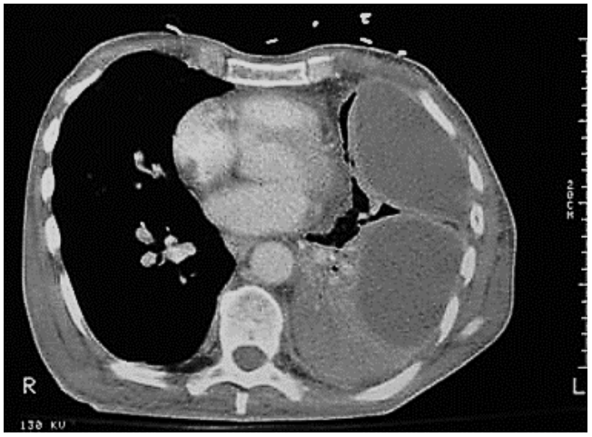

Gabarito

empiema pleural, derrame pleural complicado com empiema e sinonímia.

### Questão 18

Homem, 56a, procura Unidade Básica de Saúde referindo dor em membro inferior ao caminhar. A hipótese diagnóstica é de claudicação intermitente por obstrução arterial crônica. Na anamnese, a descrição da localização e características da dor auxiliam neste diagnóstico. A ESTRUTURA ANATÔMICA CORRESPONDENTE À DOR REFERIDA PELO PACIENTE É:

Gabarito

musculatura, panturrilha ou grupos musculares. Músculo sóleo, músculo gastrocnêmio, tríceps crural e sinonímia. EXPANSÃO DE GABARITO (gabarito ampliado após recursos)

### Questão 19

Mulher, 38a, no oitavo dia de puerpério, parto cesárea. Procura Unidade de Emergência referindo edema do membro inferior esquerdo há dois dias, acometendo até a raiz da coxa, acompanhado de dor ao caminhar e alteração azulada do membro. O EXAME COMPLEMENTAR QUE CONFIRMA A HIPÓTESE DIAGNÓSTICA É:

Gabarito

ultrassonografia vascular com Doppler ou sinonímia. Sinonímia.

### Questão 20

Homem, 80a, procura a Unidade de Pronto Atendimento queixando-se de dor em baixo ventre há seis horas. Refere história de dificuldade para urinar e jato urinário fraco, com piora no último mês. Exame físico: abaulamento em baixo ventre, doloroso à palpação. O TRATAMENTO IMEDIATO É:

Gabarito

cateterismo vesical de alívio; desobstrução vesical (sonda vesical de alívio), sondagem vesical de alívio e sinonímia.

## Pediatria

### Questão 21

Menino, 3a e 6m, previamente hígido, é trazido à Unidade Básica de Saúde com queixa de dor em pênis. Mãe refere que a criança começou a reclamar de dor local durante o banho, após tê-lo deixado sozinho por alguns minutos. Nega febre, hematúria ou outras queixas. Nega doenças ou uso de medicamentos. Exame físico: bom estado geral, corado, hidratado, chorando muito. Inspeção genital: (IMAGEM Q21). Restante do exame sem alterações. A CONDUTA IMEDIATA É:

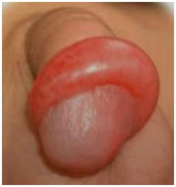

Gabarito

redução da parafimose ou redução. Sinonímia.

### Questão 22

Menina, 7a, previamente hígida, é levada ao Pronto-Socorro com febre (40ºC) há um dia, associada a dor intensa na perna direita. Nas últimas horas, evoluiu com sonolência, delírio e anúria. Exame físico: mal estado geral; sonolenta; confusa; FC=180bpm; FR=28irpm; PA=73/32mmHg; oximetria de pulso=94% (ar ambiente); temperatura axilar=39,2ºC. Perna direita=edema, calor, eritema, áreas de coloração violácea, sem focos de crepitação subcutânea, sem ferimentos. Exames laboratoriais: leucócitos=24.320/mm3; Proteína C reativa=320mg/dL; CPK=2.300U/L; Hemocultura=cocos gram positivos, em identificação. ALÉM DO STAPHYLOCOCCUS AUREUS, QUAL OUTRO AGENTE ETIOLÓGICO DEVE SER CONSIDERADO E PRONTAMENTE TRATADO?

Gabarito

Streptococcus pyogenes, estretptococo beta hemolítico do grupo A; S.pyogenes. Sinonímia.

### Questão 23

Menino, 5a, é levado ao Pronto Atendimento com queixa de febre há dois dias, tosse produtiva e dificuldade respiratória. A mãe relata episódios frequentes de engasgos durante a alimentação e aumento da salivação. O paciente é alimentado por via oral com dieta pastosa. Antecedentes pessoais: paralisia cerebral tetraparética; três pneumonias nos últimos meses (última há dois meses). Exame físico: FR=35irpm; oximetria de pulso=91% (ar ambiente). Pulmões= murmúrio vesicular presente com roncos, sibilos e estertores à direita. Radiograma de tórax=opacidade heterogênea em topografia de lobo inferior direito. AS PNEUMONIAS RECORRENTES SÃO RESULTADO DE:

Gabarito

aspiração, broncoaspiração, distúrbio de deglutição. Sinonímia.

### Questão 24

Menina, 5m, previamente hígida, é levada à Unidade Básica de Saúde com história de febre (38,5°C) de início súbito e persistente há 36h, associada a coriza, tosse e recusa alimentar. Refere boa aceitação de líquidos e diurese abundante. Nega vômitos, diarreia ou outras queixas. A mãe relata que há casos semelhantes na creche, incluindo uma professora. Refere ter administrado dipirona há uma hora. Exame físico: bom estado geral; corada; hidratada; eupneica; FC=112bpm; FR=31irpm; temperatura axilar=36,8ºC; enchimento capilar=2segundos; pulsos cheios. Pulmões= murmúrio vesicular presente, sem ruídos adventícios; restante do exame sem alterações. ALÉM DE ORIENTAR ANTITÉRMICO E HIDRATAÇÃO, O MEDICAMENTO INDICADO É:

Gabarito

fosfato de oseltamivir. Outros medicamentos não pontuam. Sinonímia.

### Questão 25

Menino, 7a, é trazido à Unidade Básica de Saúde para puericultura. Mãe refere que ele não está crescendo e é o menor da sua sala na escola e no treino de futebol. Refere alimentação adequada e atividade física regular. Nega outras queixas, doenças e uso de medicamentos. Nasceu a termo com 2.470g e 45cm. Mãe tabagista, inclusive durante a gestação. Mãe e pai são saudáveis e foram medidos durante a consulta: 153cm e 166cm, respectivamente. Menarca materna aos 11 anos. Altura prévia do paciente, com 5 anos e meio, no percentil 25 da curva de referência. Exame físico: estatura=percentil 25, que é a média do canal familiar. Radiograma de punho e mão esquerda= idade óssea de 6,5 anos para 7 de idade cronológica. A HIPÓTESE DIAGNÓSTICA PARA A ALTURA É:

Gabarito

estatura normal. Sinonímia.

### Questão 26

Menino, 3a, previamente hígido, é admitido convulsionando na Unidade de Emergência. Tem história de tosse, coriza e febre há um dia. Exame físico: FC=154bpm; FR=38irpm; temperatura axilar=36,1°C; oximetria de pulso=96% (ar ambiente); arresponsivo; pupilas isocóricas e fotorreagentes; movimentos tônico-clônicos. A MEDICAÇÃO E A VIA DE ADMINISTRAÇÃO SÃO:

Gabarito

diazepan (endovenoso ou via retal) ou midazolan (endovenoso ou inalatório ou intramuscular). Sinonímia.

### Questão 27

Menino, 6a, assintomático, exame físico normal, PA no percentil 50. Traz exame de urina, realizado de rotina: densidade=1020; pH=5,0; proteína=1+; glicose=negativo; leucócito esterase=negativo; nitrito=negativo; hemácias>100/campo; leucócitos=80/campo; presença de cilindros hemáticos e raros cristais de oxalato de cálcio. A ESTRUTURA RENAL COMPROMETIDA É:

Gabarito

glomérulo. Sinonímia.

### Questão 28

Menino, 11m, é trazido à Unidade de Emergência com história de resfriado há uma semana e febre há três dias, quando foi diagnosticada otite média aguda e iniciado uso regular de amoxicilina 80mg/Kg/dia. A mãe refere que continua com dor e febre. Exame físico: desvio anterior do pavilhão auricular direito; hiperemia, edema e calor em região retroauricular direita. A HIPÓTESE DIAGNÓSTICA É:

Gabarito

mastoidite aguda. Sinonímia.

### Questão 29

Menino, 4d, é trazido para avaliação por lesões de pele que apareceram há dois dias. Mãe está preocupada porque acha que houve piora. Nega febre, inapetência, irritabilidade, hipoatividade ou outras queixas. Refere aleitamento materno complementado com fórmula láctea de partida. Antecedentes: nascido a termo (39 semanas e 5 dias) com 3.845g. Sorologias maternas logo antes do parto para HIV, hepatites B e C e sífilis= não reagentes. Exame físico: sem alterações, exceto por lesões de pele (IMAGEM Q29) que não estão presentes em regiões plantar e palmar. A HIPÓTESE DIAGNÓSTICA É:

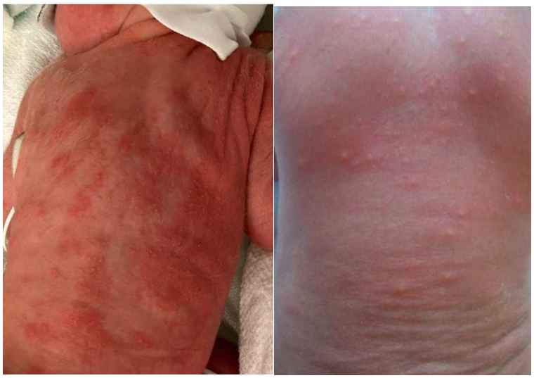

Gabarito

eritema tóxico, eritema tóxico neonatal, eritema neonatal. Sinonímia.

### Questão 30

Criança nasce com 39 semanas de idade gestacional por parto vaginal, em apneia e cianótica. Após a ligadura do cordão umbilical, recebe os passos iniciais da reanimação. À reavaliação, encontra-se em apneia, com FC=90bpm. Realizada ventilação com pressão positiva em ar ambiente, mantendo apneia e bradicardia. O PRÓXIMO PASSO NO PROCESSO DE REANIMAÇÃO É:

Gabarito

verificar ou corrigir a técnica de ventilação. Sinonímia.

## Ginecologia e Obstetrícia

### Questão 31

Mulher, 30a, G3P0A2, com 21 semanas de gestação, procura o Pronto Atendimento Ginecológico com queixa de aumento de secreção vaginal há dois dias. Nega dor, sangramento ou contrações. Exames laboratoriais dentro da normalidade. Ultrassonografia obstétrica morfológica de primeiro trimestre sem alterações. Exame especular (IMAGEM Q31). A HIPÓTESE DIAGNÓSTICA É:

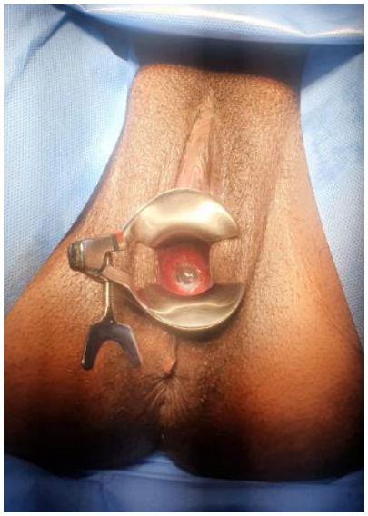

Gabarito

insuficiência istmo cervical ou incompetência istmocervical. Sinonímia.

### Questão 32

Mulher, 31a, nuligesta, com queixa de dismenorreia e dispareunia de penetração. Nega dispareunia de profundidade, dor acíclica, dor ao evacuar ou ao urinar. Ultrassonografia transvaginal= útero em medioversão, volume= 49,70cm3, aspecto globoso; miométrio de textura heterogênea com estrias no miométrio externo e perda da interface miométrio-endométrio; linha endometrial=3,5mm. Ovários sem alterações. Fundo de saco posterior com espessamento tipo III= 28x16x11mm. Lesão em parede de íleo terminal=17x13x7mm. A CONDUTA É:

Gabarito

tratamento cirúrgico, cirurgia ou sinonímia. Qualquer conduta não cirúrgica isolada não pontua.

### Questão 33

Mulher, 28a, casada, faz uso de contraceptivo oral combinado. Procura o ginecologista para saber se pode manter este método, com o qual está bem adaptada. Traz exame de ressonância magnética mostrando hiperplasia nodular hepática. Exame físico: PA=120/80mmHg; IMC=30kg/m2. A ORIENTAÇÃO NESTE CASO É:

Gabarito

pode manter o contraceptivo oral combinado, manter a prescrição. Sinonímia.

### Questão 34

Mulher, 32a, procura a Unidade Básica de Saúde para coletar citologia oncótica. Antecedentes: G2C2A0, realizou laqueadura na última cesárea há dois anos. Exame ginecológico: (IMAGEM Q34). Durante a coleta do exame de citologia, apresentou sangramento. A HIPÓTESE DIAGNÓSTICA É:

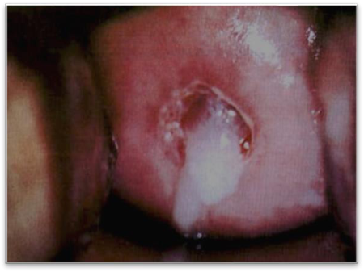

Gabarito

cervicite. Sinonímia.

### Questão 35

Mulher, 52a, apresenta ondas de calor, insônia e irritabilidade há dois anos. Antecedentes: histerectomia total por miomatose uterina há seis anos, uso regular de cálcio + vitamina D há dois meses. Mãe com diagnóstico de osteoporose. Exame físico: PA=130/78mmHg; FC=82bpm. Traz exames: mamografia=BIRADS 2; densitometria óssea: coluna lombar T score= –1,5 desvio-padrão; colo de fêmur Tscore= –1,3 desvio-padrão. A CONDUTA É:

Gabarito

terapia estrogênica isolada e sinonímia

### Questão 36

Primigesta, 40a, hipertensa crônica, com 34 semanas de gestação. Procura o Pronto Atendimento por piora no controle pressórico, queixa de cefaleia e embaçamento visual. Durante a espera para o atendimento, apresentou convulsão. Foi levada à sala de Urgência, para os cuidados iniciais, sendo realizada dose de ataque de sulfato de magnésio (4g intravenoso) e instalada dose de manutenção (1g/h). Após 20 minutos, apresenta nova convulsão, com PA 140/90mmHg. Realizada estabilização e proteção de vias aéreas. EM RELAÇÃO AO SULFATO DE MAGNÉSIO, A CONDUTA É:

Gabarito

realizar 2g de sulfato de magnésio intravenoso (metade da dose de ataque inicial). Não pontua se não estiver referido 2g. Sinonímia.

### Questão 37

Mulher, 28a, apresenta nódulo palpável de 1,5cm no quadrante superior medial da mama esquerda, distando 4cm do mamilo, móvel e indolor. Ultrassonografia: Sistema de relatório de dados e imagem da mama (BI-RADS) categoria 3. A CONDUTA É:

Gabarito

repetir ultrassonografia em 6 meses. Sinonímia.

### Questão 38

Mulher, 25a, primigesta, 12 semanas e 4 dias, vem para segunda consulta de pré-natal. Assintomática. Exames: sorologia de toxoplasmose= IgM positiva, IgG negativa. Ultrassonografia morfológica normal. Prescrito espiramicina 3g/dia. O PRÓXIMO PASSO NA INVESTIGAÇÃO DIAGNÓSTICA É:

Gabarito

repetir sorologia. Teste de gravidez não pontua. Sinonímia.

### Questão 39

Mulher, 30 a, submetida a rastreamento de câncer de colo de útero com DNA-HPV oncogênico. Resultado positivo para HPV não 16/18 (HPV outros). A citologia reflexa apresentou resultado de alterações celulares inflamatórias. A ORIENTAÇÃO EM RELAÇÃO AO RASTREAMENTO DE CÂNCER DE COLO DE ÚTERO É:

Gabarito

repetir teste DNA-HPV em 1 ano. Sinonímia.

### Questão 40

Gestante em período expulsivo. Ao toque vaginal, você avalia que a apresentação está cefálica, fletida, alta (-3) e que, para nascer, precisará descer e evoluir com rotação de 90 graus no sentido anti-horário. A VARIEDADE DE POSIÇÃO NO MOMENTO DO EXAME É:

Gabarito

occipito esquerda transversa. Sinonímia.

## Saúde Coletiva

### Questão 41

Equipe de vigilância em saúde de município com mais de 1.000.000 de habitantes é notificada de caso de óbito de paciente do sexo masculino, de 39 anos de idade, jardineiro em condomínio de luxo localizado próximo à mata, na extremidade leste do município. O paciente procurara a Unidade Básica de Saúde com febre, cefaleia, mialgia e náuseas. Foi atendido e orientado a usar dipirona, ingerir grande quantidade de líquidos e retornar em dois dias para reavaliação. No retorno, encontrava-se prostrado, ictérico e relatou epistaxe. Na mata próxima ao local de trabalho, foram encontrados macacos mortos. A DOENÇA DE NOTIFICAÇÃO COMPULSÓRIA MAIS PROVÁVEL COMO CAUSA DO ÓBITO É:

Gabarito

febre amarela. Sinonímia

### Questão 42

O Japão apresentou um dos coeficientes de mortalidade infantil mais baixos do mundo, inferior a 2 por 1.000 nascidos vivos, em 2024. O Brasil, por sua vez, apresenta um coeficiente ao redor de 13 por 1.000 nascidos vivos. NO CASO DE COEFICIENTES DE MORTALIDADE INFANTIL BAIXOS OU MUITOS BAIXOS, O COMPONENTE COM MAIOR IMPACTO NO COEFICIENTE DE MORTALIDADE INFANTIL GERAL É:

Gabarito

mortalidade neonatal. Sinonímia.

### Questão 43

Uma equipe interdisciplinar discute um caso que está evoluindo mal. Inicialmente, escutando cada um dos profissionais que conhece o paciente, a equipe busca fazer uma lista dos problemas mais importantes e definir os objetivos de curto, médio e longo prazo e as ações necessárias para cada um dos problemas. O NOME DO DISPOSITIVO RECOMENDADO PELA POLÍTICA NACIONAL DE HUMANIZAÇÃO DA ATENÇÃO E DA GESTÃO, E ELABORADO NA REUNIÃO DE EQUIPE É:

Gabarito

projeto terapêutico singular ou plano terapêutico singular. Sinonímia.

### Questão 44

Em um hospital, instituiu-se que todas as interconsultas devem conter o pedido por escrito e o contato direto entre o profissional que solicita e o membro da equipe que irá realizar a interconsulta. A devolutiva da interconsulta deve seguir o mesmo trâmite. A responsabilidade de condução global do caso permanece com a equipe demandante. DE ACORDO COM A POLÍTICA NACIONAL DE HUMANIZAÇÃO DA ATENÇÃO E DA GESTÃO, A DIRETRIZ FORTALECIDA POR ESTA PROPOSTA É:

Gabarito

equipe de referência ou equipe responsável. AMPLIAÇÃO DE GABARITO: acolhimento, clínica ampliada, cogestão, matriciamento e sinonímia. (gabarito ampliado após recursos)

### Questão 45

A PRINCIPAL FONTE DE RECURSOS UTILIZADA PARA FINANCIAR SISTEMAS COM MODELO DE PROTEÇÃO DE SEGURIDADE SOCIAL (BEVERIDGIANOS) É:

Gabarito

impostos ou impostos gerais. Sinonímia.

### Questão 46

Considerando a participação da comunidade na gestão do Sistema Único de Saúde, QUAL DEVE SER A PROPORÇÃO DE REPRESENTANTES DOS USUÁRIOS NOS CONSELHOS MUNICIPAIS DE SAÚDE EM RELAÇÃO AOS DEMAIS MEMBROS (GESTORES E TRABALHADORES)?

Gabarito

50% ou metade ou ½ ou paritária. Sinonímia.

### Questão 47

Um estudo clínico avaliou o uso de um novo medicamento. O desenho do estudo constava da administração de uma dose única do composto, com o objetivo de estudar parâmetros farmacocinéticos e tolerância. Este estudo contou com 20 voluntários e não possuía grupo placebo. A FASE DA PESQUISA CLÍNICA À QUAL SE REFERE ESTE ESTUDO É:

Gabarito

fase I ou fase IA. Sinonímia.

### Questão 48

Modelos de inteligência artificial (IA) médica vêm sendo implementados em cenários reais para apoiar a decisão clínica. Embora se prometa objetividade e reprodutibilidade, suprimindo vieses do provedor e desigualdades clínicas, na prática, esses modelos frequentemente apresentam tendenciosidade contra determinados grupos de pacientes. Esta situação gera disparidades, tanto no desempenho quanto nos benefícios clínicos potenciais ou reais. Quando não controlados, tais vieses podem afetar negativamente o cuidado e a tomada de decisão clínica. O PRINCÍPIO ÉTICO PARA PROMOVER A JUSTIÇA NO CONTEXTO DA IA MÉDICA É:

Gabarito

equidade. Sinonímia.

### Questão 49

Mulher, 32a, técnica de enfermagem há três anos. Refere o aparecimento de lesões nas mãos há seis meses, que melhoram com uso de pomada de corticoide. Relata melhora durante o período de férias, com reaparecimento das lesões no retorno. Exame físico: Pele=lesões eritemato-descamativas em região dorsal das mãos e regiões interdigitais bilaterais. O EXAME COMPLEMENTAR QUE CONFIRMA O DIAGNÓSTICO ETIOLÓGICO É:

Gabarito

patch teste ou teste epicutâneo ou teste de contato ou teste alérgico de contato. Sinonímia.

### Questão 50

Mulher, 44a, é acompanhada na Unidade Básica de Saúde por quadro de tosse e falta de ar. Antecedentes: trabalhou com confecção de prótese dentária por cerca de 14 anos, cessando esta atividade há cinco anos. Exame físico: PA=114/68mmHg; FC=70 bpm; FR=20irpm; oximetria de pulso=92% (ar ambiente). Ausculta pulmonar com estertores em terço médio. Baciloscopia de escarro=negativa. Tomografia computadorizada de tórax (IMAGEM Q50). A HIPÓTESE DIAGNÓSTICA ETIOLÓGICA É:

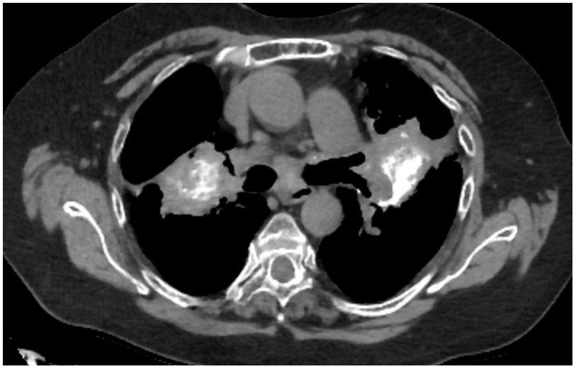

Gabarito

silicose, sílica ou pneumopatia crônica por sílica. Sinonímia.

