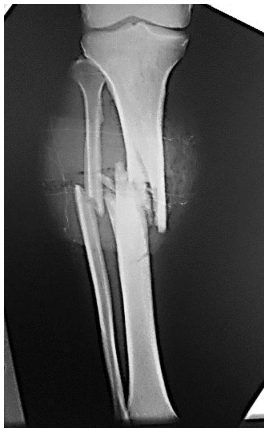
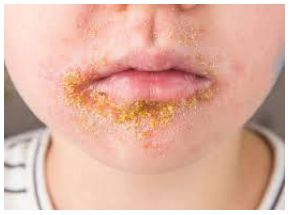
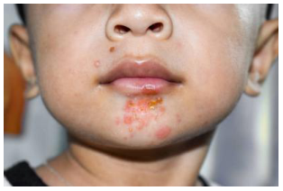
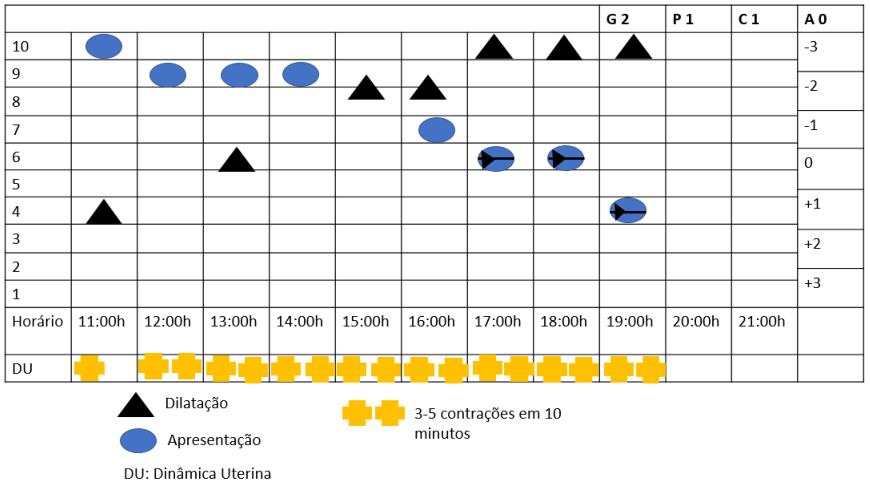

# UNICAMP 2026 – Acesso Direto – Vagas remanescentes (prova 2)

- Formato: Resposta curta (discursiva)
- Tipo: vagas remanescentes
- Data de aplicação: não informada
- Questões: 50
- Prova original: https://portal.fcm.unicamp.br/wp-content/uploads/sites/58/2026/03/AD-P2-para-publicar-1.pdf
- Gabarito oficial: https://portal.fcm.unicamp.br/wp-content/uploads/sites/58/2026/03/AD-prova-2-gabarito-1.pdf

## Clínica Médica

### Questão 1

Homem, 74a, procurou atendimento na Unidade Básica de Saúde por saída de secreção nasal há cinco meses, associada a cefaleia frontal e perda do olfato. Antecedentes pessoais: hipertensão arterial controlada. Medicações em uso: losartana 50mg/dia. Exame físico: sinais vitais dentro dos limites da normalidade; presença de secreção nasal esverdeada e espessa; dor à palpação nas regiões maxilar e frontal. O EXAME INDICADO É:

Gabarito

Tomografia computadorizada de seios de face

### Questão 2

Homem, 52a, foi internado para investigação de inapetência, vômitos e diarreia, associada a perda de 8Kg nos últimos três meses. Antecedentes: tabagismo 25 anos-maço. Exame físico: regular estado geral; peso=54Kg; altura=1,82m. Iniciado dieta oral com boa aceitação e, após três dias, passou a queixar-se de dores musculares. Exames laboratoriais: sódio=136mg/dL; potássio=3,1mg/dL; creatinina=1,1mg/dL; uréia=36mg/dL; fósforo=1,6mg/dL; magnésio=1,4mEq/L; CPK=1200U/L. A HIPÓTESE DIAGNÓSTICA É:

Gabarito

Síndrome de realimentação

### Questão 3

Mulher, 55a, compareceu à Unidade Básica de Saúde para consulta de rotina, relatando boa adesão ao tratamento farmacológico e mudança de estilo de vida nos últimos seis meses. Refere melhora discreta na pressão arterial domiciliar, porém mantém-se consistentemente acima de 150/95mmHg. Antecedentes pessoais: dislipidemia, obesidade (IMC=32kg/m²). Relata episódio de angioedema de glote com enalapril e prurido com losartana. Medicações em uso: hidroclorotiazida 25mg/dia e sinvastatina 20mg/noite. Exame físico: bom estado geral; PA=156/96mmHg; FC=78bpm; FR=16irpm; temperatura axilar=36,5ºC; sem edema periférico. Exames complementares: glicemia de jejum=95mg/dL, creatinina=0,9mg/dL, potássio=4,2mEq/L. A CLASSE DE MEDICAMENTOS A SER ADICIONADA É:

Gabarito

Bloqueador de canal de cálcio

### Questão 4

Mulher, 34a, previamente hígida, procura atendimento médico com queixa de astenia, febre não aferida, náuseas, vômitos, dor em articulações dos dedos de ambas as mãos e redução do débito urinário há dois dias. Tratou infecção urinária, com sulfametoxazol-trimetoprima por 3 dias, há uma semana. Exame físico: regular estado geral; hidratada; temperatura axilar=38,2ºC; PA=118/74mmHg; FC=98bpm; FR=18irpm. Dor em articulações interfalangianas proximais e distais de ambas as mãos, sem edema ou hiperemia. Restante do exame físico normal. Exames laboratoriais: hemoglobina=12,8g/dL; hematócrito=38,5%; leucócitos 10.800/mm3 (eosinófilos 9%, bastonetes=2%, segmentados=65%, linfócitos=20%, monócitos=4%); plaquetas=280.000/mm3; creatinina=2,1mg/dL; ureia=82mg/dL; sódio=138mEq/L; potássio=5,2mEq/L; velocidade de hemossedimentação= 40 mm/h; proteína C reativa= 35 mg/L; fator anti-nuclear negativo. Exame de urina: densidade=1.018; pH=6,0; proteínas=1+/4+; glicose=negativo; leucócito esterase=2+; nitrito=negativo; hemácias=20/campo; leucócitos=100/campo (eosinófilos +), bactérias=ausentes, cultura de urina=negativa. O DIAGNÓSTICO ETIOLÓGICO É:

Gabarito

Nefrite intersticial aguda

### Questão 5

Mulher, 36a, queixa-se de dispneia em repouso, ortopneia e tosse seca. Exame físico: Coração: sopro diastólico +++/6+ em segundo espaço intercostal esquerdo, aspecto aspirativo, sopro diastólico em ruflar ++/6+, hiperfonese de B1 e final de B2, extremidades: pulsos periféricos simétricos, amplitude normal. ALEM DO DIAGNÓSTICO DE INSUFICIÊNCIA PULMONAR, TEMOS A HIPÓTESE DIAGNÓSTICA DE:

Gabarito

Estenose mitral

### Questão 6

Mulher, 35a, portadora de anemia falciforme. Desde a adolescência, apresentou crises vaso-oclusivas frequentes e múltiplas internações por anemia grave, recebendo transfusões sanguíneas regulares. Nos últimos meses, refere palpitações, intolerância ao esforço e irregularidade menstrual. Exame físico: hiperpigmentação cutânea, fígado a 5cm do rebordo costal direito. Eletrocardiograma=alterações de condução cardíaca. Exames laboratoriais: ferritina=2.687ng/mL; AST=250U/L; ALT=301U/L. Sorologias negativas. A HIPÓTESE DIAGNÓSTICA É

Gabarito

Hemocromatose secundária ou hemossiderose transfusional

### Questão 7

Homem, 58a, com cirrose hepática por vírus da hepatite C, internado por encefalopatia hepática, em tratamento. Exame físico: FC=98bpm; FR=22irpm; temperatura axilar=36,2oC; PA=116/78mmHg; abdome: sinal de piparote presente. Líquido ascítico: neutrófilos=320/mm³, cultura negativa. ALÉM DE ADMINISTRAR ALBUMINA, A CONDUTA É:

Gabarito

Iniciar antibiótico

### Questão 8

Homem, 51a, procura atendimento com queixa de dor intensa, aumento de volume e hiperemia exuberante envolvendo a articulação metacarpo-falangeana do hálux direito, há dois dias. Coletado líquido sinovial: cor amarelo-citrino; turvo; 10.000 leucócitos/mm3; presença de cristais em forma de agulha, com refringência negativa à luz polarizada. A HIPÓTESE DIAGNÓSTICA É:

Gabarito

Gota

### Questão 9

Mulher, 84a, previamente independente para atividades básicas e instrumentais de vida diária, sofreu fratura de fêmur após queda doméstica e foi submetida à cirurgia ortopédica sem intercorrências. Após a alta hospitalar, foi encaminhada para instituição de longa permanência por dificuldade temporária de mobilidade e ausência de familiares disponíveis durante o dia. Nos primeiros dias na instituição, mostrava-se tranquila, porém, após cerca de uma semana, passou a apresentar desorientação temporal, dificuldade para reconhecer o quarto, inversão do ciclo sono-vigília, agitação noturna com tentativas de sair do leito e períodos de sonolência durante o dia. Não há história prévia de declínio cognitivo, transtorno psiquiátrico ou episódios semelhantes. O FATOR PSICOSSOCIAL RECENTE QUE AUMENTA FORTEMENTE O RISCO DESSA SÍNDROME É:

Gabarito

Institucionalização

### Questão 10

Homem, 76a, retorna à consulta médica em Unidade Básica de Saúde referindo dispneia aos grandes esforços. Medicação em uso: hidroclorotiazida 25mg/dia, sinvastatina20 mg/dia. Exame físico: PA=172/80mmHg; FC= 88bpm. Eletrocardiograma: ritmo sinusal e alterações inespecíficas da repolarização ventricular. Ecocardiograma trans torácico: aumento discreto de átrio esquerdo, ventrículo esquerdo com diâmetros normais e espessuras do septo intraventricular e parede posterior de ventrículo esquerdo aumentadas. Fração de ejeção (Simpson)=71%. Relaxamento diastólico anormal grau I. A CLASSE DE MEDICAMENTOS A SER ASSOCIADA É:

Gabarito

Inibidor de enzima conversora de angiotensina ou bloqueador de canal de cálcio

## Cirurgia

### Questão 11

Homem, 25a, é trazido para Pronto Atendimento após queda de motocicleta. Queixa-se de dor intensa em membro inferior esquerdo, onde sofreu o trauma. Exame físico: PA=140/90mHg; FC=110bpm; FR=24irpm. Apresenta ferimento corto contuso de 2cm na face anterior da perna, associado à deformidade no membro, edema moderado (2+/4+) e sangramento de característica venosa. Exame de abdome e tórax normais. Realizado radiograma (ao lado).
O DIAGNÓSTICO É:

Gabarito

Fratura exposta

### Questão 12

Menina, 2a, é trazida assintomática para puericultura. Ao exame físico foi observada hérnia umbilical redutível. Mãe refere que a criança apresenta esta alteração desde o nascimento. A CONDUTA É:

Gabarito

Tratamento expectante

### Questão 13

Mulher, 28a, procura Unidade de Emergência com queixa de dor em fossa ilíaca direita, acompanhada de inapetência, náuseas e vômitos há um dia. Exame físico: PA=120/70mmHg; FC=98bpm; FR=22irpm, temperatura=37,2ºC. Exames laboratoriais: hemoglobina=12,2g/dL; leucócitos=14.200/mm3, plaquetas=264.000/mm3; beta-HCG urinário positivo; exame de urina normal. O EXAME COMPLEMENTAR DE IMAGEM QUE AUXILIA O DIAGNÓSTICO DIFERENCIAL É:

Gabarito

Ultrassonografia (aceitar abdominal ou transvaginal)

### Questão 14

Homem, 68a, assintomático, retorna para avaliação em Unidade Básica de Saúde trazendo exame: PSAtotal=5,2 ng/mL. Toque retal= presença de nódulo endurecido. O PROCEDIMENTO QUE CONFIRMA A HIPÓTESE DIAGNÓSTICA É:

Gabarito

Biopsia de próstata

### Questão 15

Tumores cutâneos são frequentes em adultos, principalmente naqueles de pele clara e expostos à irradiação solar. A FORMA HISTOPATOLÓGICA MAIS COMUM É:

Gabarito

Carcinoma basocelular

### Questão 16

Portadores de hipertensão venosa crônica apresentam alterações cutâneas progressivas no exame físico dos membros inferiores, a saber: edema; eczema; dermatite ocre e dermatolipoesclerose. NO ESTÁGIO AVANÇADO DA DOENÇA, A PRÓXIMA ALTERAÇÃO A SER OBSERVADA É:

Gabarito

Úlcera

### Questão 17

Homem, 25a, deu entrada no Pronto Socorro após trauma por acidente automobilístico, com quadro de retenção urinária, fratura de bacia e uretrorragia. A MELHOR CONDUTA É:

Gabarito

Cistostomia ou punção suprapúbica

### Questão 18

Durante a laringoscopia na intubação oro traqueal é solicitado, para um integrante da equipe, realizar uma pressão no sentido posterior, superior e para a direita na laringe. A FINALIDADE PRINCIPAL DESTA MANOBRA É:

Gabarito

Auxiliar na visualização de cordas vocais

### Questão 19

Homem, 58a, apresenta tosse e emagrecimento de 5Kg há dois meses. Radiograma de tórax: opacidade paracardíaca direita, com apagamento do bordo direito do coração e discreto alargamento do mediastino. Biopsia por broncoscopia: carcinoma não pequenas células. O TUMOR ESTÁ LOCALIZADO NO BRÔNQUIO:

Gabarito

Do lobo médio

### Questão 20

Homem, 54a, com história de estar deprimido e com diarreia, queda de cabelo, parestesias nos membros e fraqueza há dois meses. Antecedente pessoal: cirurgia bariátrica em Y de Roux (Fobi- Capella) há 12 anos. Retorna à Unidade Básica de Saúde com resultados dos exames laboratoriais: hemoglobina=6,9 g/dL; hematócrito=25%; Volume corpuscular médio=114fL; Hemoglobina corpuscular média=29,7pg; leucócitos=3.100/mm3; plaquetas=158.000/mm3; série vermelha: anisopoiquilocitose, série branca: neutrófilos hipersegmentados, sem reticulocitose. A CONDUTA É PRESCREVER:

Gabarito

Vitamina B12

## Pediatria

### Questão 21

Menino, 12m, é trazido à Unidade Básica de Saúde para consulta de rotina. Está no município há três meses. Mãe refere alguns episódios de diarreia, no momento está bem. Alimentação: leite materno até os seis meses; não conseguiu introduzir alimentos sólidos pois acha que ele não gosta do que é ofertado, então dá leite fluido várias vezes por dia. Nega uso de medicamentos ou outros antecedentes, não lembra do peso ao nascimento. Não frequenta creche, carteira vacinal atrasada, pais desempregados. Exame físico: Peso=6,3kg (escore z-3); Comprimento=70cm (escore z 0) e IMC=13,06kg/m2 (escore z -3); irritado; não se senta sem apoio; não sorri; palidez cutânea; pele seca, enrugada, com cabelo fino/quebradiço; fígado não palpável, sem outras alterações. CONSIDERANDO AS CURVAS DA ORGANIZAÇÃO MUNDIAL DE SAÚDE, O DIAGNÓSTICO NUTRICIONAL É:

Gabarito

Magreza acentuada. Também serão aceitos desnutrição ou marasmo

### Questão 22

Menino, 3m, retorna para avaliação de resultado de hemograma, pois quem o atendeu em consulta de rotina achou que estava pálido. Sem queixas, aleitamento materno exclusivo em livre demanda e bom desenvolvimento neuropsicomotor. Antecedentes pessoais: parto cesáreo por toxemia gravídica com peso=2.300g; Apgar=8/9; Capurro=34semanas+2dias; alta com 4 dias de vida, sem intercorrências, todas as triagens neonatais normais. Medicação em uso: Vitamina D 400UI/dia. Exame físico sem alterações, com ganho ponderal=40g/dia. Hemograma coletado há seis dias: hemoglobina=9,1g/dL; hematócrito=31%; Volume Corpuscular Médio=85fL; Hemoglobina Corpuscular Média=28pg; Concentração de Hemoglobina Corpuscular Média=33g/dL; Índice de anisocitose (RDW)=14%; Leucócitos totais=9.000/mm³; Plaquetas=350.000/mm³. A DOSE INDICADA DE FERRO ELEMENTAR/KG/DIA É:

Gabarito

2mg/Kg/dia

> **Enunciado para as questões 23, 24:**
>
> Menino, 8a, previamente hígido, é trazido para pronto-atendimento na Unidade Básica de Saúde com queixa de lesões de pele pruriginosas em face há uma semana. Nega outras queixas. Exame físico: Bom estado geral, corado, afebril, eupneico. Pele (foto); restante sem alterações.

### Questão 23

O AGENTE ETIOLÓGICO É:

Gabarito

Estreptococo do grupo A

### Questão 24

CITE UMA COMPLICAÇÃO IMUNOMEDIADA DA DOENÇA:

Gabarito

Glomerulonefrite difusa aguda ou glomerulonefrite pós estreptocócica

### Questão 25

Criança nascida por parto cesáreo por prolapso de cordão, está com 7 minutos de vida. Encontra-se em ventilação por tubo traqueal em reanimador em T, massagem cardíaca coordenada com ventilação (3:1) e oxigênio a 100%. Após administração de adrenalina pelo cateter em cordão umbilical, permanece com bradicardia, palidez, má perfusão e pulsos débeis. CONSIDERANDO O PRÓXIMO PASSO DA REANIMAÇÃO NEONATAL, A CONDUTA É:

Gabarito

Soro fisiológico (dose 10ml/Kg). Apenas soro fisiológico está correto, mas dose incorreta invalida a resposta

### Questão 26

Menino, 4a, é trazido à Unidade de Emergência com história de tosse e falta de ar que pioraram nas últimas horas. Antecedentes: asma, em uso regular de corticoide inalatório com espaçador e máscara. Exame físico: FR=50irpm; FC=160bpm; Oximetria de pulso=90% (ar ambiente); agitado, evita falar; pálido; dispneico; pulmões=murmúrio vesicular presente com sibilos bilateralmente. Você classifica a exacerbação como grave e inicia o resgate com salbutamol, brometo de ipratrópio e corticoide sistêmico. Após a primeira hora de tratamento, o paciente mantém a classificação de exacerbação grave. A MEDICAÇÃO INDICADA É:

Gabarito

Sulfato de magnésio

### Questão 27

Menina, 5m, é trazida à Unidade de Emergência com história de febre iniciada hoje. Pai refere ter medicado com ibuprofeno e que, 20 minutos após, criança apresentou placas vermelhas por todo o corpo, e vômitos repetitivos. Nega outras queixas ou episódios prévios semelhantes. Exame físico: criança irritada, chorando, com discreto estridor; FC=140bpm; FR=50irpm; oximetria de pulso=93% (ar ambiente); pulsos cheios; enchimento capilar=2segundos; pele=placas urticariformes em tronco e membros; restante do exame sem alterações. O TRATAMENTO (MEDICAMENTO E VIA DE ADMINISTRAÇÃO) É:

Gabarito

Adrenalina IM

### Questão 28

Menina, 9m, é levada à Unidade de Emergência pelo pai com história de queda da cama (80cm) há 30 minutos. Pai refere que a criança chorou bastante após a queda. Nega perda da consciência, vômitos ou outras queixas. Exame físico: abertura ocular espontânea, balbucios, movimentos espontâneos normais; presença de hematoma subgaleal frontal, sem crepitação. Restante do exame físico sem alterações. SEGUNDO O PROTOCOLO PEDIATRIC EMERGENCY CARE APPLIED RESEARCH NETWORK PARA TRAUMA CRANIOENCEFÁLICO, A CONDUTA É:

Gabarito

Alta com orientação ou observação sem exame de imagem, não há necessidade de tomografia de crânio

### Questão 29

Menino, 7 semanas de vida, é trazido por sua mãe à Unidade de Emergência devido a irritabilidade. Mama seio materno em livre demanda e apresenta vômitos pós-alimentares há três semanas, com piora há cinco dias. A mãe refere que a criança está tratando doença do refluxo gastroesofágico com omeprazol e fórmula hidrolisada, mas mantém vômitos pós alimentares com conteúdo claro, parecendo ser leite. Nega redução da aceitação das mamadas, mas não está ganhando peso. Está há três dias sem evacuar e hoje a mãe notou redução da diurese. Antecedentes: nasceu a termo, sem intercorrências; apresentou conjuntivite no período neonatal, tratada com eritromicina oral; teste do pezinho e função renal normais. Exame físico e neurológico normais. A HIPÓTESE DIAGNÓSTICA É:

Gabarito

Estenose hipertrófica de piloro

### Questão 30

Recém-nascido com 4 dias de vida está em fototerapia intensiva (onde o espectro de luz é ajustado para maior efetividade) há um dia, por isoimunização Rh. Está bem, em aleitamento materno. Mãe comenta que a luz do aparelho tem uma coloração que chama a atenção. A QUAL COR ELA SE REFERE?

Gabarito

Azul

## Ginecologia e Obstetrícia

### Questão 31

Mulher, 48a, relata sangramento vaginal abundante há 25 dias, associado a dor pélvica. Informa ciclos menstruais regulares até dois meses atrás. Secundigesta, método contraceptivo laqueadura. Sem outros antecedentes. Exame físico: sem alterações. Exames laboratoriais: hemoglobina=11,2mg/dL; hematócrito=35%; FSH=14,6mUI/L; estradiol=40pg/mL. Ultrassonografia transvaginal: útero de volume normal; eco endometrial 5mm; ovários sem anormalidades. A ETIOLOGIA MAIS PROVÁVEL PARA O SANGRAMENTO UTERINO É:

Gabarito

Disfunção ovariana e sinonímia

### Questão 32

Mulher, 32a, nulípara, apresenta-se com dor pélvica intensa no quadrante inferior direito há cinco dias, associada a febre (38,5°C), náuseas e corrimento vaginal purulento. Relata múltiplos parceiros sexuais e não usa preservativos. Exame físico: sensibilidade à palpação cervical e anexial à direita, com massa palpável de 5cm no anexo direito. Exames laboratoriais: teste de gravidez=negativo; hemoglobina=12,3=g/dL; leucócitos=16.430/mm3; plaquetas=256.000/mm3. Ultrassonografia transvaginal: formação hipoecogênica heterogênea, com níveis em região anexial direita, medial ao ovário ipsilateral. A HIPÓTESE DIAGNÓSTICA É:

Gabarito

Abscesso tubo ovariano. Doença inflamatória pélvica (isolada) não pontua. A menção ao abscesso é mandatória

### Questão 33

Mulher, 28a, apresenta, ao exame físico, nódulo mamário móvel, indolor, de limites regulares, medindo 2,5cm, no quadrante superior esquerdo de mama direita. SEGUNDO AS DIRETRIZES DA FEBRASGO, O EXAME INICIAL INDICADO É:

Gabarito

Ultrassonografia de mamas

### Questão 34

Mulher, 68a, é acompanhada em Unidade Básica de Saúde por cerca de 10 anos, com quadro de dermatite vulvar pruriginosa, persistente, com áreas esbranquiçadas. Há dois meses apresentando lesão pruriginosa elevada, com ulceração na região do pequeno lábio direito, medindo cerca de 1,5 cm. O EXAME QUE CONFIRMA A HIPÓTESE DIAGNÓSTICA É:

Gabarito

Biopsia

### Questão 35

Mulher, 35a, assintomática, comparece à Unidade Básica de Saúde para orientações sobre o rastreamento do câncer de colo do útero. Última citologia realizada há quatro anos com resultado de alterações celulares inflamatórias. Teste de DNA-HPV negativo. COM BASE NAS DIRETRIZES BRASILEIRAS PARA RASTREAMENTO DO COLO DE ÚTERO COM TESTE MOLECULAR (DNA-HPV), EM QUE INTERVALO DE TEMPO O NOVO TESTE MOLECULAR DEVE SER REALIZADO?

Gabarito

5 anos

### Questão 36

Mulher, 22a, em alojamento conjunto em primeiro dia após parto normal a termo, apresenta exame de VDRL=1:64. Traz seu cartão pré-natal, com todas as sorologias (realizadas às 28 semanas de gestação) negativas, incluindo sorologias para sífilis (FTA-ABS e teste rápido negativos). Nega alergias. O TRATAMENTO MATERNO (MEDICAMENTO, DOSE E VIA DE ADMINISTRAÇÃO) É:

Gabarito

Penicilina benzatina, 2.400.000UI, IM

### Questão 37

Mulher, 28a, primigesta, comparece à primeira consulta de pré-natal com 18 semanas de idade gestacional. É sedentária e não refere queixas. IMC=29 kg/m². Traz os exames da rotina inicial solicitados na semana anterior: tipagem sanguínea=O positivo; hemoglobina=12,2g/dL; hematócrito=37%; glicemia de jejum=104mg/dL; TSH=2,1mUI/L; Urocultura=Negativa; VDRL=Não Reagente; anti-HIV= Não Reagente; HBsAg=Não Reagente; Sorologia para Toxoplasmose=IgG Reagente, IgM Não Reagente. A HIPÓTESE DIAGNÓSTICA É:

Gabarito

Diabetes mellitus gestacional

### Questão 38

Primigesta, 34 semanas, encaminhada para avaliação em maternidade de referência. Diagnóstico de hipertensão gestacional às 32 semanas. Traz controles adequados de pressão arterial, em uso de alfa-metildopa 1g/dia. Exames laboratoriais: creatinina=0,6mg/dL; proteína/creatinina em amostra isolada de urina=0,1. Ultrassonografia= peso fetal estimado no percentil 2, Dopplervelocimetria dentro do normal. A HIPOTESE DIAGNÓSTICA MATERNA É:

Gabarito

Pré-eclampsia

### Questão 39

Mulher, 30 anos, procura Unidade Básica de Saúde para orientação de método contraceptivo. Antecedentes: síndrome dos ovários policísticos, hipertensão arterial controlada com uso de três classes de antihipertensivos. Deseja um método seguro e que ajude a tratar as queixas de hiperandrogenismo. O MELHOR MÉTODO INDICADO PARA ESTA MULHER É:

Gabarito

Pílula de progestagênio ou implante de progestagênio ou progestagênio injetável

### Questão 40

Mulher, 39a, G2P1C1A0, idade gestacional 38 semanas e 5 dias, interna em Maternidade por rotura de membranas amnióticas e trabalho de parto espontâneo. Cardiotocografia=normal. Apresenta evolução, conforme partograma abaixo, sob analgesia peridural contínua.
A CONDUTA É:

Gabarito

Aguardar a evolução do parto ou conduta expectante. Cesárea ou fórceps não pontuam.

## Saúde Coletiva

### Questão 41

Um estudo clínico comparou o uso de Rivaroxabana ou placebo em associação à terapêutica usual para doença arterial coronariana. Sua hipótese nula era a de que os eventos cardiovasculares seriam semelhantes entre pacientes que tomaram Rivaroxabana e aqueles que tomaram Placebo. Em um teste estatístico de hipóteses, SE O valor-p OBTIDO FOR MAIOR QUE O NÍVEL DE SIGNIFICÂNCIA ESTIPULADO, A DECISÃO CORRETA É:

Gabarito

Aceitar a hipótese nula, ou rivaroxabana e placebo possuem efeito semelhante

### Questão 42

Homem, 32a, chega ao Pronto-atendimento queixando-se de febre, cefaleia e diarreia há 24 horas. Refere ter realizado trilha em mata fechada antes de desenvolver os sintomas. Exame físico: presença de escara de inoculação no tornozelo direito. Solicitados exames complementares para investigação diagnóstica de Febre Maculosa. Tendo em vista a suspeita diagnóstica, O SISTEMA DE INFORMAÇÃO PARA A ADEQUADA NOTIFICAÇÃO DO CASO É:

Gabarito

Sistema nacional de agravos e notificação (SINAN)

### Questão 43

Homem, 32a, operário de fundição, apresenta dor abdominal recorrente, fadiga e irritabilidade. Exame físico: presença de linha azulada na gengiva. Hemograma: anemia microcítica hipocrômica, presença de pontilhados basofílicos em hemácias, leucócitos e plaquetas dentro dos valores normais. O DIAGNÓSTICO MAIS PROVÁVEL É

Gabarito

Saturnismo ou intoxicação por chumbo

### Questão 44

Homem, 40a, trabalha há 15 anos em uma metalúrgica exposto a ruídos intensos. Relata perda auditiva progressiva, principalmente em ambientes barulhentos, além de zumbido constante. Otoscopia normal. O TIPO DE PERDA AUDITIVA É:

Gabarito

Neurossensorial

### Questão 45

Homem, 67a, em acompanhamento ambulatorial com diagnóstico de adenocarcinoma de pâncreas avançado, sem proposta cirúrgica. Antecedentes: diabetes melito, amaurose bilateral. VISANDO O CONTROLE DA DOR E MELHORA DA QUALIDADE DE VIDA, A LINHA DE CUIDADO PROPOSTA NESTE CASO É:

Gabarito

Cuidados paliativos. Terapêutica isolada não pontua

### Questão 46

Estima-se que o sinal de Romaña esteja presente em 25% da fase aguda da doença de Chagas, sendo considerado um sinal patognomônico desta doença. ESTA AFIRMAÇÃO TEM COMO BASE A ELEVADA…

Gabarito

Especificidade

### Questão 47

Mulher, 31a, procura o serviço por estar gestante e deseja orientação em relação à interrupção da gravidez. Refere que a gestação é fruto de um estupro ocorrido há nove semanas. Na época, ficou muito traumatizada e não fez boletim de ocorrência, não contou para ninguém sobre o ocorrido e nem procurou atendimento médico. Traz ultrassonografia com idade gestacional compatível. A ORIENTAÇÃO MÉDICA SOBRE O ABORTO É:

Gabarito

Explicar que tem direito ao aborto legal, mediante seu próprio relato

### Questão 48

Considerando o processo histórico de construção dos sistemas de proteção social, o modelo adotado pelo Brasil antes da Constituição Federal de 1988 caracterizava-se pelo financiamento tripartite (Estado, empregadores e trabalhadores) e pela conquista de direitos previdenciários. Historicamente, sua implantação buscou responder ao avanço do movimento operário mediante a concessão de direitos sociais limitados. ESTE MODELO É CONHECIDO COMO:

Gabarito

Bismarckiano

### Questão 49

A Comissão Nacional de Incorporação de Tecnologias no SUS (Conitec) aprovou uma imunização para gestantes no segundo/terceiro trimestre, que reduz formas graves da doença em bebês. Também liberou o uso de um anticorpo monoclonal, em dose única, para recém-nascidos e crianças até dois anos. O AGENTE INFECCIOSO ALVO DESSA ESTRATÉGIA DE PREVENÇÃO É:

Gabarito

Vírus sincicial respiratório

### Questão 50

O Ministério da Saúde definiu, em 2025, novos indicadores para qualificar e monitorar as boas práticas na Atenção Primária à Saúde. No indicador de cuidado da pessoa com diabetes, são elencadas seis boas práticas: (1) realização de consulta recente (presencial ou remota); (2) aferição de pressão arterial; (3) registro de peso e de altura; (4) realização de visitas domiciliares e (5) solicitação ou avaliação de hemoglobina glicada. O SEXTO PARÂMETRO É:

Gabarito

Avaliação dos pés/avaliação do pé diabético

